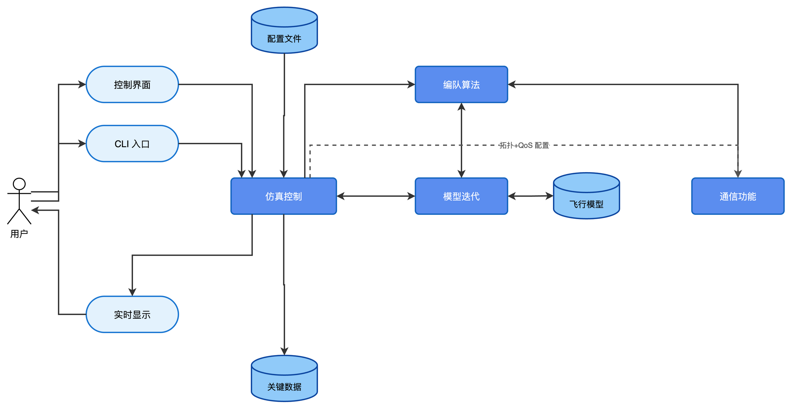
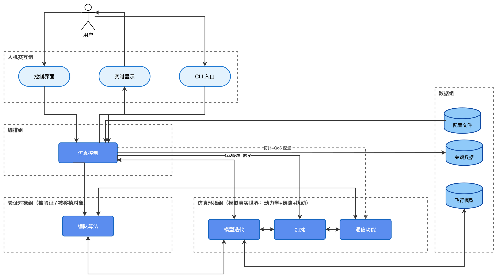
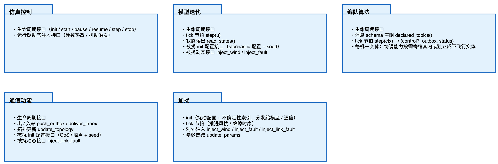
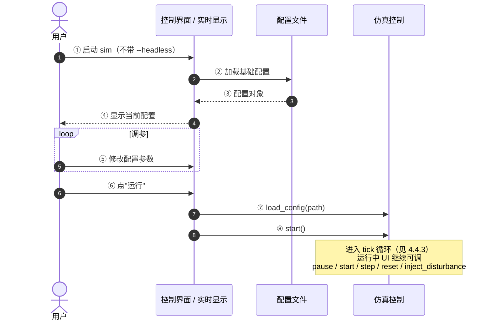
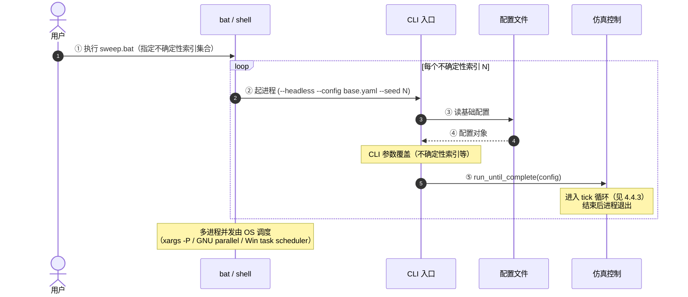
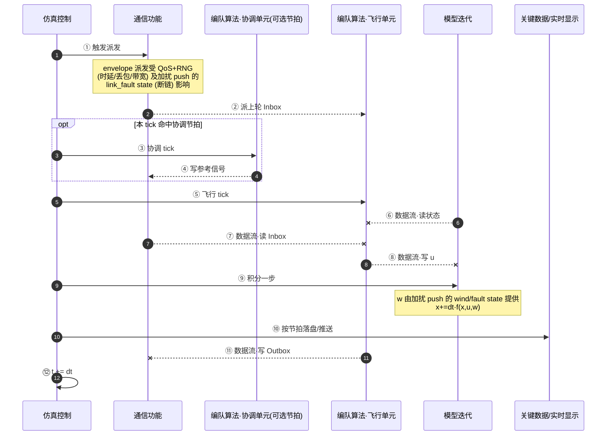

# 一、目标

本文主要针对编队的仿真验证平台进行架构设计；

* 首先，编队仿真验证平台分为三种，本次仿真验证平台仅针对python仿真进行设计，但是后续两个仿真会参考这个架构
  * python仿真：主要快速验证算法可行性
  * C的数字仿真：主要验证python移植后的代码
  * 半物理仿真：主要验证机载硬件是否可行

为了加固自己的架构设计水平，本次使用ADMEMS方法论进行架构设计。

# 二、系统PA阶段

| 需求结构化     | 功能                                                         | 质量                                                         | 约束                                                         |
| -------------- | ------------------------------------------------------------ | ------------------------------------------------------------ | ------------------------------------------------------------ |
| **业务级需求** | * 支持验证编队的集结、保持、重构（队形变换）和避障的相关能力<br />* 算法快速验证、演示验证、报告生成、与后续 C 仿真/半物理仿真对齐<br />* 同一场景下对比不同算法或不同参数<br />* 批量仿真：多场景、多参数组合自动运行，避免手工反复操作 | * 扩展性（后续可能扩展协同和集群的相关能力）<br />* 可移植性：为 C 仿真/半物理仿真对齐留出口 | * 分离并沉淀仿真、算法报告、设计和分析工具<br />* 一个月的开发时间，实际投入约 0.5 人月 |
| **用户级需求** | * 支持更换不同的算法<br />* 支持添加不同的扰动（链路延迟、丢包、断链、风扰动、控制滞后、障碍物、单机故障、定位漂移等）<br />* 支持仿真结果日志记录和自动化分析<br />* 支持数据配置、期望队形、实时显示、超频运行、分段仿真、三维可视化（可选）等功能<br /> | * 扩展性：后续算法、扰动、仿真类型可扩展<br />* 易用性：配置、运行、查看结果方便 | * 使用者非专业人员，因此需要支持可视化的UI                   |
| **开发级需求** | * 三种仿真的数据分析工具拉齐<br />* 支持单步仿真（数据回放先不做，后面有空再说）<br />* 支持自动化测试用例和回归框架 | * 可维护性：便于后续自己迭代和排查问题                       | * 个人对python熟悉度不够<br />* 提高开发效率<br />* 仅支持3自由度仿真<br />* 不需要支持操作系统<br />* 利用ai进行开发<br />* 文档推动开发 |

# 三、系统CA阶段

## 3.1 鲁棒图

按 Jacobson/ICONIX 三要素拆分：Boundary（边界）、Control（控制）、Entity（实体）。鲁棒图阶段 Control 节点 4 个（仿真控制、模型迭代、编队算法、通信功能），位于 ICONIX 推荐上限内；3.4 高层分割阶段新增 1 个横切机制 Control（加扰），共 5 个。

> **关于命名**：本平台目标是支持多种编队方法（领航-跟随 / 虚拟结构 / 行为法 / 一致性 等），算法的角色分布因方法而异。因此采用中性命名：
> - **编队算法**（多实例 ×N，N≥1）：每架飞机本地运行的算法实体，承载编队、制导、控制律。集中式策略所需的全局协调能力**以单元形式寄宿在某个编队算法实体内**（领航-跟随寄宿长机），或独立成一个不飞行的编队算法实体（虚拟结构的地面站/虚拟节点、参考一致性的参考节点）；纯分布式方法（行为法、一致性）无协调能力。详见 3.3。
> - **通信功能** 接受 **拓扑+QoS 配置**（由仿真控制读配置后转发，图中虚线箭头），按算法所需的通信图（star / ring / mesh / 稀疏图 / 时变图）路由消息（通信扰动由"加扰"实施，见 3.4 / 4.4）。所有配置加载入口集中在仿真控制，避免配置入口分裂。



> ⚠️ **待按实体模型重绘**：原图含"协调算法、节点算法"两个 Control，应合并为单一 **编队算法** Control（协调能力作为其内可选单元）。
> 图源：[`鲁棒图.drawio`](./鲁棒图.drawio)

## 3.2 节点说明

| 类型 | 节点 | 主要职责 |
| --- | --- | --- |
| Actor | 用户 | 操作人员，下发配置与运行指令、查看实时显示 |
| Boundary | 控制界面 | 接收用户输入（算法选择、航线、扰动设置等）（GUI 模式启用；批量模式不启） |
| Boundary | 实时显示 | 向用户推送仿真过程状态（GUI 模式启用；批量模式不启） |
| Boundary | CLI 入口 | 接收 CLI 参数（`--config` `--seed` `--output` `--headless` 等）；加载配置文件、CLI 覆盖、调用 `仿真控制.run_until_complete(config)`（headless 模式启用；GUI 模式不启） |
| Control | 仿真控制 | ① 基于配置和界面初始化各算法和模型，并将拓扑/QoS 等参数下发给通信功能；<br />② 任务调度（编队算法、模型迭代、加扰）；<br />③ 把扰动配置 + 不确定性索引整体下发给加扰；节拍触发加扰 tick；转发 UI 经控制界面下发的动态扰动注入命令；<br />④ 关键数据定时落盘；<br />⑤ 实时数据推送 |
| Control | 模型迭代 | 统一推进所有飞机的动力学积分；内部按 init 配置 + seed 实施传感器噪声 / 定位漂移 / 控制滞后；通过 inject_wind / inject_fault 接受加扰 push 的动态扰动 |
| Control | 编队算法 | 每架飞机本地的算法实体（×N，N≥1）；含编队、制导、控制律。集中式协调能力按需以单元寄宿在某实体内（领航-跟随寄宿长机）或独立成一个不飞行的实体（地面站 / 虚拟节点 / 参考节点）；分布式方法无协调能力（见 3.3） |
| Control | 通信功能 | 消息通道；按"拓扑+QoS"配置路由；内部持有消息缓冲（Inbox/Outbox/在途队列）；按 init QoS 配置 + seed 实施链路时延 / 丢包 / 带宽；通过 inject_link_fault 接受加扰 push 的链路故障 |
| Control | 加扰（3.4 引入） | ① 持 model/comm 引用，统一管理不确定性索引 + 动态扰动；<br />② init 时把 stochastic 扰动配置 + seed 分发到 model/comm 的 set 接口；<br />③ 运行期 tick 推进动态扰动（wind / fault / link_fault）并 push 到 model/comm；<br />④ 接收 UI 经仿真控制下发的动态注入命令 |
| Entity | 配置文件 | 算法配置（选哪种编队方法）、拓扑/QoS 配置、扰动配置、航线、机型、日志配置 等 |
| Entity | 关键数据 | 仿真过程关键变量持久化 |
| Entity | 飞行模型 | 机型参数（质量、气动系数、惯量等） |

## 3.3 编队算法的实例化（编队方法映射）

3.1 的 **编队算法** 是平台对各编队方法的中性抽象：每架飞机本地运行一个编队算法实体（×N）。集中式策略所需的全局协调能力不是独立节点，而是**以单元形式寄宿在某个编队算法实体内**，或独立成一个不飞行的编队算法实体。本节给出主流方法下"实体怎么分布、协调能力在哪、彼此怎么通信"的映射。

（本节不是 ICONIX 意义上的 Use Case；真正的执行流程见 4.4 运行视图。）

| 编队方法 | 编队算法实体 | 协调能力（在哪 / 有无） | 通信拓扑 | 主要消息 |
| --- | --- | --- | --- | --- |
| **领航-跟随 (Leader-Follower)** | 长机 + 僚机各一个 | **寄宿在长机实体**：航线规划 + 队形指令生成 | star（长机中心） | 长机状态 → 僚机（位置/速度/姿态） |
| **虚拟结构 (Virtual Structure)** | 各飞机各一个 | **独立协调实体**（地面站 / 虚拟节点，不飞行）：虚拟刚体位姿规划 + 几何映射到各机期望位置 | star（虚拟节点中心） | 虚拟刚体状态 → 各飞机期望位置 |
| **行为法 (Behavioral)** | 各飞机各一个 | **无** | mesh 或邻居图 | 邻居状态互发 |
| **纯一致性 (Pure Consensus)** | 各飞机各一个 | **无** | 任意连通图（可时变） | 邻居一致变量（位置/速度差等） |
| **参考一致性 (Reference Consensus)** | 各飞机各一个 | **轻量协调实体**（参考节点 / 虚拟领导者，仅产参考信号、不做集中规划） | 含参考节点的连通图 | 参考信号 + 邻居一致变量 |

### 3.3.1 关键观察

1. **协调能力可缺省，且"参考节点 ≠ 集中规划"**：纯分布式方法（行为法、纯一致性）无协调能力；参考一致性下虽有"参考节点"，但它只产生参考信号、不做全局规划，是一种"轻量协调"。平台需支持 协调能力 0 个、1 个完整、1 个仅参考型 三种合法形态。
2. **协调能力的物理位置不固定，且它本身也是编队算法实体**：寄宿在飞行实体内（领航-跟随）/ 独立成不飞行实体（虚拟结构地面站、参考一致性参考节点）。架构上把"协调能力"与"物理位置"解耦——实体模型天然表达这点：协调只是某实体挂接了协调单元，或某不飞行实体只挂协调单元，由配置文件指定。
3. **通信拓扑是一等配置项**：5 种方法对应 4 种典型拓扑（star / star / mesh / 任意图 / 含参考节点图），通信功能必须 topology-aware，不能硬编码任一种。
4. **消息 schema 由算法插件声明，通信功能只识别通用 envelope**：领航-跟随发的是绝对状态、虚拟结构发的是期望位置、行为法/一致性发的是邻居信息——这些**具体 schema 属于算法插件**，由插件向通信功能声明。通信功能只识别通用 envelope 字段（topic / source / target / timestamp / payload），不理解 payload 内的控制语义，避免通信模块承担算法知识。

## 3.4 高层分割

本平台是单一系统，采用"切系统为子系统"的方式分割。分割结果如下（在 3.1 鲁棒图基础上重排布局、加分组框，并新增 **加扰** 控制对象——分割过程中发现的横切机制，见下文"关于加扰"）：



> ⚠️ **待按实体模型重绘**：验证对象组内的"协调算法、节点算法"应合并为单一 **编队算法**。
> 图源：[`高层分割.drawio`](./高层分割.drawio)。鲁棒图节点是本图的子集，加扰为分割阶段发现并新增的机制。

| 分组 | 包含节点 | 分组依据 |
| --- | --- | --- |
| 人机交互组 | 控制界面、实时显示、CLI 入口 | 都直接面向用户（Boundary）；交互形态可独立替换/扩展（CLI、GUI、三维可视化等） |
| 编排组 | 仿真控制 | 全系统唯一的"指挥者"：生命周期、多速率调度、扰动触发、配置分发、数据出口（见 4.4 tick 时序），不承载领域逻辑 |
| 验证对象组 | 编队算法 | **被验证、被移植对象**：python 验证可行性后翻译为 C、再上半物理，是三种仿真间唯一搬动的代码 |
| 仿真环境组 | 模型迭代、加扰、通信功能 | **模拟真实世界**：动力学（模型迭代）+ 链路（通信功能）+ 扰动（加扰）——真实世界本就带着扰动；半物理仿真中这一组整体被真实硬件/真实链路替换 |
| 数据组 | 配置文件、关键数据、飞行模型 | 慢变持久化数据（Entity），统一管理读写格式 |

> **验证对象组的内容**：组名取分组依据（被验证、被移植）而非内容物。组内包含三类：任务流程骨架（集结→保持→重构等阶段切换的状态机，跨编队方法通用）+ 编队方法插件（特定，被替换）+ 制导/控制律（通用底座）。"流程 vs 方法"的拆分是同一架构元素（编队算法）内部多个实现的共性抽取（模板方法/策略模式），不改变任何组间关系，属于 LLD 的类设计，架构层面不展开。注意区分：场景脚本（何时变换队形、何时注入扰动）是仿真实验编排、模拟外部指令源，属于编排组+配置文件，不属于本组。

> **关于"加扰"（本图相对鲁棒图新增的控制对象）**
>
> 扰动按"运行期是否需要人为干预"分两类：
> - **stochastic 扰动**（链路时延 / 丢包 / 带宽、传感器噪声 / 定位漂移、控制滞后）——是 model / comm 模拟真实世界的固有属性，按 init 配置 + 共享 seed 在它们内部自演化
> - **动态扰动**（风扰、单机故障、链路故障）——由加扰运行期通过 `inject_*` 接口 push 给 model / comm
>
> 加扰是 **不确定性索引 + 动态扰动** 的统一管理者：init 时把 stochastic 扰动配置 + 不确定性索引分发到 model / comm 的 `set_*` 接口；运行期 `tick()` 推进动态扰动并 push。model / comm 不持加扰引用、不调加扰函数，仅暴露被扰输入接口接受 push。
>
> 不确定性索引统一由加扰管理（保证批量仿真可复现）。仿真控制对扰动的职责简化为"调加扰 init / tick + 转发 UI 动态命令"，只与加扰一个节点对接。加新动态扰动 = 在加扰内加 inject 类型并扩展 model / comm 对应接口，不动其他节点，PA 的"扰动可扩展"由此落地。

**对分割结果的几点解释：**

1. **分组标准是"变化方向一致"**：验证对象组随"换编队方法"变，仿真环境组随"换仿真形态（python/C/半物理）"变，人机交互组随"换交互方式"变——把变化方向相同的节点框在一起，后续替换才能整组进行；
2. **图的上下即依赖方向**：上层组可调下层组，禁止反向；数据组在侧，被各组读写、不调用任何组；
3. **验证对象组与仿真环境组左右并排、代码级互不依赖**：图中两组之间的连线是**运行期数据流**（状态、u、消息确实在两组间流动），但**代码上互不持有对方引用**——双向数据都由仿真控制搬运：输入侧，仿真控制从模型迭代/通信功能读出状态/Inbox（流经加扰）后作为参数传给算法；输出侧，算法只通过自己的返回值/读接口暴露 u 和 Outbox，由仿真控制取走并（经加扰）写给模型迭代/通信功能（4.4 步骤 ⑥⑦⑧⑪）。算法因此保持"无 I/O、不持引擎引用"，移植时源码不改，扰动也无法被旁路。**这个形态与机载软件同构**：机载代码中各任务（编队算法、无人机控制、多机链路）以线程 + 消息机制交互，任务之间不存在直接调用——本方案里"算法只接收输入、暴露输出，不调用任何对象"恰好就是消息驱动任务的形态，仿真控制的搬运对应机载的消息派发。移植到 C 时算法可直接落位为一个消息驱动的任务线程，无需把"函数调用式"改造成"消息式"，可移植性更强；
4. **跨三种仿真的对齐点共三个**：① 验证对象组的代码（唯一被移植，要求保持"无 I/O、不持引擎引用"的纯算法形态，便于翻译为 C）；② 关键数据的日志格式（三种仿真统一落盘格式，"三种仿真的数据分析工具拉齐"由此达成）；③ 配置文件 schema（倾向统一，待 C 仿真启动时定型）。其余部分各仿真自治，C 仿真/半物理只复用本文的架构设计；
5. **两类不参与本次分割的内容**：报告生成/数据分析工具不在鲁棒图中（离线消费关键数据落盘文件，不参与仿真闭环），是平台之外的独立工具，与平台的唯一契约是日志格式；Tier（物理分层）到半物理仿真才出现 机载/地面 的真实部署边界，届时再做。

### 3.4.1 遗留问题（带入后续阶段）

暂无。

# 四、系统RA阶段

## 4.1 逻辑视图

包依赖与 3.4 高层分割图同构，不另绘；接口契约见下图。本节按 3.1 + 3.4 的 5 个 Control 对象，列出每个对外暴露的接口"类别"——具体 API 签名属 LLD。

接口按以下五类划分（图中各包内罗列）：

- **生命周期**：init / start / pause / reset / close 等
- **tick 节拍**：被仿真控制按周期驱动的步进接口
- **算法主接口**：step / read_states / deliver_inbox / push_outbox / update_topology 等业务主接口
- **被扰 init 配置 / 动态注入**：模型 / 通信对外暴露给加扰的注入入口
- **schema 声明**：算法对外声明消息 schema



> ⚠️ **待按实体模型重绘**：原图含"协调算法、节点算法"两个包，应合并为单一 **编队算法**（协调能力作为其内可选单元）。

**关键设计约束**（图表达不出，单列）：

- 模型 / 通信的 stochastic 扰动配置不自己读 yaml，由加扰在 init 时统一下发——保证"一个 seed 对应一组完整 stochastic 配置"的同源性，避免配置入口分裂（同 [配置 Entity 不直连多个 Control] 原则）。
- 加扰对外暴露 inject_wind / inject_fault / inject_link_fault，仿真控制只负责按 tick 节拍调 `加扰.tick()` 并转发 UI 来的动态注入命令，不直接触达 model / comm——避免仿真控制和每个被扰模块两两耦合。
- 协调能力可选：协调以单元形式寄宿在某编队算法实体内，或独立成一个不飞行的编队算法实体；纯分布式方法无协调能力。仿真控制对所有编队算法实体使用同一契约驱动。
- 所有 Control 都遵循同一份生命周期模板，仿真控制按统一时序拉起 / 拆解整图，便于批量仿真 1 exe 模式下复用。

## 4.2 物理视图

暂不涉及。

## 4.3 开发视图

### 4.3.1 目录结构

按 3.4 高层分割的五组（人机交互组 / 编排组 / 验证对象组 / 仿真环境组 / 数据组）映射成 python 包：

```
src/
├── ui/                     # 人机交互组
│   ├── gui/                # 控制界面 + 实时显示
│   └── cli/                # CLI 入口
├── runner/                 # 编排组
│   └── sim_control.py      # 仿真控制
├── algorithm/              # 验证对象组（唯一被移植到 C）= 编队算法
│   │                       # 内部 = 实体组 + 算法库 + 流程库，详见 3-编队算法HLD
│   ├── coord/              # （待重构）协调本体 / 协调能力
│   ├── node/               # （待重构）飞机本体
│   └── base.py             # 算法基类 + 消息 schema 声明 API
├── environment/            # 仿真环境组
│   ├── model.py            # 模型迭代
│   ├── comm.py             # 通信功能
│   └── disturb.py          # 加扰
├── data/                   # 数据组
│   ├── config_loader.py    # 配置文件读写
│   ├── logger.py           # 关键数据落盘（HDF5）
│   └── aircraft_models/    # 飞行模型库
├── common/                 # 时钟、状态机、消息 envelope
└── main.py                 # 进程入口

tests/
├── llt/                    # Low-Level Test
└── st/                     # System Test

configs/                    # yaml 配置模板
scripts/                    # bat/sh 批量脚本 + 离线分析工具
docs/
```

### 4.3.2 第三方库

| 类别 | 选型 | 备注 |
| --- | --- | --- |
| 数值 | numpy、scipy.integrate | 矩阵/向量、积分器 |
| 配置 | PyYAML | 简单够用 |
| GUI | PySide6 | LGPL，官方 Qt for Python；headless 模式按需 import |
| 三维可视化（可选） | matplotlib / vispy | PA 标注为"可选" |
| 测试 | pytest + pytest-cov | |
| 日志格式 | **HDF5**（h5py） | 二进制时序原生、增量写、自带 dataset/dtype schema；跨语言成熟（C 仿真用 libhdf5）；hdfview 可直接打开查看 |

### 4.3.3 测试分级

- **LLT（Low-Level Test）**：算法纯函数行为、加扰内部逻辑、配置加载、消息 envelope 序列化等；细粒度、跑得快、覆盖率优先
- **ST（System Test）**：以**"场景脚本"**（配置 + 不确定性索引集合 + 关键指标容差）为单位；**直接复用 4.4.2 批量模式** 跑全流程，结束后调离线分析工具对比关键指标
- **回归基线**：每个场景脚本绑定一份指标基线快照；ST 跑完自动 diff；基线**滚动更新**——版本演进后若结果合理变化，人工 approve 写入新基线（避免锁死基线后改 bug 也被挡）
- **CI 挂接**：`.github/workflows/`；PR 跑 LLT 全集 + ST 子集，nightly 跑 ST 全集

## 4.4 运行视图

python 仿真为**单进程 tick 循环**。运行模式分两种（UI 模式与批量模式都走仿真控制同一组 in-process API，无专有协议）：

### 4.4.1 带 UI 的独立仿真

启动方式：`python sim.py --config base.yaml`

- 启动 → 启 UI → UI 加载配置文件并显示
- 用户在 UI 调参（修改的就是配置对象本身）
- 用户选择配置 → UI 调 `仿真控制.load_config(path)`
- 用户点"运行" → UI 调 `仿真控制.start()`
- 运行中：UI 可调 `pause / start / step / reset / inject_disturbance`（`start()` 在暂停态表示继续；step 用于 pause 态下单步推进，PA 单步仿真需求由此落地）；仿真控制 推送实时数据流给 实时显示
- 跑完：用户选择关闭 / 重跑



### 4.4.2 不带 UI 的批量仿真

启动方式：`python sim.py --headless --config base.yaml --seed N --output run_N.log`

- 外层 bat / shell 循环起 N 个进程（不同不确定性索引），多进程并发由 OS 层调度（`xargs -P` / GNU parallel / Win task scheduler）
- 单进程内：CLI 解析参数并应用配置覆盖 → 调 `run_until_complete(config)` → 跑完落盘 → 退出
- 不启 控制界面 / 实时显示；关键数据 按节拍落盘，头部写实际不确定性索引
- 失败 / 重试 / 进度跟踪 / 资源限流由脚本层管，**平台不感知"批量"概念**



### 4.4.3 一次 tick 的时序



> 注：⑥⑦⑧⑪ 虚线箭头表示**数据流向**（非函数调用）；实际搬运者均为仿真控制（参数注入，见 3.4 解释 3），算法与模型迭代 / 通信功能之间没有直接调用。

### 4.4.4 扰动注入点（与执行阶段对应）

按 3.4 关于加扰，扰动按 **stochastic（model/comm 内部自演化）** vs **动态（加扰 push）** 分别归属：

| 扰动类型 | 类别 | 实施者 | 实施方式 |
| --- | --- | --- | --- |
| 链路时延 / 丢包 / 带宽 | stochastic | 通信功能 | init 接 stochastic 配置 + seed；派发阶段（①–②）按 QoS + RNG 自演化 |
| 链路断链 | 动态 | 加扰 push → 通信功能 | 运行期 inject_link_fault；派发阶段（①–②）按 fault state 切断 |
| 传感器噪声 / 定位漂移 | stochastic | 模型迭代 | init 接 stochastic 配置 + seed；状态读出阶段（⑥前）按配置 + RNG 自演化 |
| 控制滞后 | stochastic | 模型迭代 | init 接配置；控制→积分之间（⑧→⑨）按延迟队列 apply |
| 风扰 / 气动扰动 | 动态 | 加扰 push → 模型迭代 | init 设基线 + 运行期 inject_wind 改；积分阶段（⑨）按 wind state 用 |
| 单机故障 | 动态 | 加扰 push → 模型迭代 | 运行期 inject_fault；积分阶段（⑨）按 fault state 用 |

### 4.4.5 多速率说明

各 Control 的节拍**互相独立**，由仿真控制的调度器按配置判定当前 tick 触发哪些 Control：

| Control | 典型节拍 |
| --- | --- |
| 编队算法·协调单元（可选） | 1–10 Hz（轨迹规划尺度） |
| 编队算法·飞行单元 | 50–200 Hz（控制律尺度） |
| 模型迭代 | 与编队算法·飞行单元同步或更高（积分精度） |
| 关键数据落盘 | 10–100 Hz |
| 实时显示推送 | 5–10 Hz（**wall-clock**，与 sim-time 解耦，见 4.4.6） |

### 4.4.6 倍频运行

机理与 C 仿真一致：每次 tick 循环结束后**追加可控延迟**实现可控倍频；不追加延迟即全速跑（最大倍频）。

- **配置**：仿真控制 接受 `speedup_factor`（N 倍实时）；N=1 实时，N=∞ 全速，N 为有限值时按 `dt/N - tick_runtime` 延迟
- **倍频上限**：受单次 tick 固有运行时间限制——若 `dt/N < tick_runtime`，按全速跑并标记 warning
- **固定延迟扣减**：sleep 时长必须扣掉本次 tick 实际运行时间
- **实时显示推送频率与倍频解耦**（对应 C 仿真的"通信保证"）：推送恒按 wall-clock 节流（5–10 Hz），避免 UI 被淹 + 避免推送占用 tick 算力
- **批量模式恒为全速**（N=∞），无倍频选项

## 4.5 数据视图

3.4 高层分割的数据组已经把持久化数据归位。本节按"运行时高频读写"和"持久化"两类罗列架构层关注的数据，每项给出读写关系和用途。具体内容与格式（日志 schema、配置 schema 等）属 LLD。

**动态数据**

| 数据 | 读写关系 | 用途 |
| --- | --- | --- |
| **仿真状态**（各机位置/速度/姿态/角速度等） | 模型迭代 持有并积分推进；read_states() 内部按 init 配置 + seed apply 传感器噪声 / 定位漂移；仿真控制 直接读出后作为参数注入算法 | 飞行动力学状态，算法控制律的输入 |
| **通信数据**（Inbox / Outbox / 在途队列） | 通信功能 持有；派发时内部按 QoS+seed 自演化（时延 / 丢包 / 带宽）并叠加加扰 push 的 link_fault；仿真控制 读 Inbox 注入算法，算法返回 Outbox | 节点间消息通道；algorithm-agnostic envelope |

**持久化数据**

| 数据 | 读写关系 | 用途 |
| --- | --- | --- |
| **配置文件** | 仿真控制 init 时读，按段下发到各 Control | 算法 / 拓扑+QoS / 扰动 / 航线 / 机型 / 日志 各配置段；schema 见 LLD |
| **飞行模型**（机型参数） | 模型迭代 init 时读 | 质量、气动系数、惯量等机型常量 |
| **关键数据** | 仿真控制 按节拍写，头部写入实际 不确定性索引；离线分析工具读 | 仿真过程关键变量持久化；日志格式三种仿真统一对齐，schema 见 LLD |
| **不确定性** | 包含两部分：<br />① **不确定性索引**——配置文件 或 CLI `--seed` 输入，落盘时写入 关键数据 头部；<br />② **不确定性组合**——加扰 内部由索引经不确定性生成器展开，逐 tick 产出风扰/丢包/噪声等扰动样本 | 仿真可复现性的横切支点；同一索引 → 同一组合，单次复现 + 批量并行的统一开关 |
