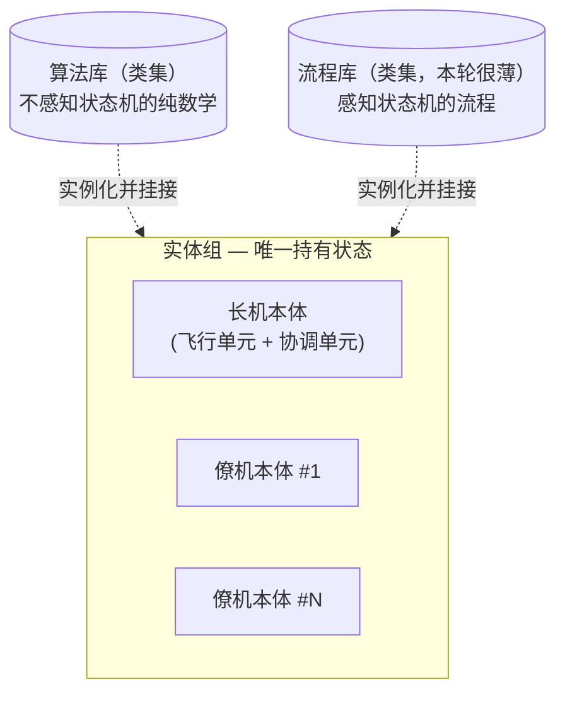
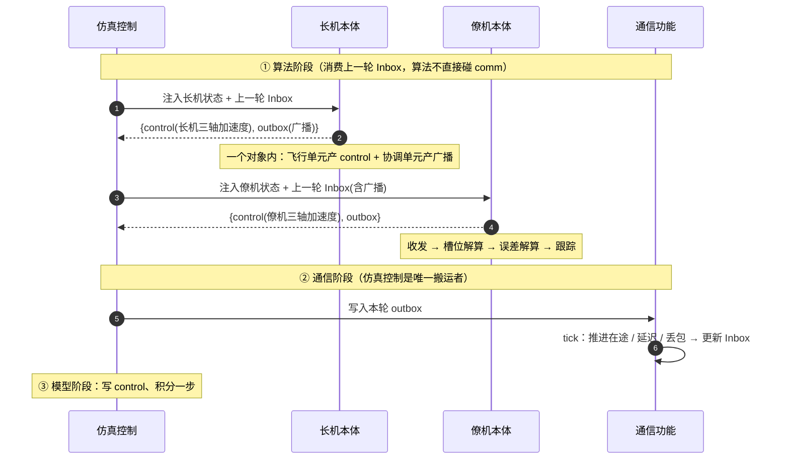

# 编队算法 HLD

> 本文是 **编队算法**（验证对象组，唯一被移植到 C）的 HLD（HLD+LLD 合一，逐步细化）。
> 编队算法取代了早期"协调算法 + 节点算法"两个控制对象——现为单一控制对象，协调能力按需以单元寄宿在某实体内或独立成不飞行实体（见 `0-架构HLD` 3.3）。
> 状态：**架构形态已收敛**；编排抽离、动态/静态数据管理、跨模块契约等见文末"待细化 / TODO"。

## 1. 本轮范围

实现一个最小可验证方案：**集中式任务编排 + 集中式通信 + 长机-僚机算法，仅做编队保持**（暂不做集结 / 重构全流程）。

- 锚定**领航-跟随**一种方法；架构要能向 `0-架构HLD` 3.3 的 5 种方法扩展，但本轮只落地这一种。
- 只有"保持"一个模态 → 运行期**动态管线重连本轮不建**，每个实体用一条固定串联。

## 2. 核心模型：实体组 + 算法库 + 流程库

验证对象算法不再按"协调算法 / 节点算法"两类划分，而是拆成 **一套实体组 + 两套公共库（类集合）**：



| 组成 | 是否持状态 | 职责 |
| --- | --- | --- |
| **实体组** | **是（唯一）** | 每个实体 = 一个对象，实例化并组合它需要的库类，持有这些子对象 = 持有全部维护数据。包含飞机本体；将来可有独立协调本体（如地面站） |
| **算法库** | 否（实例态在挂接处） | 一组**类**，提供**不感知状态机**的纯计算：PID、制导律、编队几何、航迹偏差、航线生成原语等 |
| **流程库** | 否（实例态在挂接处） | 一组**类**，提供**感知状态机**的流程：收发处理、任务状态机、航线推进、（将来）任务编排 / 执行 / 生成的模态分支 |

**两条不变式（很关键）：**

1. **可重入 = 实例化，不是无状态。** N 个僚机 = `Wingman` 类的 N 个实例，各持各的状态；库类的**定义就是那份共享代码**。真正禁止的是**全局 / 共享可变态**，而不是禁止状态。
2. **C 移植零损失。** Python 的一个算法对象 ≡ C 的 `struct + 接收 struct 指针的函数`。例：`PID(gains)` ≡ `pid_init(pid_t*, gains)`，`self.pid.step(e)` ≡ `pid_step(pid_t*, e)`。用类不是退步，正是 C 工厂模式的最简表达。

## 3. 关键决策与演进（为什么是这个模型）

| # | 决策 | 理由 |
| --- | --- | --- |
| 1 | **协调能力寄宿在长机实体内部**，不另起一个协调实例 | 长机物理上是一个实体（既飞又协调）。拆成两实例会让"长机自己的状态"被迫绕道仿真控制来回传（旧 B 的 ping-pong）。寄宿在同一对象内 → 自己的状态自己接线，无绕路 |
| 2 | **control 只从飞行实体产出**；协调单元只产 outbox | 协调是叠加在飞行实体上的几层能力，不单独飞 |
| 3 | **取消"协调算法 / 节点算法"二分**，统一为"实体 + 可寄宿的协调能力" | 二分把"功能角色"误当顶层单元。实体才是顶层单元；"协调"退化为某些单元是否挂接。这天然解释了 3.3.1"协调位置不固定（机载/地面站/虚拟节点）" |
| 4 | **库写成类、实体实例化挂接**，不手工做"数据 / 流程物理分离" | 可重入是"一个硬件平台仿真多个硬件平台"的**必要成本**，不是方案成本。用对象边界承担分离，语言替我们穿线，省掉全部手工外置状态 |

**实体边界 = 自由内部接线 ↔ 必须穿过带扰动 comm 的分界线：**
- 实体**内部**单元之间：直接接线、即时、无损（动态数据在实体自己手里流）。
- 实体**之间**：只能走 comm，吃延迟 / 丢包 / 断链。

旧 B 之所以绕，就是把"本该自由的实体内部数据"画到了 comm / 仿真控制这条外部线上。

## 4. 本轮装配（领航-跟随）

| 实体 | 挂接的单元（执行顺序） | 产出 |
| --- | --- | --- |
| **长机本体** | 飞行：`航线生成 → 误差解算 → 跟踪`；协调：`任务编排 → 队形规划 → 广播` | `control`（长机三轴加速度）+ `outbox`（广播） |
| **僚机本体 ×N** | `收发 → 槽位解算 → 误差解算 → 跟踪` | `control`（僚机三轴加速度） |

长机本体在**一个对象**内同时跑"飞自己"和"协调别人"两条流，共享自己的状态、直接接线，无绕路。

长机飞行流与僚机飞行流几乎同构，只差"产出待跟踪目标"的那一步：

```
长机：           航线生成(载入离线航线)   → 误差解算 → 跟踪 → control
僚机：收发 → 槽位解算(长机位+队形+槽位)   → 误差解算 → 跟踪 → control
                ↑ 都是"产出要跟的东西"，下游 解算/跟踪 完全一致
```

**任务编排 / 任务执行本轮内联，先不抽离：**

| 动作 | 本轮放哪 | 本轮形态 | 将来抽离的触发条件 |
| --- | --- | --- | --- |
| 任务编排（定模态） | 长机对象的方法 | 写死返回"保持"的常量方法 | 出现真实模态决策逻辑 |
| 任务执行（串联各单元） | 每个实体的 `step()` | 写死固定调用顺序 | 出现按模态换管线 / 异构僚机 |

> **僚机扩展与编排抽离正交**：N 个僚机靠**实例化**支持（`[Wingman(cfg_i) for cfg_i in configs]`），串联写死在 `step()` 里是**类级共享代码**，不写死个数。抽离编排买到的是"按模态换管线 / 异构僚机"，**不是数量扩展**。所以延后抽离不挡僚机扩展，且将来抽离是局部改动（搬 `step()` 接线 + 加执行单元）。

## 5. 单 tick 数据路径



> 长机广播**不直接写通信功能**：算法只把 outbox 交回仿真控制，由仿真控制写给 comm（搬运者模型）。
> 编队保持闭环**穿过 comm 且带一拍延迟**：僚机这 tick 用的是"上一轮写入、受延迟 / 丢包的长机状态"，非真值——这是要仿真的对象，控制律须容忍此滞后。

## 6. 两套库的内容

### 6.1 算法库（不感知状态机的纯数学 — 一目了然）

| 类别 | 内容 | 本轮 |
| --- | --- | --- |
| 控制 | PID（实例持积分 / 限幅态） | ✅ |
| 制导律 | 比例导引 / 视线制导 / 相对位置制导 | ✅（至少一种） |
| 编队几何 | 槽位 + 队形类型 + 长机位 → 期望点 | ✅ |
| 航迹偏差 | 侧偏 / 待飞距 / 航迹角偏差 / 曲率 | ✅ |
| 航线生成原语 | 航线插值；（未来）Dubins / 集结航线 / 避障航线 | 部分 |
| 通用数学 | 坐标变换、限幅、滤波；（未来）一致性律 | 按需 |

### 6.2 流程库（感知状态机的流程 — 本轮很薄）

我们原先设想的"6 层"大部分一落地就**塌进两边**：纯计算（槽位解算 / 误差解算 / 制导律）归算法库，串联接线归实体 `step()`。真正属于"流程"且本轮需要的只剩：

| 单元 | 本轮 | 说明 |
| --- | --- | --- |
| 收发处理 | ✅ | envelope 解析 / 打包，topic 与 payload schema 映射 |
| 任务状态机骨架 | ✅（占位） | 本轮恒"保持" |
| 航线推进 | ✅（长机） | 航点切换 / 待飞距驱动航段前进；僚机保持模态基本不用 |
| 任务编排 / 任务执行 / 生成流程的模态分支 | ⏸ TODO | 流程库的"含金量"几乎全在这里，正是延后的部分 |

> **结论**：本轮流程库薄到不必硬撑成正式库 = **算法库（完整）+ 实体（直接接线）+ 两三个薄流程 helper**。"流程库"作为会随模态长起来的东西，先留壳、记 TODO。

## 7. 已定原则与约束

| # | 原则 |
| --- | --- |
| 1 | 验证对象组无 I/O、不持引擎引用、消息驱动，便于移植 C |
| 2 | 单消息通道：任务分发产出与邻居消息一样走 comm；算法不直接碰 comm，由仿真控制读 outbox / 写 comm / 注入 Inbox（搬运者模型） |
| 3 | 消息 payload 由算法插件自声明；comm 只认通用 envelope，不懂语义 |
| 4 | 粒度归插件：本轮"槽位级"——coord 发槽位、僚机自算几何 |
| 5 | control 只从飞行实体出 |
| 6 | 可重入靠实例化（无全局共享态）；C 移植靠 对象↔结构体+函数 |
| 7 | 动态重连本轮不建；编排 / 执行内联，留干净边界待抽离 |

## 8. 待细化 / TODO

| 项 | 说明 | 触发 / 归属 |
| --- | --- | --- |
| 编排 / 执行抽离 | 内联在长机方法 / 实体 `step()`；将来抽成独立单元 | 出现模态决策 / 异构僚机时 |
| 动态数据管理（Q1 / Q2） | 单元间数据传递：显式传参 vs 共享上下文 | **与"编排抽离"连体**，一起做 |
| 静态数据管理（Q4） | 控制参数等 → 构造函数入参（用类后基本自然解决） | 细化时确认 |
| control 三轴加速度向量定义 | 与 `2-模型迭代` 共享，**不对齐没法真跑** | 跨模块，需与同事对齐 |
| coord→僚机 payload schema | `{任务, 长机状态, 队形类型, 槽位}` 字段级定义 | 细化 |
| 统一实体契约 | 与 `1-仿真控制HLD` §8.4 / §8.5 收敛为 `step(ctx) -> {control?, outbox, status}` | 跨模块 |
| 扩展性压测 | 加第二个待验证方案时回头检验弹性 | 第二方案进来时 |

## 9. 关联文档（含待修订项）

- `docs/0-架构HLD.md`：**待修订**——3.1 鲁棒图 / 3.4 高层分割中的"协调算法、节点算法两个 Control"应收敛为"算法实体 + 可寄宿的协调能力"；3.3.1 的"协调位置不固定"由实体模型天然解释。
- `docs/1-仿真控制HLD.md`：**待修订**——§8.4 / §8.5 两套接口收敛为一套统一实体契约。
- 早期的 `3-协调算法HLD.md` / `4-节点算法HLD.md` 已随两对象合并为本文删除。
- `src/algorithm/base.py`、`src/algorithm/coord/`、`src/algorithm/node/`。
</content>
