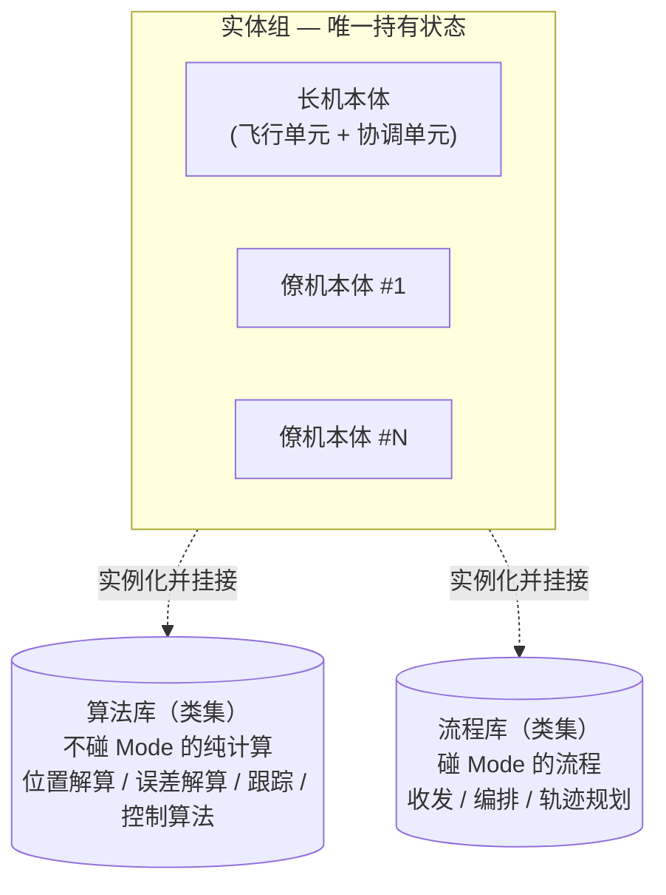
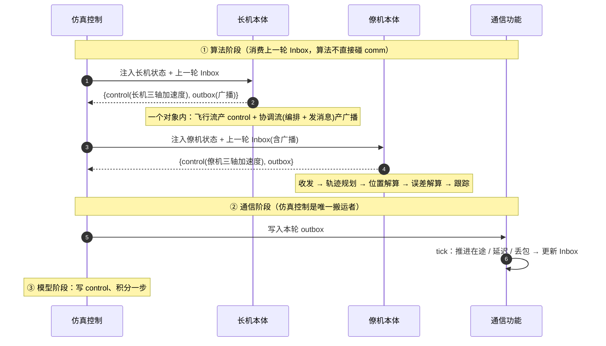

# 编队算法 HLD（架构设计）

> 编队算法属于**验证对象组**，是全平台**唯一被移植到 C** 的模块，也是单一控制对象（取代早期"协调算法 + 节点算法"二分，见 `../0-架构HLD.md` 3.3）。
> 因本模块体量大，按"一个独立子系统"来设计：**本册是模块架构（按 5 视图）**；接口契约见 `1-LLD综述.md`，实现见 `2-实体组LLD.md` / `3-算法库LLD.md` / `4-流程库LLD.md`，方案组合见 `5-用例-领航跟随保持.md`。

## 1. 定位与本轮范围

- **定位**：每架飞机本地一个飞行实体（×N）+ 可选非飞行协调实体（×0/1）；承载编队、跟踪、控制律。纯算法形态（无 I/O、不持引擎引用、消息驱动），便于移植到 C / 半物理。
- **本轮范围**：最小可验证方案——**集中式任务编排 + 集中式通信 + 长机-僚机算法，仅做编队保持**（暂不做集结 / 重构全流程）。
  - 锚定**领航-跟随**一种方法；架构要能向 `../0-架构HLD.md` 3.3 的 5 种方法扩展，但本轮只落地这一种。
  - 只有"保持"一个模态 → 运行期**动态管线重连本轮不建**，每个实体用一条固定串联。

## 2. 逻辑视图

验证对象算法拆成 **一套实体组 + 两套公共库（类集合）**：



| 组成 | 是否持状态 | 职责 |
| --- | --- | --- |
| **实体组** | **是（唯一）** | 每个实体 = 一个对象，实例化并组合它需要的库类，持有这些子对象 = 持有全部维护数据。含飞机本体；将来可有独立协调本体（如地面站） |
| **算法库** | 否（实例态在挂接处） | 一组**类**，提供**不碰 `Mode` 的纯计算**；被流程在外部按 Mode 选/切，自身不感知状态机 |
| **流程库** | 否（实例态在挂接处） | 一组**类**，提供**碰 `Mode` 的流程**：产 / 用 / 切模态，决定"做什么、选哪个"，把活派给算法 |

**算法组 / 流程组大致功能：**

| 算法组（不碰 Mode、可换策略族） | 作用 |
| --- | --- |
| 位置解算 | `航段` / `队形指令`(+主机运动状态) → 待跟踪 `目标指令`（实现：航线插值 / 槽位几何） |
| 误差解算 | `(目标指令, 本体运动状态)` → `三轴误差`（三轴位置误差 + 速度误差） |
| 轨迹 / 编队跟踪 | `三轴误差` → 期望加速度；按通道**组合**控制算法（如垂向 TECS、横侧 PID） |
| 控制算法 | PID / L1 / ADRC 等**原子**控制律，被跟踪组合调用 |
| 通用数学 | 坐标变换、限幅、滤波（工具函数，非 `step` 单元，不受策略族原则约束） |

| 流程组（碰 Mode、可换策略族） | 作用（含可换实现） |
| --- | --- |
| 收发处理 | envelope 收（解析 → 写黑板：`主机运动状态 / 编队模式 / 队形指令`）/ 发（长机：组装 `长机运动状态 + 编队模式 + 队形指令` → 广播 envelope）（实现：领航-跟随收 / 发、点对点、不发…） |
| 任务编排 | 定模态 → `Mode`（实现：常量"保持" / 真实模态状态机；本轮占位恒"保持"） |
| 轨迹规划 | mode-aware：长机航线推进、僚机空规划（预埋）→ `航段`（交给位置解算） |

> **"实体组唯一持状态"的准确含义 = 无全局 / 类级可变态**：库单元自身的实例态（PID 积分等）放各自 `self`，但这些单元对象的所有权随挂接处的实体走，故仍归"实体持有"。不变式是"没有跨实例共享的可变态"，不是"单元无状态"。

**关键决策（为什么是这个模型）：**

| # | 决策 | 理由 |
| --- | --- | --- |
| 1 | **协调能力寄宿在长机实体内部**，不另起协调实例 | 长机物理上是一个实体（既飞又协调）。拆两实例会让"长机自己的状态"绕道仿真控制来回传。寄宿同一对象内 → 自己的状态自己接线，无绕路 |
| 2 | **control 只从飞行实体产出**；协调单元只产 outbox | 协调是叠加在飞行实体上的几个单元，不单独飞 |
| 3 | **取消"协调 / 节点"二分**，统一为"实体 + 可寄宿的协调能力" | 实体才是顶层单元；"协调"退化为某些单元是否挂接，天然解释 3.3.1"协调位置不固定" |
| 4 | **库写成类、实体实例化挂接** | 用对象边界承担"数据/流程分离"，语言替我们穿线，省掉手工外置状态 |

**实体边界 = 自由内部接线 ↔ 必须穿过带扰动 comm 的分界线：**
- 实体**内部**单元之间：直接接线、即时、无损；
- 实体**之间**：只能走 comm，吃延迟 / 丢包 / 断链。

## 3. 开发视图

模块映射到 `src/algorithm/` 包（**当前为旧 `coord/` `node/` 结构，待重构**）：

```
src/algorithm/
├── entities/    # 实体组：飞机本体 / 协调本体（唯一持状态）   —— 见 2-实体组LLD
├── algo_lib/    # 算法库：位置解算 / 误差解算 / 跟踪 / 控制算法  —— 见 3-算法库LLD
├── flow_lib/    # 流程库：收发 / 编排 / 轨迹规划               —— 见 4-流程库LLD
└── base.py      # 算法基类（旧 declare_message_schema 待重构，见原则 3）
```

本模块设计文档体系（一个独立子系统）：

| 文档 | 负责 |
| --- | --- |
| `0-HLD`（本册） | 模块架构（5 视图） |
| `1-LLD综述` | 三个 LLD 的接口契约 + 统一数据契约 + TODO 总表 |
| `2-实体组LLD` / `3-算法库LLD` / `4-流程库LLD` | 三模块各自的实现方法 |
| `5-用例-领航跟随保持` | 本场景如何组合三模块 |

## 4. 运行视图

**单 tick 数据路径**（搬运者模型：算法只收注入、只返回输出，不直接碰 model/comm）：



**实体内逐步调用（流程 F / 算法 A，本轮领航-跟随）：**

僚机本体一拍（黑板读 → 写；僚机无任务编排 / 发消息）：

| 步 | 单元 | 库 | 读黑板 → 写黑板 |
| --- | --- | --- | --- |
| 1 | 收消息(`Inbound`) | F | `inbox` → `主机运动状态, 编队模式, 队形指令` |
| 2 | 轨迹规划(空规划·预埋) | F | `编队模式, 上一拍航段, 本体运动状态, 上一拍待飞距` → `航段`（本场景空） |
| 3 | 位置解算(槽位几何) | A | `队形指令, 主机运动状态`（+init 飞机ID/队形信息）→ `目标指令` |
| 4 | 误差解算 | A | `目标指令, 本体运动状态` → `三轴误差` |
| 5 | 跟踪 | A | `三轴误差` → `三轴加速度`（=control；内部调控制算法） |

长机本体一拍（飞行流 + 协调流，同一对象；黑板读 → 写）：

| 步 | 单元 | 库 | 读黑板 → 写黑板 |
| --- | --- | --- | --- |
| 1 | 任务编排 | F | `遥控指令(=mission_command), 上一拍编队模式` → `编队模式, 队形指令` |
| 2 | 轨迹规划(**航线推进**) | F | `编队模式, 上一拍航段, 本体运动状态, 上一拍待飞距` → `航段`（航点切换 / 待飞距驱动） |
| 3 | 位置解算(**航线插值**) | A | `航段, 本体运动状态` → `目标指令, 待飞距` |
| 4 | 误差解算 | A | `目标指令, 本体运动状态` → `三轴误差` |
| 5 | 跟踪 | A | `三轴误差` → `三轴加速度`（=control） |
| 6 | 发消息(`Outbound`) | F | `队形指令, 主机运动状态, 编队模式`（+init 网络拓扑）→ 广播 `outbox` |

> 各单元经**黑板**按写死的固定拓扑序串联（动态管线重连本轮不建），不单列"执行"环节。长僚机 4–5 步同构（误差 / 跟踪一致），差在第 1–3 步"产 `目标指令`"的来源（航线插值 vs 槽位几何）；僚机另少 `任务编排`（模态由收消息出）与 `发消息`。`待飞距` 是反馈槽（位置解算写、下一拍轨迹规划读，见 `1-LLD综述.md` §2.3）。

- **闭环穿过 comm 且带一拍延迟**：僚机这 tick 用的是"上一轮写入、受延迟 / 丢包的长机状态"，非真值——这是要仿真的对象，控制律须容忍此滞后。
- **调度（对齐 `../1-仿真控制HLD.md` §7）**：本轮整个编队算法是**单一 20 Hz 调度块**，所有实体在同一拍统一触发；长机协调流与飞行流在**同一 `step` 内同拍**产出。协调若需更低频广播，按"实体内对协调单元 K 抽帧"实现（本轮恒同拍，**留 TODO**）。真·多速率（按单元独立节拍 / 抽帧）留到半物理阶段，本轮契约的单一 `dt_s` 不承载。
- **实体内执行**：`step()` 内按**固定拓扑序**调用各单元；单元经 **per-entity 黑板 + 类型化指针视图**读写数据（u/y 在 `init` 绑定到黑板槽，非每拍组装），本轮单模态、单条固定 DAG，详见 `1-LLD综述.md` §2.0/§2.3、`2-实体组LLD.md`。

## 5. 数据视图

数据按"是否穿过 comm"分两类：

| 类别 | 流向 | 性质 |
| --- | --- | --- |
| 实体内 | 单元 ↔ 单元（同对象 **per-entity 黑板**读写，类型化指针视图） | 即时、无损、不经仿真控制 |
| 实体间 | 实体 ↔ 实体（经 comm 的 `MessageEnvelope`） | 受 QoS + 扰动（延迟 / 丢包 / 断链） |

- **注入算法的状态**：`NavState`（由仿真控制从 `../2-模型迭代HLD.md` 的 `AircraftState` 投影出的导航视图，不含模型内回路量；噪声 / 漂移叠加在此层。字段级定义见 `../2-1-三自由度模型LLD.md`）。
- **算法产出**：`control = AccelerationCommand`（ENU 三轴期望加速度，对齐 2-）+ `outbox`（消息）+ `status`。
- **持有**：实体持有全部维护数据——**per-entity 黑板**（过程中间量）+ 各子单元 `self`（内部状态）；库类无全局可变态，可重入靠实例化（黑板与视图均 per-instance）。
- 字段级定义见 `1-LLD综述.md` §1.2（数据契约）。

## 6. 物理视图

本模块在 python 仿真中**单进程内多实体实例**，无物理部署边界。半物理阶段，各实体落位为对应机箱上的任务/线程（飞控任务 = 飞行实体；协调任务 = 协调能力），与机载软件同构——届时再展开，本册不涉及。

## 7. 已定原则与约束

| # | 原则 |
| --- | --- |
| 1 | 验证对象组无 I/O、不持引擎引用、消息驱动，便于移植 C |
| 2 | 单消息通道：算法不直接碰 comm，由仿真控制读 outbox / 写 comm / 注入 Inbox（搬运者模型） |
| 3 | 消息 payload 由算法插件自声明；comm 只认通用 envelope，不懂语义。**本轮无独立 schema 注册 API**（已撤 `declared_topics()`）：payload 由配对的收 / 发插件各自约定并拥有，comm 不消费 schema；需要注册时再补边界 |
| 4 | 粒度归插件：本轮"飞机 id 级"——长机发队形类型 + 长机态，僚机用静态 `队形信息` 按 `飞机ID` 自算几何（不发 `slot_assignment`） |
| 5 | control 只从飞行实体出 |
| 6 | 可重入靠实例化（无全局共享态）；C 移植靠 对象 ↔ 结构体 + 函数 |
| 7 | 动态重连本轮不建；编排占位、串联内联（`step()` 固定顺序），留干净边界待抽离 |
| 8 | **实体内数据流 = per-entity 黑板 + 类型化指针视图**（4 层，见 `1-LLD综述.md` §2.0）：单元 In/Out 是指向黑板槽的指针、`init` 一次绑定，`step(self)` 经视图读写，实体不每拍拼装数据。固定拓扑序 + 反馈槽"先读后写 / 本轮不双缓冲"（双缓冲待动态管线重连）；每槽单写者 |
| 9 | **算法 / 流程分界 = 是否碰 `Mode`**：流程产 / 用 / 切模态（编排 / 规划 / 收发），算法是不读状态机的纯计算（位置解算 / 误差解算 / 跟踪 / 控制算法）。**"模态相关的用法" ≠ "需要感知状态"**——选哪个策略、何时切由外部流程负责，被选策略本身保持纯算法 |
| 10 | **每个提炼出的单元都是一个策略族**（抽象基类 + 多实现）：情景差异靠**族内换实现**、非散落 `if/else`；**挂接 = 实体为每个族选定一个实现并绑定其 In/Out 到黑板**（`init`）。族按"**共性父类 / 差异子类、输入下沉 / 输出族级**"组织——输入各 impl 私有（只声明它读的槽、不为同族拉齐），输出共性留父类（下游必读槽留父类、焊死 swap 安全）；族由"统一 `step(self)` + 输出槽契约"统一（≈ 同 `y`）。通用数学等工具函数不在此列；`ControlLaw` 被 `Tracking` 组合调用、由其间接选 |

## 8. 关联

- 系统架构：`../0-架构HLD.md`（3.3 编队方法映射、3.4 高层分割）
- 对接：`../1-仿真控制HLD.md` §8.4（统一实体契约）、`../2-模型迭代HLD.md`（`AircraftState` / `AccelerationCommand` 概述）、`../2-1-三自由度模型LLD.md`（字段级定义）
- 跨文档 TODO 总表见 `1-LLD综述.md`。
