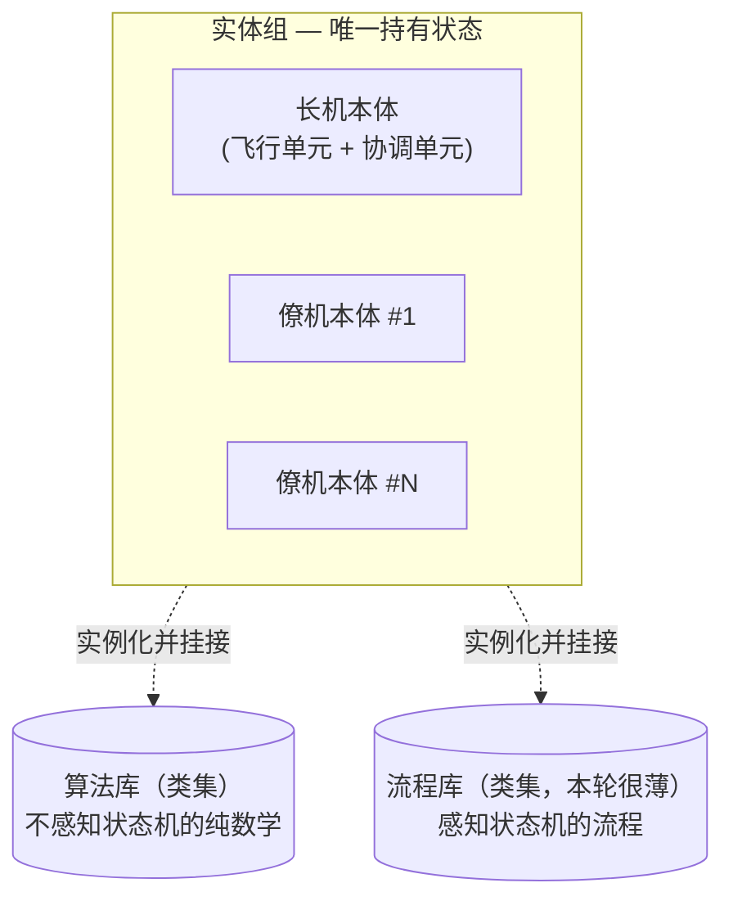
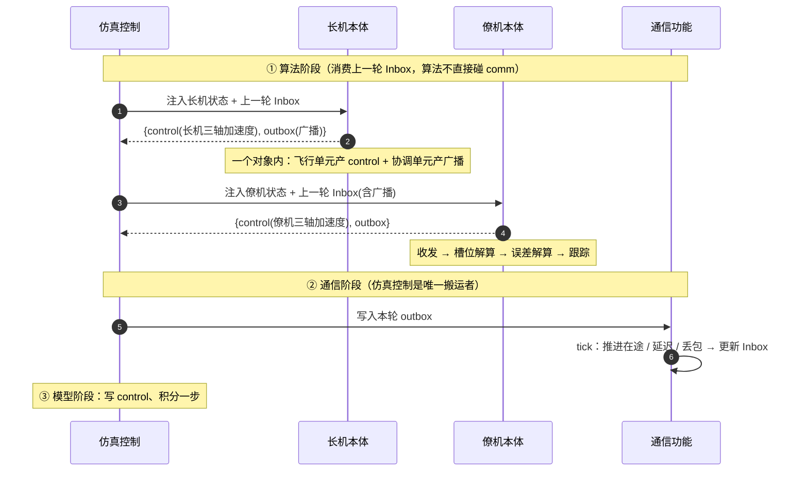

# 编队算法 HLD（架构设计）

> 编队算法属于**验证对象组**，是全平台**唯一被移植到 C** 的模块，也是单一控制对象（取代早期"协调算法 + 节点算法"二分，见 `../0-架构HLD.md` 3.3）。
> 因本模块体量大，按"一个独立子系统"来设计：**本册是模块架构（按 5 视图）**；接口契约见 `1-LLD综述.md`，实现见 `2-实体组LLD.md` / `3-算法库LLD.md` / `4-流程库LLD.md`，方案组合见 `5-用例-领航跟随保持.md`。

## 1. 定位与本轮范围

- **定位**：每架飞机本地一个飞行实体（×N）+ 可选非飞行协调实体（×0/1）；承载编队、制导、控制律。纯算法形态（无 I/O、不持引擎引用、消息驱动），便于移植到 C / 半物理。
- **本轮范围**：最小可验证方案——**集中式任务编排 + 集中式通信 + 长机-僚机算法，仅做编队保持**（暂不做集结 / 重构全流程）。
  - 锚定**领航-跟随**一种方法；架构要能向 `../0-架构HLD.md` 3.3 的 5 种方法扩展，但本轮只落地这一种。
  - 只有"保持"一个模态 → 运行期**动态管线重连本轮不建**，每个实体用一条固定串联。

## 2. 逻辑视图

验证对象算法拆成 **一套实体组 + 两套公共库（类集合）**：



| 组成 | 是否持状态 | 职责 |
| --- | --- | --- |
| **实体组** | **是（唯一）** | 每个实体 = 一个对象，实例化并组合它需要的库类，持有这些子对象 = 持有全部维护数据。含飞机本体；将来可有独立协调本体（如地面站） |
| **算法库** | 否（实例态在挂接处） | 一组**类**，提供**不感知状态机**的纯计算：PID、制导律、编队几何、航迹偏差、航线生成原语等 |
| **流程库** | 否（实例态在挂接处） | 一组**类**，提供**感知状态机**的流程：收发处理、任务状态机、航线推进、（将来）任务编排 / 执行 / 生成的模态分支 |

**关键决策（为什么是这个模型）：**

| # | 决策 | 理由 |
| --- | --- | --- |
| 1 | **协调能力寄宿在长机实体内部**，不另起协调实例 | 长机物理上是一个实体（既飞又协调）。拆两实例会让"长机自己的状态"绕道仿真控制来回传。寄宿同一对象内 → 自己的状态自己接线，无绕路 |
| 2 | **control 只从飞行实体产出**；协调单元只产 outbox | 协调是叠加在飞行实体上的几个单元，不单独飞 |
| 3 | **取消"协调 / 节点"二分**，统一为"实体 + 可寄宿的协调能力" | 实体才是顶层单元；"协调"退化为某些单元是否挂接，天然解释 3.3.1"协调位置不固定" |
| 4 | **库写成类、实体实例化挂接** | 用对象边界承担"数据/流程分离"，语言替我们穿线，省掉手工外置状态 |

**实体边界 = 自由内部接线 ↔ 必须穿过带扰动 comm 的分界线：**
- 实体**内部**单元之间：直接接线、即时、无损；
- 实体**之间**：只能走 comm，吃延迟 / 丢包 / 断链。

## 3. 开发视图

模块映射到 `src/algorithm/` 包（**当前为旧 `coord/` `node/` 结构，待重构**）：

```
src/algorithm/
├── entities/    # 实体组：飞机本体 / 协调本体（唯一持状态）   —— 见 2-实体组LLD
├── algo_lib/    # 算法库：PID / 制导 / 几何 / 误差 / 航线…     —— 见 3-算法库LLD
├── flow_lib/    # 流程库：收发 / 状态机 / 航线推进…            —— 见 4-流程库LLD
└── base.py      # 算法基类 + 消息 schema 声明 API
```

本模块设计文档体系（一个独立子系统）：

| 文档 | 负责 |
| --- | --- |
| `0-HLD`（本册） | 模块架构（5 视图） |
| `1-LLD综述` | 三个 LLD 的接口契约 + 统一数据契约 + TODO 总表 |
| `2-实体组LLD` / `3-算法库LLD` / `4-流程库LLD` | 三模块各自的实现方法 |
| `5-用例-领航跟随保持` | 本场景如何组合三模块 |

## 4. 运行视图

**单 tick 数据路径**（搬运者模型：算法只收注入、只返回输出，不直接碰 model/comm）：



- **闭环穿过 comm 且带一拍延迟**：僚机这 tick 用的是"上一轮写入、受延迟 / 丢包的长机状态"，非真值——这是要仿真的对象，控制律须容忍此滞后。
- **多速率**（节拍互相独立，由仿真控制调度，见 `../1-仿真控制HLD.md` §7）：协调单元（可选）1–10 Hz、飞行单元 50–200 Hz。
- **实体内执行**：`step()` 内按固定顺序**显式链式**调用各单元（本轮单模态，不引入共享黑板），详见 `2-实体组LLD.md`。

## 5. 数据视图

数据按"是否穿过 comm"分两类：

| 类别 | 流向 | 性质 |
| --- | --- | --- |
| 实体内 | 单元 ↔ 单元（同对象 `step` 内显式传参） | 即时、无损、不经仿真控制 |
| 实体间 | 实体 ↔ 实体（经 comm 的 `MessageEnvelope`） | 受 QoS + 扰动（延迟 / 丢包 / 断链） |

- **注入算法的状态**：`NavState`（由仿真控制从 `../2-模型迭代.md` 的 `AircraftState` 投影出的导航视图，不含模型内回路量；噪声 / 漂移叠加在此层）。
- **算法产出**：`control = AccelerationCommand`（ENU 三轴期望加速度，对齐 2-）+ `outbox`（消息）+ `status`。
- **持有**：实体持有全部维护数据（其子单元对象的 self），库类无全局可变态。
- 字段级定义见 `1-LLD综述.md` §（数据契约）。

## 6. 物理视图

本模块在 python 仿真中**单进程内多实体实例**，无物理部署边界。半物理阶段，各实体落位为对应机箱上的任务/线程（飞控任务 = 飞行实体；协调任务 = 协调能力），与机载软件同构——届时再展开，本册不涉及。

## 7. 已定原则与约束

| # | 原则 |
| --- | --- |
| 1 | 验证对象组无 I/O、不持引擎引用、消息驱动，便于移植 C |
| 2 | 单消息通道：算法不直接碰 comm，由仿真控制读 outbox / 写 comm / 注入 Inbox（搬运者模型） |
| 3 | 消息 payload 由算法插件自声明；comm 只认通用 envelope，不懂语义 |
| 4 | 粒度归插件：本轮"槽位级"——coord 发槽位、僚机自算几何 |
| 5 | control 只从飞行实体出 |
| 6 | 可重入靠实例化（无全局共享态）；C 移植靠 对象 ↔ 结构体 + 函数 |
| 7 | 动态重连本轮不建；编排 / 执行内联，留干净边界待抽离 |
| 8 | 实体内单元间显式传参（链式），不引入共享黑板；黑板待动态重连出现再评估 |

## 8. 关联

- 系统架构：`../0-架构HLD.md`（3.3 编队方法映射、3.4 高层分割）
- 对接：`../1-仿真控制HLD.md` §8.4（统一实体契约）、`../2-模型迭代HLD.md`（`AircraftState` / `AccelerationCommand`）
- 跨文档 TODO 总表见 `1-LLD综述.md`。
</content>
