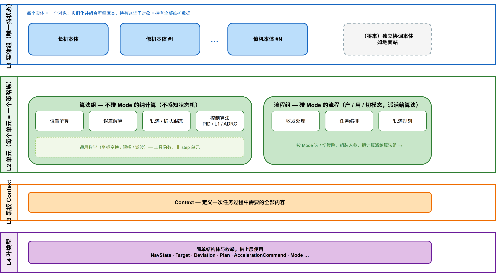
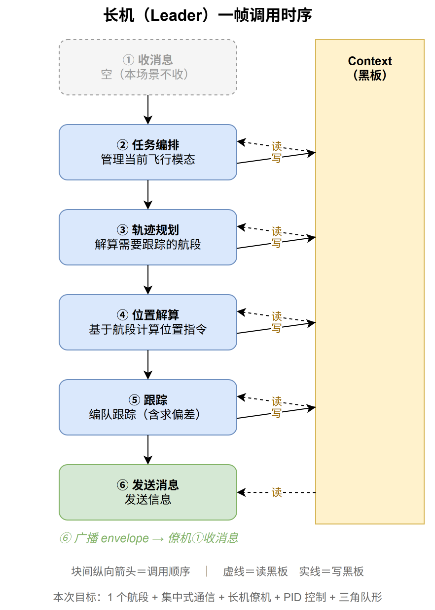
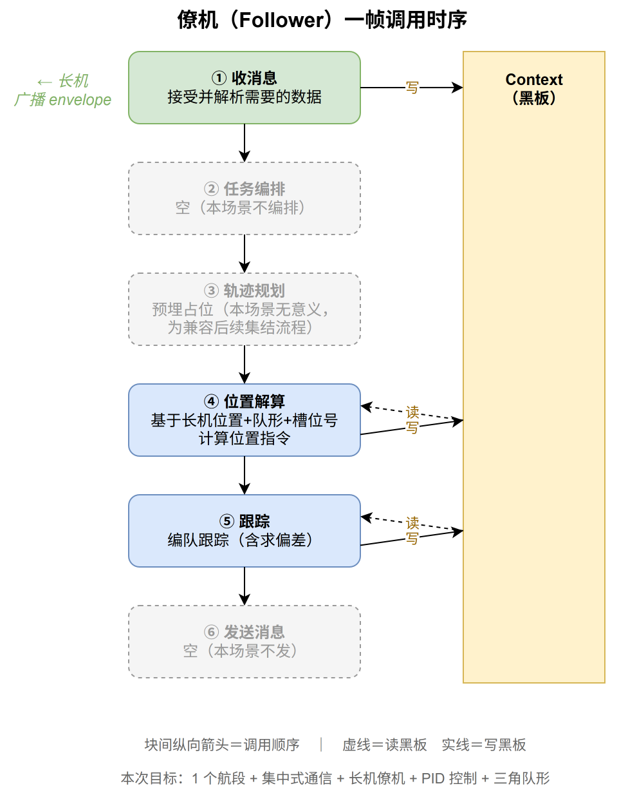
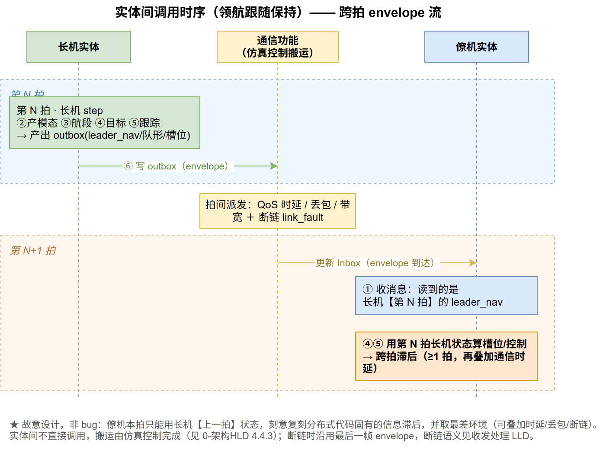

# 编队算法 HLD（架构设计）

> 编队算法属于**验证对象组**，是全平台**唯一被移植到 C** 的模块，也是单一控制对象
> 因本模块体量大，按"一个独立子系统"来设计：**本册是模块架构（按 5 视图）**；接口/实现见 `1-Context和叶类型.md`、`2-算法组.md`、`3-流程组.md`、`4-对象组.md`（规范见 `2-4模板说明.md`），方案组合见 `5-用例-领航跟随保持.md`。

## 1. 定位与范围

- **定位**：每架飞机本地一个飞行实体（×N）+ 可选非飞行协调实体（×0/1）；承载编队、跟踪、控制律。纯算法形态（无 I/O、不持引擎引用、消息驱动），便于移植到 C / 半物理；
- **范围**：本册定义编队算法的分层结构、数据流、实体组合方式和依赖边界。LLD 面向领航跟随保持场景，并为其它编队方法保留可替换的策略族接口。

## 2. 逻辑视图

### 2.1 系统架构图

主要将架构分为4层：

* L1实体：只有对象组，每个实体 = 一个对象，实例化并组合它需要的库类，持有这些子对象 = 持有全部维护数据。含飞机本体；将来可有独立协调本体（如地面站）
* L2单元：包含算法组和流程组
  * 算法组：一组**类**，提供**不碰 `Mode` 的纯计算**；被流程在外部按 Mode 选/切，自身不感知状态机；
  * 流程组：一组**类**，提供**碰 `Mode` 的流程**：产 / 用 / 切模态，决定"做什么、选哪个"，把活派给算法
* L3黑板（`Context`）：用于定义一次任务过程中需要的所有内容，由对象组中的对象进行实例化
* L4 叶类型：定义一些简单的结构体和枚举，供上层使用




> 图源：[系统架构图.drawio](./系统架构图.drawio)

* 几个关键原则：
  * 算法组和流程组的区别在于，流程组需要感知状态信息（比如编队指令/状态），而算法组不需要感知这些信息；
  * 所有算法/流程单位（除了通用数学）都使用策略模式，也就是说一个算法/流程单位就是一个算法/流程族，使用者（对象组的各个对象）不关注算法/流程的具体实现，仅选择需要的算法/流程并传递需要的输入和输出即可；
  * 算法/流程单位都是类，由对象组中的实体实例化并持有运行期状态；
  * 数据交换采用黑板模式 + 端口绑定，具体规则见第 3 章。

### 2.2 对象组

**除对象组自身外，其余所有库单元（算法组、流程组、Context）的实例化均由对象实体完成，并由该实体持有**——实体即"持有全部维护数据"的唯一所有者，库单元不自行创建、也不互相持有。

### 2.3 算法组

* 包含功能如下：

| 算法组（不碰 Mode、可换策略族） | 作用 |
| --- | --- |
| 位置解算 | 解算需要跟踪的目标位置信息 |
| 轨迹 / 编队跟踪 | 根据目标与当前状态算出三轴加速度（内部完成求偏差与坐标变换） |
| 控制算法 | PID / L1 / ADRC 等**原子**控制律，被跟踪组合调用 |
| 通用数学 | 坐标变换、限幅、滤波（工具函数，非 `step` 单元，不受策略族原则约束） |

### 2.4 流程组

* 包含功能如下：

| 流程组（碰 Mode、可换策略族） | 作用 |
| --- | --- |
| 收发处理 | 完成本实体与其他实体的数据收发接管、数据拼装和数据解析 |
| 任务编排 | 根据提前加载的任务 与 当前的飞行状态，制定下一步的飞行计划，主要有集结、编队保持、编队重构等动作 |
| 轨迹规划 | 根据飞行计划和当前的飞行状态，制定需要飞行的轨迹 |

### 2.5 Context和叶类型

这些比较简单，不需要做HLD设计，具体参考《1-Context和叶类型.md》

### 2.6 通用接口设计

* 接口定义
  * L1接口设计为：`init(self, cfg: XXXInitS)`、`step(self, u: XXXInputS, y: XXXOutputS)`、`reset(self)`、`close(self)`；其中 `y` 由 `step` 原地写出（无返回值）；
  * L2接口设计为：`init(self, cfg: XXXInitS)`、`step(self, u: XXXInputS, y: XXXOutputS)`、`reset(self)`；（L2 不持有/实例化子单元，故无需 `close`）
* 命名，XXX为单元名，因此涉及到的结构体为XXXInitS、XXXInputS和XXXOutputS；各个模块的XXX命名如下：
  * 对象组：Entity
  * 收发处理：收Inbound、发Outbound
  * 任务编排：FormationTask
  * 轨迹规划：TraPlan
  * 位置解算：PosCalc
  * 轨迹/编队跟踪：PosTrack
  * 控制算法：Ctrl
  * 通用数学：FormationMath
  * 上下文：Context
  * 叶类型，都是一堆结构体和枚举，没有必要定义对象

## 3 数据视图

### 3.1 黑板+端口绑定设计

编队算法采用黑板模式 + 端口绑定组织数据流。各算法单元和流程单元通过策略模式屏蔽具体实现，通过 `XXXInputS` / `XXXOutputS` 显式声明端口；对象组在实体初始化阶段把端口绑定到 `Context` 的叶类型对象。实体负责组合和调度，单元只通过端口读写，不直接感知黑板根对象，也不在单元之间直接传参。

### 3.2 黑板+端口绑定方案

沿用 2.1 的四层划分，从**数据**视角看各层职责：

| 层 | 角色 | 职责 |
| --- | --- | --- |
| L4 叶类型 | 数据零件 | 定义最小结构体/枚举（如 `NodeS`、`LineS`） |
| L3 黑板 `Context` | 数据中枢 | 把一次任务所需的全部叶类型组装成**一个大对象**，是唯一的真实数据存储 |
| L2 单元 | 计算 | 各自声明 `Input`/`Output`，其字段是指向黑板子对象的**引用（端口）**；`step` 只经端口读写，不知黑板存在 |
| L1 实体 | 装配 | 实例化黑板与各单元的 I/O，并把每个端口**绑定**到黑板内部对应的子对象 |

核心机制：所有单元的 `step` 实际操作的都是**同一个黑板对象**，无需任何人在单元之间搬运 / 拼接数据。

C 里靠「结构体指针指向黑板成员」实现绑定；Python 没有裸指针，但**对象赋值即共享引用**，天然等价——只要被绑定的端口是**可变对象**（叶类型实例），多个单元的 I/O 引用同一个对象，对其字段的修改即对所有人可见。

> 注意：端口绑定的最小粒度是「叶类型对象」，不能是裸 `float` / `int`。因为 Python 的数值不可变，`u.x = cxt.x` 之后再 `u.x = 1.0` 只会让 `u.x` 改指向、断开与黑板的联系。这与 C 里绑定 `NodeS *`（而非 `float *`）一致。

示例（对应 txt 的四层）：

```python
from dataclasses import dataclass, field

# L4 叶类型：数据零件
@dataclass
class NodeS:
    x: float = 0.0
    y: float = 0.0
    z: float = 0.0

@dataclass
class LineS:
    a: float = 0.0
    b: float = 0.0
    c: float = 0.0

# L3 黑板：把所有叶类型组装为一个大对象（唯一真实存储）
@dataclass
class ContextS:
    node: NodeS = field(default_factory=NodeS)
    line: LineS = field(default_factory=LineS)

# L2 单元：Input/Output 字段是「端口」，运行期绑定到黑板子对象
@dataclass
class XxxInputS:
    node: NodeS = None      # 端口：将绑定到 Context.node

@dataclass
class XxxOutputS:
    line: LineS = None      # 端口：将绑定到 Context.line

class Xxx:
    def step(self, u: XxxInputS, y: XxxOutputS) -> None:
        # 只经端口读写，单元不感知黑板
        y.line.a = u.node.x

# L1 实体：实例化 + 端口绑定
class Entity:
    def init(self) -> None:
        self.cxt = ContextS()               # 1) 实例化黑板
        self.xxx = Xxx()                    # 2) 实例化单元及其 I/O
        self.xxx_u = XxxInputS()
        self.xxx_y = XxxOutputS()
        # 3) 端口绑定：把单元 I/O 引用到黑板内部子对象
        self.xxx_u.node = self.cxt.node
        self.xxx_y.line = self.cxt.line

    def step(self) -> None:
        self.xxx.step(self.xxx_u, self.xxx_y)   # 实际读写的就是 cxt 的内存
```

每次 `Entity.step()`，单元读写的都是同一个 `cxt`，由此带来四点好处：

1. **扩展隔离**：要给单元增减输入/输出，只要黑板里有对应数据，扩展 `XxxInputS` / `XxxOutputS` 并在 `init` 里加一行绑定即可，已实现的差异算法（策略族其他成员）不感知；
2. **免拼接**：实体只做绑定，不在单元之间搬运数据；
3. **数据流可见**：从各单元 I/O 的端口声明即可一眼看清数据走向，便于实体编排；
4. **抑制 I/O 结构体膨胀**：抽象层的 `Input` / `Output` 只暴露公共必要字段，与具体算法强相关的中间量下沉到子算法自己的 `self`，避免个别算法把公共 I/O 结构体撑大。

### 3.3 Context 边界与配置归属

3.2 说明了数据如何在单元间流动，本节规定哪些数据放入 `Context`，哪些不放：

* **进入 Context 的条件**：只有需要**跨拍保留**或**被多个单元读写**的工作状态才放入 `Context`，例如 `cmd/state`、`wayLine`、各 `MotionProfS`、`selfAccCmd`。两个条件满足其一即可。
* **边界 I/O 不放入 Context**：只被单个单元使用的外部输入（`inbox` 收到的 `list[MessageEnvelope]`、`remote` 遥控指令）和外部输出（`outbox` 待发的 `list[MessageEnvelope]`），由对象组在边界持有。收到的 envelope 解析后，只将其中的数据写入 `Context`（长机运动状态写入 `leaderState`，模态与队形写入 `cmd`），envelope 本身不保留。（`MessageEnvelope` 由通信模块定义，见《5-1-通信功能LLD.md》§4.1）
* **配置不放入 Context**：初始化配置（`FormCommInitS` 网络拓扑与队形几何、`FormSelfInitS` 机 ID、`RouteS` 航线）由对象组在 `init` 时持有，并注入各单元的 `self`。
* **单枚举/标量作端口需包装**：见 3.2 注，端口只能绑定可变的叶类型对象。因此 `remote` 这类单个枚举需包成结构体（`RemoteCmdS{ FormStageE stage; }`）由对象组持有；实体每拍更新其字段，而非重新赋值整个对象。

## 4 运行视图

### 4.1 单实体调用时序（领航跟随保持）

本节从**运行期**视角描述：一帧 `step` 内，实体如何按固定顺序串行调用各流程/算法单元，以及每个单元如何经黑板读写数据（数据如何组织见第 3 章）。单元之间不直接传参，全部通过黑板 `Context` 交换。

领航跟随保持场景包含 1 个航段、集中式通信、长机僚机、PID 控制和三角队形。长机与僚机复用同一套单元，但因角色不同，调用链不同：

* **长机**：自身产模态、推进航线 → 算目标 → 跟踪 → **广播** envelope；不收消息；
* **僚机**：先**收**长机广播并解析 → 执行空轨迹规划单元 → 基于长机位置+队形+槽位号算目标 → 跟踪；不发消息。

两机唯一的耦合点是长机末步广播的 `list[MessageEnvelope]` 喂入僚机首步的收消息；位置解算与跟踪两步两机同构，仅位置解算的输入来源不同（跟踪已并入求偏差）。

图中：块间纵向箭头表示一帧内的**调用顺序**；每个有效步骤对右侧 `Context` 黑板各有一组**读（虚线）/ 写（实线）**箭头，体现单元只与黑板交互、彼此不直接传参（长机末步发送仅读黑板、僚机首步收消息仅写黑板）；灰色虚线块表示该场景下不读写黑板的空步骤。

| 长机时序 | 僚机时序 |
| --- | --- |
|  |  |

> 图源：[长机调用时序.drawio](./长机调用时序.drawio) ／ [僚机调用时序.drawio](./僚机调用时序.drawio)

### 4.2 实体间调用时序（领航跟随保持）

实体之间**不直接调用**：长机产出的 `outbox` 经通信功能（由仿真控制统一搬运）派发，更新僚机的 `Inbox`，平台级搬运机制见 `0-架构HLD.md` 4.4.3，本节不再重复。本节只补 4.4.3 抽象掉、而本册必须显式承认的一件事——**跨拍 envelope 流**：

* 长机在**第 N 拍** `step` 产出 `outbox`（`leader_nav` + 队形 + 槽位）；
* 通信在**拍间**派发（受 QoS 时延/丢包/带宽与断链 `link_fault` 影响）；
* 僚机要到**第 N+1 拍**才在 `Inbox` 读到，且读到的是长机**上一拍**的状态。

也就是说，僚机本拍始终基于长机「上一拍（再叠加通信时延）」的状态算槽位与控制，存在 **≥1 拍的信息滞后**。

> **这是故意设计，不是 bug。** 该滞后刻意复刻了分布式代码的固有特性——实体间靠消息耦合，本就拿不到对端「本拍」状态；这里更进一步取**最差环境**（一拍延迟之上可叠加时延/丢包/断链），让算法在最不利条件下验证。之所以安全：领航跟随是**单向无环**结构（僚机跟长机、长机不依赖僚机），一拍滞后只是滞后、不会形成代数环或发散；且一拍（飞行单元 50–200 Hz）相对长机慢动态量级很小。真正需处理的是断链时 `Inbox` 不更新导致的陈旧数据——僚机沿用最后一帧 envelope，断链语义见收发处理 LLD。



> 图源：[实体间调用时序.drawio](./实体间调用时序.drawio)

## 5 开发视图

### 5.1 目录结构

编队算法位于 `src/algorithm/`，按 HLD 四层组织；L2 单元按「一个单元 = 一个策略族」拆子包（`base.py` 放族抽象 + I/O 端口结构体，其余文件为具体策略）；L1 实体按「场景 × 实体方式」组织。

```
src/algorithm/
├── __init__.py
├── context/                         # L3 黑板 + L4 叶类型
│   ├── context.py                   #   ContextS：黑板根，聚合全部叶类型
│   └── leaf_types.py                #   叶类型：枚举（FormationMode…）+ 结构体
├── entity/                          # L1 实体（对象组）——实体方式族
│   ├── base.py                      #   EntityBase：init/step/reset/close
│   ├── types.py                     #   EntityInitS / EntityInputS / EntityOutputS
│   └── leader_follower_hold/        #   场景：领航跟随保持（用例 5）
│       ├── leader.py                #     LeaderEntity：长机实体方式
│       └── follower.py              #     FollowerEntity：僚机实体方式
└── units/                           # L2 单元
    ├── algo/                        # 算法组（不碰 Mode）
    │   ├── pos_calc/                #   PosCalc 位置解算
    │   │   ├── base.py              #     PosCalcBase + InitS/InputS/OutputS
    │   │   ├── route_interp.py      #     航线插值（长机）
    │   │   └── slot_geometry.py     #     槽位几何（僚机）
    │   ├── pos_track/               #   PosTrack 跟踪（含求偏差）→ pid_compose.py
    │   ├── ctrl/                    #   Ctrl 原子控制律 → pid.py
    │   └── formation_math/          #   FormationMath 纯工具函数（非策略族）
    └── process/                     # 流程组（碰 Mode）
        ├── inbound/                 #   Inbound 收 → leader_follower.py
        ├── outbound/                #   Outbound 发 → leader_broadcast.py
        ├── formation_task/          #   FormationTask 编排 → hold.py（恒"保持"）
        └── tra_plan/                #   TraPlan 轨迹规划 → leader_route.py
```

约定：

* **一个单元一个子包**：`base.py` 为策略族抽象（接口 `init/step/reset`）并声明 `XXXInitS/XXXInputS/XXXOutputS` 端口结构体；同目录其余文件为具体策略实现；
* **算法组 / 流程组** 分置 `units/algo` 与 `units/process`，对应「不碰 Mode / 碰 Mode」；
* **实体方式族**：`EntityBase` 为抽象，每种实体方式（如长机 / 僚机）是子类，在 `init` 里实例化所需单元子类并绑定端口、在 `step` 里按本方式顺序串联；同一场景 1~3 种方式同放一个场景目录，新场景另建目录复用同一批 `units/` 子类；
* **通用数学** 不建策略族，为纯函数模块（不持实例态）。

> 注：`coord/`、`node/`、`base.py` 用于兼容协调本体和飞机本体的组织方式。

### 5.2 依赖方向规则

目录结构说明「有哪些模块」，本节钉死「谁可以依赖谁」，防止架构腐化（review 时据此把关）。依赖只能自上而下、不得反向或横向越界：

| 层 / 模块 | 可依赖 | 禁止依赖 |
| --- | --- | --- |
| L1 实体（entity） | L2 单元、L3 黑板、L4 叶类型 | —— |
| L2 算法组（units/algo） | L3 黑板、L4 叶类型、通用数学、（最小化、无环的）其它算法单元 | **流程组**、L1 |
| L2 流程组（units/process） | L3 黑板、L4 叶类型、通用数学 | 其它流程单元、算法单元、L1 |
| L3 黑板（context） | L4 叶类型 | 任何 L2 / L1 |
| L4 叶类型（leaf_types） | （无） | 任何上层 |
| 通用数学（formation_math） | （无） | 任何单元 / 实体 |

要点：

* **依赖尽量少**——流程单元之间、以及流程与算法之间从不直接 import 彼此，只通过黑板端口间接交互；算法单元之间最小化依赖，仅在复用原子能力时（如跟踪组合控制律 Ctrl）才直接依赖，且禁止形成循环依赖（呼应 3.2）；
* **算法组不依赖流程组**——算法组不碰 `Mode`，自然不应反向感知流程；
* **串联只发生在 L1**——把多个单元接起来、决定调用顺序，是实体方式（entity 子类）的职责，不下沉到单元层。

### 5.3 可移植性约束

编队算法是全平台**唯一移植到 C** 的模块（见开篇）。为让 Python 实现能平滑移植到 C / 半物理，开发时遵守以下纪律（把"便于移植"落成可检查的规则）：

* **纯算法形态**：无 I/O、不持引擎引用、消息驱动；与外界只经 `step` 的 `u/y` 端口和 envelope 交互；
* **端口绑定可变对象**：端口（叶类型）须为可变对象、绑定后不重赋值，对应 C 的结构体指针（见 3.2 注）；
* **数据结构 C 友好**：叶类型用扁平结构体 + 定长字段 + 枚举，避免变长容器、嵌套字典、动态属性等难移植结构；
* **避免难移植的动态特性**：不用反射、`*args/**kwargs`、运行期 monkey-patch、闭包捕获状态等；策略选择在 L1 装配期一次性定死（实例化对应子类），不在 `step` 内动态分发；
* **状态显式化**：所有可变态归实体持有、放各单元 `self`，不依赖模块级全局或单例（呼应 2.2 不变式）。
* **边界 envelope 定长化**：`list[MessageEnvelope]` 只出现在对象组边界，不在需移植的 `Context` 叶类型中；其数量不超过 N（实体数），移植 C 时用定长数组加计数实现，不使用动态容器。

> 命名约定见 2.6（`XXXInitS/XXXInputS/XXXOutputS`、各单元 XXX 名），此处不重复。构建 / 依赖 / CI / 测试组织属平台级，见 `0-架构HLD.md`，本册不展开。
