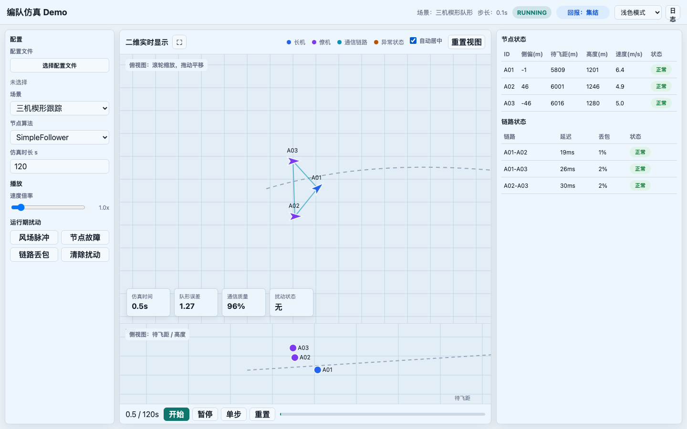
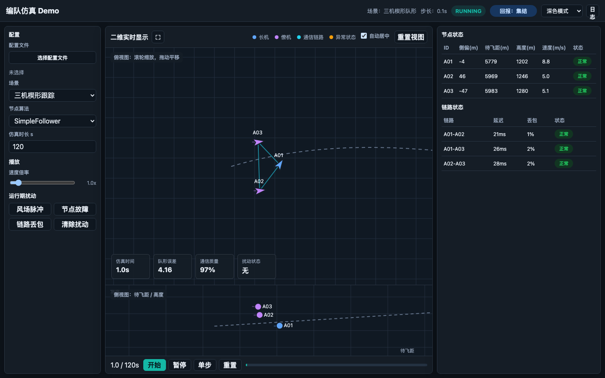

# UI HLD

## 1. 定位

UI 是人机交互组的 Boundary，面向带界面的单次仿真运行。UI 负责配置选择、运行控制、实时态势显示、节点 / 链路状态展示、运行期扰动注入、日志查看和主题切换。

UI 只通过仿真控制模块交互，不直接调用编队算法、模型迭代、通信功能或加扰模块。

## 2. 界面基线

当前 HTML demo 是正式 UI 的交互基线，用于确定布局、控件和状态字段。HTML demo 不作为正式运行时技术选型，不引入 Web 前端依赖；正式界面仍采用 PySide6 实现，并优先保持同样的信息结构。

浅色模式：

深色模式：

## 3. 主界面结构

主界面采用一屏式工作台布局：

- 顶部状态栏：场景、仿真步长、运行状态、仿真控制回报、主题切换、日志入口。
- 左侧配置区：配置文件选择、场景选择、算法选择、仿真时长、播放倍率、运行期扰动入口。
- 中央实时显示区：俯视图、侧视图、图例、网格开关、自动居中、航段锁定、视角数值框与滑条、重置视图、全屏显示。
- 右侧状态区：整体跟踪表、节点相对槽位偏差表、链路状态表。
- 底部时间轴：仿真时间、开始、暂停、单步、重置、进度条。

## 4. 关键交互

- 配置文件：用户选择 `.yaml`、`.yml` 或 `.json` 配置文件后，UI 显示文件名并调用仿真控制加载配置。
- 运行控制：开始、暂停、恢复、单步、重置均通过仿真控制入口执行。
- 播放倍率：支持 `0.1x` 到 `50.0x`，滑条采用分段档位：`0.1x~2.0x` 步长 `0.1x`，`2.0x~10.0x` 步长 `1x`，`10.0x~20.0x` 步长 `2x`，`20.0x~50.0x` 步长 `3x`；播放倍率影响 UI 驱动或回放节奏，不改变算法接口语义。
- 动态扰动：风场脉冲、节点故障、链路丢包、清除扰动通过仿真控制转发给加扰模块。
- 日志：顶部只保留“日志”入口，点击后弹出日志面板；日志不常驻占用主显示区。
- 主题：支持浅色模式和深色模式；主题切换只影响显示，不影响仿真状态。
- 全屏：中央实时显示区支持界面内全屏，退出后需要保持俯视图、侧视图和时间轴布局稳定。
- 网格：俯视图和侧视图默认显示网格；用户可以通过工具栏开关同时隐藏或恢复两个视图的网格。网格开关只影响显示辅助线，不影响航线、参考线、节点、链路和轨迹。
- 自动居中：只调整视图平移，使无故障飞机保持在视图中心；不自动调整缩放比例。
- 手动视图操作：俯视图和侧视图都支持中键拖动平移、左键拖拽矩形区域放大、滚轮滚动连续缩放、左键双击或“重置视图”按钮按航段、飞机和尾迹自适应显示范围。俯视图操作只改变俯视图平面视野；侧视图操作只改变侧视图横轴和高度轴。用户手动操作视图时关闭自动居中，避免刷新覆盖手动视角。
- 轨迹显示：俯视图、侧视图和 3D 态势共用控制器按仿真时间固定 `10 Hz` 产生的 ENU 有界队列；GUI 轮询只消费游标后的批量样本，不能成为尾迹采样时钟，因此轨迹密度和时长不随播放倍率变化。
- 2D 尾迹绘制：分块 `QPainterPath` 只消费稳定队列，并在队尾到飞机当前位置之间额外描一条常数开销的实时末段；实时位置不写回队列或路径缓存。绘制前必须显式使用 `NoBrush` 并恢复调用方状态，禁止让航点、机体或障碍遗留画刷把开放折线隐式闭合填充。
- 3D 态势补间：飞机与尾迹活动末段共用同一个 90 ms 展示进度。历史大网格只固化上一条展示消息已经覆盖的稳定队列前缀，本轮批量样本延后一条展示消息原子追加；活动末段从已固化队尾连接飞机共同补间位置。若极短窗口已淘汰该队尾，窗口级展示状态保留上一末端坐标作临时锚，历史流可清空但不得提前采用本轮新队首。展示锚和补间坐标都不入 `TrailBuffer`，不增加尾迹容量，也不移动中间历史中心线。

## 5. 实时显示

俯视图展示水平面态势：

- 长机、僚机、通信链路、异常状态使用不同颜色。
- 默认显示网格，支持通过工具栏关闭或恢复网格。
- 支持中键拖动平移、左键框选区域放大、滚轮连续缩放、左键双击和按钮重置视图。
- 展示航线、目标点、节点 ID、通信链路和历史轨迹。

侧视图展示横向投影 / 高度关系：

- 默认启用“航段锁定”。存在当前航段时，侧视图横轴为当前航段起点到终点方向上的航段里程；只绘制当前锁定航段，不需要用户手动选择航段。
- 航段锁定时，“视角”数值框与滑条禁止手动输入或拖动，但随当前航段自动更新。视角定义为观察方向：`0°` 表示面朝正北，横轴为东向距离；`90°` 表示面朝正东，横轴为南向距离。
- 关闭航段锁定或当前快照没有可锁定航段时，“视角”数值框与滑条允许在 `0..360°` 范围内手动设置，侧视图横轴按该观察方向投影得到。
- 侧视图横轴独立于俯视图平面视野维护；侧视图网格竖线按当前横轴投影距离绘制。
- 支持中键拖动平移、左键框选区域放大、滚轮连续缩放、左键双击和按钮重置视图；重置时按航段、飞机和尾迹自适应横轴与高度轴，侧视图横向操作只更新侧视图横轴，高度方向操作只缩放或平移高度轴。
- 展示节点高度、参考高度线和历史轨迹。
- 不单独控制仿真状态。

3D 态势展示三维地形、航线、障碍风险区域、飞机和连续尾迹：

- 数据层仍以仿真时间固定 `10 Hz` 的 ENU 真实采样点和稳定序号为权威来源；一次墙钟显示刷新可以携带多个样本，3D 显示层只做 Quick3D 轴映射与展示补间。
- 每次显示快照到达时，飞机目标位置更新；活动尾迹末端通过同一 `presentationProgress` 从上一展示位置移动到该目标，禁止另设动画时钟或把补间点写入队列。
- 历史尾迹使用增量 `TrailRibbonGeometry`，只追加上一条展示消息已覆盖的固定样本，并按稳定序号弹头；当前消息新收到的批量样本等下一条展示消息再固化，确保历史队尾不会越过正在补间的飞机。补间期间历史顶点和索引缓冲必须保持不变。
- 活动末段使用独立 `TrailTipGeometry`，固定为 6 个顶点和 9 个索引；其中两个三角形绘制末段，至多一个 bevel 三角形闭合与历史平头端帽的转角。60 Hz 更新量恒定，不随历史点数增长。
- 正常数据刷新约为 100 ms，展示补间为 90 ms。偶发提前到帧进入容量为 2 的展示消息队列并按序消费；极端积压时先共同完成当前目标，再处理最老消息，不能丢弃增量尾迹消息。机型切换或地形就绪造成的同一时刻 payload 重推同样进入该队列，上一条补间完成后才可固化其观察到的队尾。空节点帧没有动画完成信号，必须异步续取下一条消息，避免配置切换后的 READY 帧永久滞留。
- 相机重置只读取最新 payload 的相机字段，禁止调用整帧场景更新；否则会绕过展示消息队列并破坏尾迹增量游标顺序。
- 视角操作将缩放（`distance`）、平移（`focus`）和旋转（`yaw/pitch`）作为三个独立自由度：跟随只接管平移并逐帧跟踪长机焦点，手动平移退出跟随，缩放与旋转不打破跟随；俯视和侧视只设置旋转；重置恢复全部三者并退出跟随。
- 右下角常驻半透明指北针：北向指针与相机 `yaw` 同步旋转，确保始终表达 ENU 世界北向；罗盘平面按 `sin(abs(pitch))` 做纵向投影并设置侧视最小可见厚度，使俯视时接近圆盘、斜视时呈椭圆、侧视时压缩成窄盘。该控件只反映视角，不拦截场景鼠标操作。
- 启用障碍不再渲染为固定高度的红色圆柱或方盒；圆形与多边形（含安全间距）按真实水平轮廓混入地形顶点色，以低饱和铁锈红表达风险，同时保留地形起伏、光照和贴图细节。地形顶点色始终静态，只有贴合显示地形的闭合告警边界以 4.8 秒周期缓慢呼吸；禁用障碍必须同步清除对应着色和边界。
- 航线复用连续线带几何，但不绑定展示末端，始终保持静态路径语义；场景没有障碍库时，布局文件中的兼容风险峰仍可使用风险线和缓冲圈提示，且兼容提示不参与呼吸动画。
- `TerrainField.heights_m` 保留布局声明的米制高度，继续作为净空与障碍提取的唯一依据；岩脊、沟壑和尖峰修形只写入独立的 `display_heights_m`，垂向位移限制在 ±220 m，低于 120 m 的航迹低地不做显示位移。
- 正式地形网格提供 position、normal、UV、tangent、binormal 和 vertex color；低饱和分层顶点色负责宏观岩性，无缝反照率/法线贴图负责像素级裂隙，主方向光阴影与屏幕空间 AO 负责峡谷和山脚体积感。

## 6. 状态字段

顶部状态栏：

- 场景名称
- 仿真步长
- 运行状态：`READY`、`RUNNING`、`PAUSED`
- 仿真控制回报：如 `待命`、`集结`、`保持`、`重构`

整体跟踪表：

- 侧偏 `(m)`
- 待飞距 `(m)`
- 高度 `(m)`
- 地速 `(m/s)`
- 天向速度 `(m/s)`

节点相对槽位偏差表：

- 节点 ID
- 待飞距 `(m)`：`目标 - 本机`，正值表示目标在本机前方
- 高飘 `(m)`：`本机 - 目标`，正值表示本机高于目标
- 右偏 `(m)`：`本机 - 目标`，正值表示本机位于目标右侧
- 状态：正常、降级等

链路状态表：

- 链路端点
- 延迟
- 丢包率
- 状态：正常、丢包等

## 7. 对外接口

UI 只调用仿真控制应用层接口。接口细节以 `docs/1-仿真控制HLD.md` 为准，本节只保留 UI 侧依赖清单。

UI 调用仿真控制：

- `load_config(path)`
- `start()`
- `pause()`
- `step()`
- `reset()`
- `set_playback_rate(rate)`
- `inject_disturbance(command)`
- `subscribe_snapshot(callback)`
- `get_snapshot()`
- `get_recent_events(limit)`

说明：

- “开始 / 继续”统一调用 `start()`；不单独设计 `resume()`。
- 当前主界面没有显式“停止”按钮；窗口关闭、CLI 退出和批量任务取消统一调用 `close()` 做资源释放，不单独设计 `stop()`。
- UI 可以缓存事件用于日志窗口显示，但最近事件的权威来源仍是仿真控制。

仿真控制推送给 UI 的 `SimulationSnapshot` 至少包含：

- `time_s`
- `duration_s`
- `step_s`
- `run_state`
- `control_report`
- `nodes`
- `links`

UI 不直接读取其他模块内部状态，也不自行合成节点 / 链路核心数据。整体跟踪表、节点相对槽位偏差表、链路状态表、顶部状态栏和实时显示从 `SimulationSnapshot` 渲染；日志面板通过 `get_recent_events()` 查询最近事件。

## 8. 边界

- UI 不直接读取模型、通信、算法内部状态。
- UI 不直接写关键仿真日志；关键日志由数据模块负责。
- UI 不实现批量仿真调度。
- UI 不在 headless 模式启用。
- UI 可以保存用户界面偏好，例如主题、窗口尺寸、视图缩放，但这些偏好不属于仿真配置。

## 9. 关联代码

- `docs/demo.html`
- `src/ui/gui/`
- `src/ui/gui/main_window.py`
- `src/runner/sim_control.py`
