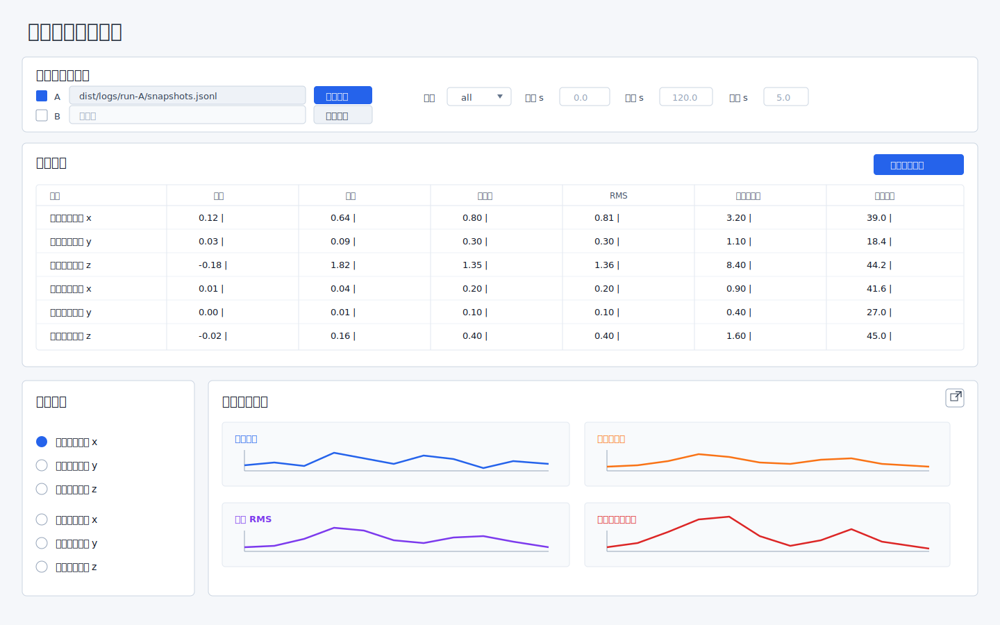

# 数据分析功能规划

## 1. 定位

数据分析功能用于离线评估仿真输出的控制效果。它不参与仿真闭环，不解释扰动机理，只把不同扰动、不同参数或不同配置产生的 `snapshots.jsonl` 当作测试结果来分析。

本功能只关注仿真结果的控制误差统计和时序变化；多文件场景仅做 A/B 并列展示，供用户肉眼比较，不做差值、比值、高亮或自动结论。

## 2. 工作阶段

### 2.1 阶段一：定分析目标

输入：

- 一份或多份典型 `snapshots.jsonl`。
- 用户希望检查的控制效果问题。

输出：

- 控制效果指标清单。
- 各指标的计算口径。
- 第一版和后续版本的功能边界。

第一版关注：

- 各飞机跟踪误差的均值、标准差、RMS、最大绝对值。
- 所有飞机同类误差的总体均值、标准差、RMS、最大绝对值。
- 滑动窗口内同类误差的均值、标准差、RMS、最大绝对值曲线。
- 用户指定时间段内的统计结果。

第一版不关注：

- 扰动配置解析。
- 扰动原因归因。
- 航段切换识别。
- 读取 `config.json` 或 `events.jsonl`。
- 修改仿真日志格式。

约束：

- 输入只使用 `snapshots.jsonl`。
- 分析器只相信日志中已有字段，不回读配置来推导理论队形或扰动参数。
- 统计结果必须能独立于 GUI 运行，便于后续批量分析和自动化测试。

### 2.2 阶段二：定界面草稿和输入输出内容

输入：

- 阶段一确定的指标清单。
- 一份典型 `snapshots.jsonl` 字段样例。

输出：

- 离线分析界面草稿。
- 用户操作流程。
- 输入参数列表。
- 输出表格、曲线和导出内容定义。

低保真草图：



说明：

- 草图只表达信息结构和主要交互，不代表最终 PySide6 样式。
- 界面支持文件 A/B 并列展示，但不规划额外的差值、比值或高亮对比功能。

界面草稿：

```text
离线控制效果分析
├── 文件
│   ├── 文件 A：启用勾选 + 选择 snapshots.jsonl
│   └── 文件 B：启用勾选 + 选择 snapshots.jsonl
├── 分析范围
│   ├── 开始时间 start_s
│   ├── 结束时间 end_s
│   └── 窗口宽度 window_s
├── 分析对象
│   ├── all：所有飞机合并统计
│   └── 单机：只统计所选飞机
├── 滑动窗口
│   ├── 窗口宽度 window_s，单位 s
│   └── 步进宽度内部默认按日志采样点逐帧滑动，不在第一版主界面暴露
├── 绘图通道
│   ├── 前向位置误差 track_pos_err_x_m
│   ├── 垂向位置误差 track_pos_err_y_m
│   ├── 侧向位置误差 track_pos_err_z_m
│   ├── 前向速度误差 track_vel_err_x_mps
│   ├── 垂向速度误差 track_vel_err_y_mps
│   └── 侧向速度误差 track_vel_err_z_mps
├── 汇总表
│   ├── 单机单通道指标
│   └── 全机同类误差指标
├── 滑动窗口曲线
│   ├── 窗口均值（独立 Y 轴）
│   ├── 窗口标准差（独立 Y 轴）
│   ├── 窗口 RMS（独立 Y 轴）
│   └── 窗口最大绝对值（独立 Y 轴）
└── 导出
    └── 全部指标 CSV
```

输入参数：

| 参数 | 类型 | 默认值 | 说明 |
| --- | --- | --- | --- |
| `snapshot_inputs` | 文件输入列表 | 文件 A 启用，文件 B 未启用 | 最多两份 `snapshots.jsonl`；每份包含 `enabled`、`label`、`path` |
| `start_s` | 浮点数 | 日志最小时间 | 分析起点，单位 s |
| `end_s` | 浮点数 | 日志最大时间 | 分析终点，单位 s |
| `analysis_target` | 下拉选项 | `all` | 选项来自日志中的节点：`all` + 各 `node_id`；`all` 表示合并所有飞机，节点 ID 表示只分析该飞机 |
| `analysis_channels` | 字段名列表 | 六个航迹系误差通道 | 参与统计的误差字段；第一版默认全算，不作为绘图筛选 |
| `plot_channel` | 字段名 | `track_pos_err_z_m` | 当前绘制的误差通道；只影响图表，不影响统计计算 |
| `window_s` | 浮点数 | `5.0` | 滑动窗口宽度，单位 s |

输出内容：

| 输出 | 内容 | 用途 |
| --- | --- | --- |
| 指标表 | 当前分析对象在全部默认通道上的统计量 | 判断哪个方向误差最差 |
| 窗口曲线 | 当前绘图通道在每个时间窗口的均值、标准差、RMS、最大绝对值；已启用文件分别绘制 | 定位问题出现时间、持续时间和恢复情况 |
| 全部指标 CSV | 全机合并统计 + 每架飞机分解统计，覆盖全部默认通道 | 便于 Excel、MATLAB、Python 二次处理 |

界面约束：

- 总体布局采用上中下三段：顶部是文件与分析范围，中间是全宽汇总指标，底部左侧是绘图通道选择、右侧是滑动窗口曲线。
- 正式界面不放说明性注释文案；含义通过标题、表头、控件状态和布局表达。
- 汇总指标区直接显示全部默认通道的表格，不再额外放“最大 RMS”“最大绝对误差”等摘要卡片。
- 界面表头使用中文：通道、均值、方差、标准差、RMS、最大绝对值、发生时刻；导出字段名可以继续使用英文，便于脚本处理。
- 文件 A / 文件 B 各有启用勾选框；未勾选的文件不参与汇总指标、滑动窗口曲线和导出。
- 汇总指标每个数值单元固定保留 `|` 分隔符，左侧代表文件 A，右侧代表文件 B；B 未启用时显示为 `0.12 |`，A/B 都启用时显示为 `0.12 | 0.15`。
- 绘图通道只影响下方滑动窗口曲线，不影响汇总指标表。
- 绘图通道选择放在底部左侧，与右侧滑动窗口曲线并列，避免占用汇总指标横向空间。
- 滑动窗口曲线标题右侧提供“弹出窗口”按钮；点击后打开只包含四个窗口曲线子图的独立窗口，沿用当前文件启用状态、分析对象、时间段、窗口宽度和绘图通道。
- 导出入口放在汇总指标区右上角，导出对象是全部默认通道的统计结果，不导出滑动窗口曲线数据。
- 第一版不设置“重新分析”按钮；选择文件、勾选/取消文件、切换分析对象、切换绘图通道、修改窗口宽度后自动刷新。开始时间和结束时间输入框在回车或失焦且校验通过后刷新，避免半输入状态触发分析。

### 2.3 阶段三：单次数据分析代码开发

输入：

- 一份或两份已启用的 `snapshots.jsonl`。
- 时间段参数。
- 滑动窗口参数。
- 分析对象参数。
- 绘图通道参数。

输出：

- 可复用的数据读取模块。
- 可复用的指标计算模块。
- 单次分析结果对象 `AnalysisResult`。
- 全部指标 CSV 导出能力。
- PySide6 离线分析界面入口。

建议实现顺序：

1. 数据读取层：解析 `snapshots.jsonl`，提取时间、节点 ID、通道值。
2. 数据过滤层：按 `[start_s, end_s]` 过滤记录，剔除缺失值。
3. 指标计算层：对每份已启用文件分别计算全部分析通道指标，生成统一的 `AnalysisResult`；按 `analysis_target` 决定是 all 合并统计还是单机统计。
4. 滑动窗口层：对每份已启用文件分别按 `window_s` 生成窗口统计序列，窗口步进默认使用日志采样间隔；绘图阶段只展示当前 `plot_channel`。
5. 导出层：输出全部指标 CSV，包含每份已启用文件的全机合并统计和每架飞机统计。
6. GUI 接入层：在现有离线分析窗口中展示时间段、窗口宽度、汇总表和窗口曲线；逐飞机分解只进入全部指标 CSV。

代码边界：

- 分析内核不 import PySide6。
- GUI 只负责输入参数、展示结果和触发导出。
- 数据读取和指标计算要有单元测试。
- 对损坏行、空文件、缺少字段、时间段无数据等情况要给出明确错误。
- 不修改 `SimulationSnapshot`、`NodeState` 或日志写入格式。

开发完成后的检查点：

- 用户能选择一个 `snapshots.jsonl` 完成分析。
- 用户能启用第二个 `snapshots.jsonl` 做并列展示；取消勾选后第二份结果从汇总表和曲线中消失。
- 用户能设置开始时间、结束时间和窗口宽度。
- 用户能在 `all` 和某架飞机之间切换分析对象。
- 切换分析对象后自动更新汇总表和滑动窗口曲线，不需要点击“重新分析”。
- 全部默认通道都会参与指标计算，绘图通道只影响当前图表展示。
- 滑动窗口曲线能对当前绘图通道显示均值、标准差、RMS 和最大绝对值。
- 滑动窗口曲线不得把不同统计量强行放在同一个 Y 轴；均值、标准差、RMS 和最大绝对值默认使用独立子图或标签页展示。
- 点击滑动窗口曲线的弹出按钮后，能打开独立曲线窗口；独立窗口只显示图，不显示汇总表和文件选择区。
- 全部指标能导出为 CSV；导出内容按文件区分，包含每份已启用文件的全机合并统计和每架飞机统计，且覆盖全部默认通道。

### 2.4 阶段四：A/B 并列展示收口

输入：

- 一份或两份 `snapshots.jsonl`。
- 与单次分析相同的时间段、通道和滑动窗口参数。

输出：

- A/B 汇总指标并列展示。
- A/B 滑动窗口曲线同图展示。
- 全部指标 CSV 按输入文件标签区分来源。

阶段二/三已经支持两份文件并列显示。后续不再开发额外的数值对比层，用户通过并列数值和同图曲线肉眼判断差异。

明确不做：

- `B - A` 差值。
- `B / A` 比值或其他除法指标。
- 更优项标记。
- 阈值高亮。
- 自动生成对比结论。

保留口径：

- 文件 A/B 使用同一分析对象、时间段、窗口宽度和绘图通道。
- 文件 A/B 各自独立计算指标和窗口曲线。
- 汇总表用 `A | B` 的固定结构表达两份文件的同一指标。
- 曲线用 A/B 两个图层同图显示，图层显隐不触发另一侧重复计算。

### 2.5 导出口径

第一版导出不导出窗口曲线数据，只导出全部统计指标。

导出 CSV 至少包含以下两类行：

| 行类型 | 内容 |
| --- | --- |
| 全机合并统计 | 每份已启用文件中，所有飞机合并后，每个默认通道各一行 |
| 单机统计 | 每份已启用文件中，每架飞机、每个默认通道各一行 |

建议字段：

| 字段 | 说明 |
| --- | --- |
| `input_label` | 文件标签，如 `A`、`B` |
| `source_path` | 源 `snapshots.jsonl` 路径 |
| `scope` | `all` 或 `node` |
| `node_id` | `scope=node` 时为飞机 ID；`scope=all` 时为空或 `all` |
| `channel` | 误差通道字段名 |
| `count` | 有效采样点数量 |
| `mean` | 均值 |
| `variance` | 方差 |
| `std` | 标准差 |
| `rms` | RMS |
| `max_abs` | 最大绝对值 |
| `max_abs_time_s` | 最大绝对值发生时刻 |

导出不受当前 `analysis_target` 和 `plot_channel` 限制；这两个参数只影响界面当前显示。导出始终覆盖已启用文件的全机合并统计和逐飞机统计。

## 3. 指标口径

### 3.1 单机单通道指标

对每架飞机 `node_id` 和每个通道 `channel`，在指定时间段内计算：

| 指标 | 说明 |
| --- | --- |
| `count` | 有效采样点数量 |
| `mean` | 算术均值 |
| `std` | 标准差 |
| `rms` | 均方根 |
| `max` | 最大正值 |
| `min` | 最大负值 |
| `max_abs` | 最大绝对值 |
| `max_abs_time_s` | 最大绝对值发生时刻 |
| `variance` | 方差，默认只用于导出或内部计算 |

说明：

- 标准差和方差默认按总体口径计算，即除以 `N`。
- `max_abs_time_s` 若有多个同值点，取最早时间。
- 空数据不输出数值，记录为缺失。
- 界面和摘要报告默认突出显示 `mean`、`std`、`rms`、`max_abs`，不把 `variance` 作为主要展示字段。

### 3.2 标准差、RMS 和方差的展示口径

标准差用于看误差围绕均值的波动大小，单位与误差本身一致。RMS 用于看总体误差水平，同时包含稳定偏差和波动。方差是标准差的平方，单位会变成原单位的平方，不适合作为主要人工读数。

示例：

```text
误差 [5, 5, 5, 5]：
mean = 5, std = 0, rms = 5
含义：没有波动，但长期偏 5 m。

误差 [-5, 5, -5, 5]：
mean = 0, std = 5, rms = 5
含义：平均不偏，但来回振荡 5 m。
```

因此第一版界面主指标采用：

- `mean`：判断是否长期偏在一侧。
- `std`：判断振荡和波动幅度。
- `rms`：判断综合误差水平。
- `max_abs`：判断最坏瞬间误差。

### 3.3 全机同类误差指标

对每个通道，把所有飞机的有效采样点合并后计算同一组指标。

示例：

```text
track_pos_err_z_m 全机总体指标 =
    A01.track_pos_err_z_m 全部有效点
  + A02.track_pos_err_z_m 全部有效点
  + ...
```

该口径用于回答“整体控制效果如何”。

### 3.4 分析对象口径

分析对象决定统计样本集合，绘图通道不影响统计样本集合。

| 分析对象 | 样本集合 | 输出 |
| --- | --- | --- |
| `all` | 所有飞机、每个默认通道、指定时间段内的全部有效采样点 | 每个默认通道各一组指标 |
| 某个 `node_id` | 该飞机、每个默认通道、指定时间段内的全部有效采样点 | 每个默认通道各一组指标 |

示例：

```text
analysis_target = all
track_pos_err_z_m 指标 = A01/A02/.../A10 的侧向位置误差有效点合并后统计

analysis_target = A05
track_pos_err_z_m 指标 = 仅 A05 的侧向位置误差有效点统计
```

指标表必须展示全部默认通道，而不是只展示当前绘图通道。`plot_channel` 只决定滑动窗口曲线区域当前画哪一个通道。

每个通道至少输出 `mean`、`variance`、`std`、`rms`、`max_abs` 和 `max_abs_time_s`，用于同时判断均值偏差、波动、综合误差和最坏瞬间。

绘图时用户只选择一个 `plot_channel`。例如 `analysis_target=all` 且 `plot_channel=track_pos_err_z_m` 时，窗口曲线对每份已启用文件分别绘制“所有飞机侧向位置误差合并后的窗口统计”；切换到 `A05` 后，窗口曲线对每份已启用文件分别绘制 A05 侧向位置误差的窗口统计。

### 3.5 单机指标聚合

除全机合并采样点外，还保留单机指标的聚合结果：

| 指标 | 说明 |
| --- | --- |
| `mean_of_node_mean` | 各飞机均值的平均值 |
| `max_node_rms` | 各飞机 RMS 的最大值 |
| `max_node_max_abs` | 各飞机最大绝对值的最大值 |
| `worst_node_id` | 对应最大绝对值的飞机 |

该口径用于回答“是否某一架飞机明显更差”。

### 3.6 滑动窗口指标

窗口以仿真时间为基准。

输入：

- `window_s`：窗口宽度，单位 s。
- 窗口步进：第一版不在主界面暴露，内部默认按日志采样间隔逐帧滑动。
- `[start_s, end_s]`：分析范围。

每个窗口计算：

| 指标 | 说明 |
| --- | --- |
| `window_start_s` | 窗口起点 |
| `window_end_s` | 窗口终点 |
| `mean` | 窗口内误差均值 |
| `std` | 窗口内误差标准差 |
| `rms` | 窗口内误差 RMS |
| `max_abs` | 窗口内最大绝对值 |
| `variance` | 窗口内误差方差，默认只用于导出或内部计算 |

曲线展示约束：

- `mean` 是有符号量，`std`、`rms`、`max_abs` 是非负量，不能默认共用同一个 Y 轴。
- `max_abs` 可能明显大于 `mean`、`std` 或 `rms`，同轴显示会压扁其他曲线。
- 第一版默认采用同一通道下多个指标独立子图的布局；各子图共享 X 轴时间范围，但 Y 轴独立缩放。
- 后续若支持同轴叠加，必须由用户显式开启，并在图例中提示量纲和缩放风险。
- 窗口步进属于高级参数。若后续发现逐帧滑动导致曲线过密或计算过慢，再放到高级设置中；第一版主界面只让用户设置窗口宽度。

窗口边界：

- 窗口包含 `time_s >= window_start_s` 且 `time_s < window_end_s` 的采样点。
- 最后一个窗口不得超过 `end_s`；若剩余长度小于 `window_s`，第一版可以跳过。
- 若窗口内没有有效点，输出缺失值或跳过该窗口，具体在实现计划中确定。

## 4. 数据字段

第一版默认通道：

| 字段 | 说明 |
| --- | --- |
| `track_pos_err_x_m` | 航迹系前向位置误差，单位 m |
| `track_pos_err_y_m` | 航迹系垂向位置误差，单位 m |
| `track_pos_err_z_m` | 航迹系侧向位置误差，单位 m |
| `track_vel_err_x_mps` | 航迹系前向速度误差，单位 m/s |
| `track_vel_err_y_mps` | 航迹系垂向速度误差，单位 m/s |
| `track_vel_err_z_mps` | 航迹系侧向速度误差，单位 m/s |

后续可选通道：

| 字段 | 说明 |
| --- | --- |
| `pos_err_east_m` / `pos_err_north_m` / `pos_err_h_m` | ENU 位置误差 |
| `vel_err_east_mps` / `vel_err_north_mps` / `vel_err_up_mps` | ENU 速度误差 |
| `cross_track_error_m` | 航线侧偏距 |
| `distance_to_go_m` | 当前航段待飞距 |
| `nx` / `nz` / `phi_deg` | 控制量或姿态输出，不作为误差通道 |

## 5. 验收节奏

开发按大步推进。每完成一个大步，暂停给用户做代码检查和手动测试。

### 5.1 第一大步：规划文档确认

输出：

- 本文档经用户确认。

验收：

- 分析目标明确。
- 输入只使用 `snapshots.jsonl`。
- 界面草稿和输入输出内容明确。
- 滑动窗口支持设置窗口宽度。
- A/B 只做并列展示，不规划差值、比值、高亮或自动结论。

### 5.2 第二大步：单次分析内核和导出

输出：

- 数据读取、指标计算、窗口统计、全部指标 CSV 导出代码。
- 单元测试。

验收：

- 命令行或测试代码能对指定 `snapshots.jsonl` 生成指标。
- 时间段过滤有效。
- `window_s` 改变后，窗口曲线结果随之变化。
- 空文件、坏行、缺字段有明确错误。
- 导出 CSV 同时包含全机合并统计和每架飞机统计，且不包含滑动窗口曲线数据。

### 5.3 第三大步：PySide6 离线分析界面

输出：

- 文件 A/B 选择与启用、时间段输入、窗口宽度输入、指标表、窗口曲线、全部指标导出按钮。

验收：

- 界面能打开并加载 `snapshots.jsonl`。
- 文件 A 默认启用；文件 B 勾选后参与汇总表和滑动窗口曲线，取消勾选后立即隐藏。
- 用户能调整分析时间段和窗口宽度。
- 表格与曲线随参数变化刷新。
- GUI offscreen 构造测试通过。
- 若修改布局或图表，生成或查看真实窗口截图。

### 5.4 第四大步：A/B 并列展示收口

输出：

- 两份 `snapshots.jsonl` 的指标并列展示。
- 两份 `snapshots.jsonl` 的窗口曲线同图展示。

验收：

- 同一时间段、同一分析对象、同一绘图通道和同一窗口宽度下，A/B 能并列显示。
- 汇总表保持 `A | B` 结构；B 未启用时只显示左侧 A。
- 曲线保留 A/B 图层和图例，取消勾选时只隐藏对应图层。
- 不输出差值、比值、高亮结果或自动结论。

## 6. 测试要求

修改 Python 代码后至少运行：

```bash
python -m compileall -q src
python -X utf8 scripts/comment_coverage.py --fail-under-module 100 --fail-under-class 100 --fail-under-func 100 --fail-under-inline 15 --worst 12
git diff --check
```

修改 PySide6 GUI 后还需要运行 offscreen 构造测试，并根据布局、样式、表格或图表变化生成或人工查看真实窗口截图。

只修改本文档时，运行：

```bash
git diff --check
```
