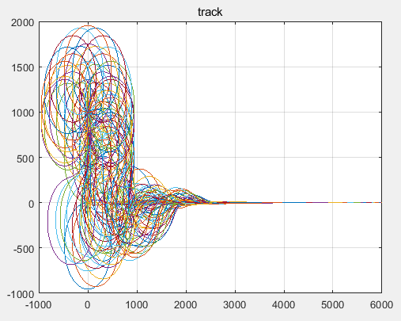
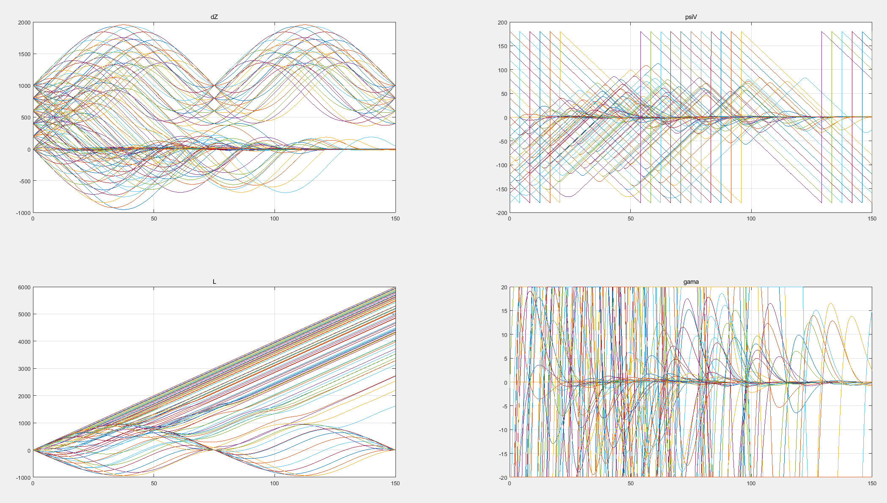
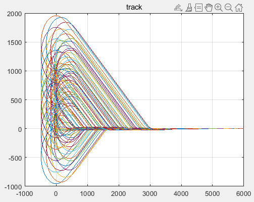
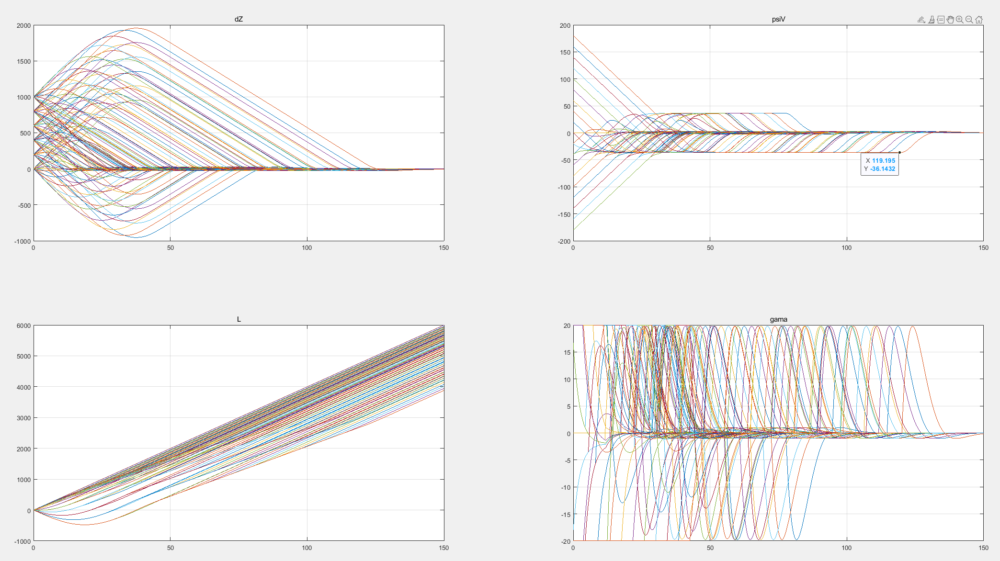
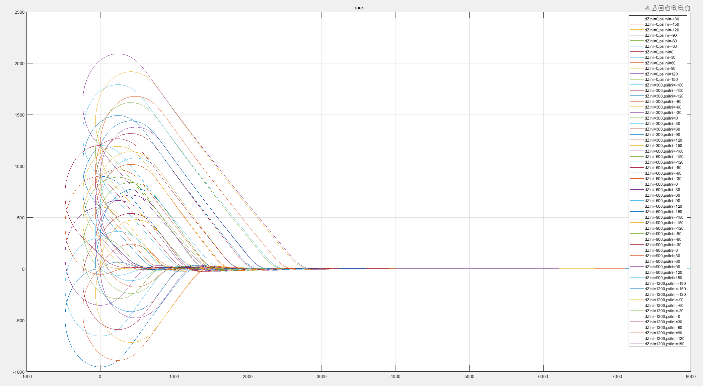
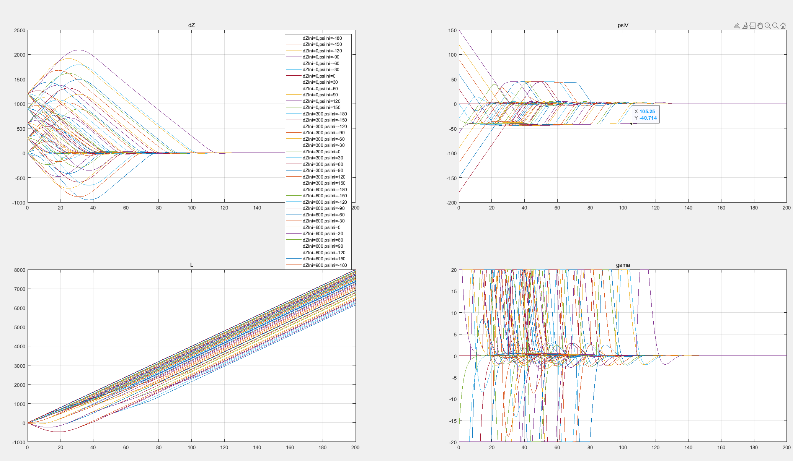
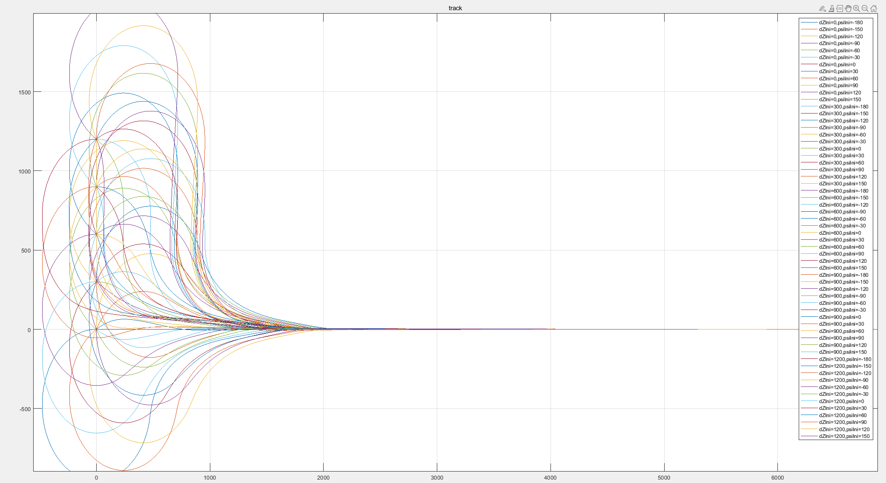
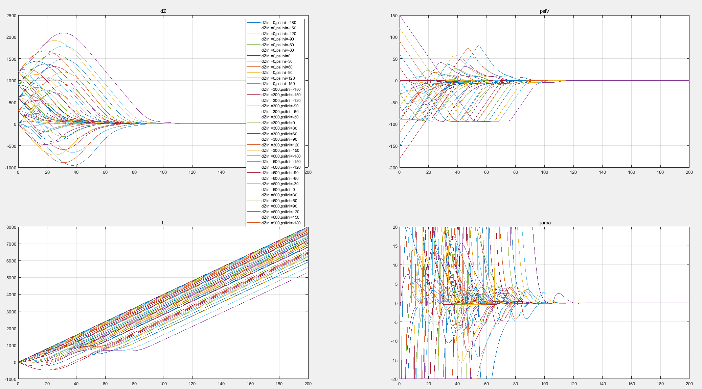

# 横侧向点号切入问题

张蒙

# 一、问题和背景

## 1.0 问题说明

当前制导策略无法保证起始点在任意侧偏和任意航迹角组合场景下，都能够很好的进行点号切入，本文主要尝试解决该问题。

## 1.1 流程说明

目前点号切入的流程为：

1. 沿航段反方向飞行直至待飞距大于1000m（这个建议使用2.5倍最小转弯半径）
1. 垂直航段飞行直至侧偏距小于1倍最小转弯半径（建议使用1.2倍最小转弯半径）
1. 滚转直至航迹方向和航段方向夹角小于10deg
1. 接入航线飞行，使用侧偏控制

从上面流程可以看出本来是想要根据待飞距、侧偏距、航迹角进行全量判断，但是这里有一个最大的问题是判断是有先后顺序的，也就是说当满足航迹角时，侧偏可能不再满足，从而导致问题，举个例子：

> 假设初始就在目标航段上，但方向相反
>
> 1. 反向飞行直至待飞距满足
> 2. 此时侧偏为0也满足
> 3. 这时会左转或右转170度，这时侧偏距约为转弯半径的两倍（无风场景），大概有几百米的侧偏距
> 4. 在几百米的侧偏距下直接接入侧偏控制会导致
>    1. 不断滚转盘旋，再也无法切入到航线
>    2. 切入到航线时航迹角偏差过大，进而导致震荡，难以收敛

## 1.2 问题复现

### 1.2.1 基本说明

* 复现飞机：XY5
* 复现时机：平飞段
* 横侧向制导参数：
* 使用组合场景，由于侧偏对称性因此有如下组合（65组）
  * 初始侧偏从0-1200m，每300m一个间隔，共5组
  * 初始航迹角偏差[-180, 180)deg，每30deg一个间隔，共13组
* 复现方法：
  * 线性方法：在matlab下忽略角运动，直接给定初始状态进行仿真飞行，该方法验证快速，方便收集指标和画图（gitlab：XY\XY5\1-design\98_横侧向仿真）
  * 非线性方法：
    * 设计航段2和航段3都尽可能长，大于5km
    * 批处理入参作为航段3和侧偏距的指标（1000~1064），其中:
      * 期望侧偏距=(cmd - 1000) % 5 * 300
      * 航段2方向为0deg
      * 航段3方向=(cmd-1000) / 5 * 30 - 180
    * 航段2到航段3的提前转弯为-3000，保证无扰动下过2号点才会切到航段3
    * autorun实时监控到航段3侧偏，当侧偏和期望侧偏距小于5m，做航段3的点号切入
    * 进入航段4则退出

| 批处理索引-1000 | 0    | 300  | 600  | 900  | 1200 |
| --------------- | ---- | ---- | ---- | ---- | ---- |
| -180            | 0    |      |      |      |      |
| -150            | 5    | 6    | 7    | 8    | 9    |
| -120            | 10   | 11   | 12   | 13   | 14   |
| -90             | 15   | 16   | 17   | 18   | 19   |
| -60             | 20   | 21   | 22   | 23   | 24   |
| -30             | 25   | 26   | 27   | 28   | 29   |
| 0               | 30   | 31   | 32   | 33   | 34   |
| 30              | 35   | 36   | 37   | 38   | 39   |
| 60              | 40   | 41   | 42   | 43   | 44   |
| 90              | 45   | 46   | 47   | 48   | 49   |
| 120             | 50   | 51   | 52   | 53   | 54   |
| 150             | 55   | 56   | 57   | 58   | 59   |
| 180             | 60   |      |      |      |      |

* 指标：
  * 稳态时间：从点号切入指令到侧偏第一次稳态收敛到2m以内的时间
  * 稳态前飞距离：从点号切入指令到侧偏第一次稳态收敛到2m以内的前飞距离
  * 超调：最大的负侧偏值

### 1.2.2 仿真复现

ctrl函数

### 1.2.3 问题说明

从上面数据可以看到，当侧偏较大而直接使用侧偏控制时，可能存在飞机转圈而无法飞行到航段上的可能。

# 二、解决方案

## 2.0 优化一 —— 限幅修改

### 2.0.1 优化思路

问题的本质是最大的侧偏出舵大于航迹限幅出舵，从而导致持续滚转从而转圈，所以比较简单的思路是保证“最大的侧偏出舵小于航迹限幅出舵”即可。

### 2.0.2 参数设计

侧偏限幅设计为100

### 2.0.3 仿真结果

ctrlLimit

### 2.0.4 优缺点分析

#### 2.0.4.1 优点

解决方案简单，性价比最高

#### 2.0.4.2 缺点

1）收敛速度隐含，由控制参数和限幅统一计算得到，每次参数修改就会导致轨迹跟着变化，从而导致收敛时间和收敛待飞距对控制参数比较敏感。

2）收敛速度慢，在dZ较大时PsiV可以更激进，但是限幅浪费了能力（时间为130s左右，L为3.5Km）

## 2.1 优化一 —— 并行改串行

### 2.1.1 优化思路

2.0.4.2的问题一阐释了并联控制的核心问题，因此这里使用串联控制解决该问题，其核心思路时通过限幅航迹角指令进而在保证2.0优化的基础上显性航迹角最大值。

### 2.1.2 参数设计

这里使用等价设计，已知并联控制为
$$
Gama_{cmd} = K_d*PsiV + K_p*dZ + K_i*\dfrac{dZ}{s}
$$
可以近似等价于
$$
PsiV_{cmd} = K_1*dZ\\
Gama_{cmd} = K_2*(PsiV-PsiV_{cmd}) + K_3*\dfrac{PsiV-PsiV_{cmd}}{s}
$$

其中
$$
\begin{cases}
K_1=-\frac{K_p}{K_d}\\
K_2=K_d\\
K_3=\frac{K_d*K_i}{K_p}
\end{cases}
$$

航迹角指令限幅为40deg

### 2.1.3 优化结果

ctrSerl

### 2.1.4 优缺点分析

从上图可以看到，飞机在侧偏较大时，会按照-40的航迹角向中心点前进，从而解决参数设计敏感问题。

但是同样的，收敛时间慢的问题没有解决。（时间为115s左右，L为3Km）

## 2.2 优化二 —— 变航迹角限幅

### 2.2.1 优化思路

收敛速度较慢的本质是大侧偏下可以用更大的航迹角指令跟踪（比如在3k处使用90deg垂直跟踪），在小侧偏时在逐步收机头。

### 2.2.2 参数设计

* 借鉴L1方案做侧偏跟踪收敛，长度为R
* 航迹角限幅最小限幅值为7deg

因此航迹角指令限幅公式为：
$$
PsiV_{max}^{cmd}=\begin{cases}
90&, |dZ| >= R\\
arcsin\frac{|dZ|}{R} * 57.3&, R <= |dZ| <= sin(\frac{7}{57.3}*R)\\
7&, |dZ| <= sin(\frac{7}{57.3})*R
\end{cases}
$$

其中R计算公式为，建议向上取整从而留有一定余量
$$
R = \dfrac{V^2}{sind(Gama_{max}) * 9.8} * 1.2
$$

> [!NOTE]
>
> 之所以在过渡过程中不使用圆弧限幅，是因为侧偏控制展开后等价于L1控制（与侧偏等比），这意味L1根本追不上限幅，因此导致在中心线附近航迹角仍较大，从而导致震荡，可以参考ctrSerlR函数

### 2.2.3 优化结果

ctrSerlL1

从上图可以看出，在一段时间内航迹角垂直于航段直接切入，从而节省了切入时间和距离

### 2.2.4 优缺点分析

时间为100s左右，收敛长度为2Km

# 三、后续工作

## 3.1 流程优化

目前点号切入的流程为：

1. 沿航段反方向飞行直至待飞距大于4倍最小转弯半径
2. 垂直航段飞行直至侧偏距小于1.2倍最小转弯半径
3. 滚转直至航迹方向和航段方向夹角小于10deg
4. 接入航线飞行，使用侧偏控制

## 3.2 方案问题

由于积分在航迹角上，因此对于航段的方位角精度有较高要求。目前机载代码通过两个航点反算航段方位角时存在0.12deg的误差（这里只是做了几个实验发现，可能有在某些场景下误差更大的风险），从而导致侧偏存在1m的稳态误差。

因此该方法在机载地图模型没有进一步优化前，不建议使用在陡下滑，可以使用在空中段（点号切入本身也是在空中段发生）。
