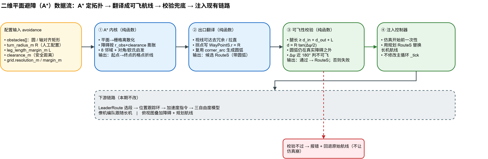
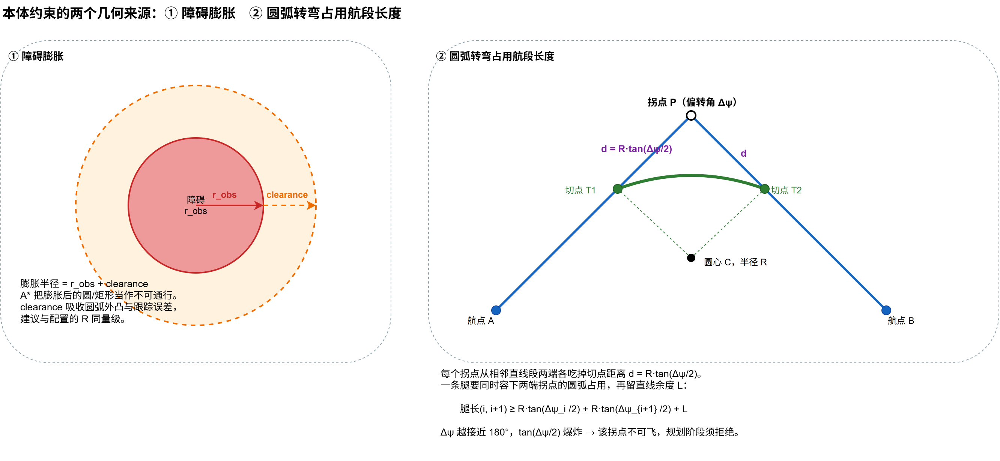

# 二维平面避障（A*）开发计划

> 状态：**草案 v1，待评审**。本文档为"讨论先行"阶段的产物，仅描述方案与分步计划，尚未落地任何代码。
> 评审通过后，按"第 6 节 分步开发计划"逐步实施，每完成一大步由作者做代码检查 + 手动测试。

---

## 1. 目标与范围

给现有编队仿真引入**二维水平面避障**：把风险区视为**三维无限高的柱体**，因此只在 East-North 水平面上规划，高度剖面保持不变。用 **A\*** 在栅格上求绕障拓扑路径，再翻译成项目现有的可飞航线（`RouteS`）喂给长机。

### 1.1 分两版推进

| 版本 | 触发时机 | 目标 | 关键难点 |
| --- | --- | --- | --- |
| **第一版（本计划主体）** | **离线静态**：仿真开始前，对长机整条航线规划一次 | 跑通"配置障碍 → A* → 可飞航线 → 长机绕障飞行 → 可视化可见" | 出口翻译 + 可飞性校验 |
| 第二版（本计划仅给衔接概述，见第 7 节） | 在线动态：飞行中周期性重规划 | 应对移动/突现障碍 | 初始航向约束（Dubins）、实时性、航线热切换抖动 |

### 1.2 范围边界（第一版）

- **只对长机航线避障**；僚机跟随长机。
- 障碍形状：**圆形** + **轴对齐矩形**。
- 高度：保持原航线高度剖面，只改水平 East-North。
- 无解或不可飞：**报错并回退到原始航线**，绝不让仿真崩。
- 不修改主循环 `_tick`、跟踪环、编队、模型；下游全部复用。

### 1.3 已知约束声明（第一版暂不处理，留待后续）

1. **僚机槽位可能侵入障碍**：只保证长机航迹安全，编队队形展开后僚机位置不校验。
2. **初始航向约束**：静态版仿真起点航向基本对齐首航段，问题小；在线动态版才需要按当前 `vPsi` 做 Dubins 式约束。
3. **窄处自动减速换更小转弯半径**：第一版航段速度沿用原配置，不为避障调速。
4. **垂直机动避障**：本期不做，风险区按无限高柱体处理。

---

## 2. 总体架构与数据流

A\* 只负责"从障碍哪一边绕"（**拓扑**）；飞机本体约束由"膨胀 + 出口圆弧 + 可飞性校验"保证"绕得过来"（**可飞性**）。两者分层，校验兜底。



> 图源：[避障-A星-数据流.drawio](./避障-A星-数据流.drawio)

关键点：只要出口产出合法 `RouteS`，**下游链路（`LeaderRoute` 选段 → 位置跟踪环 → 三自由度模型、僚机编队、俯视图）全部零改动**。

---

## 3. 飞机本体约束与避障的耦合

栅格 A\* 不懂动力学，本体约束必须从源头揉进规划，否则路径"几何可行但飞不出来"。经讨论收敛，**几何上真正支配避障的物理约束只有转弯半径 R 一个**；`clearance` 与 `L` 是围绕 R 选取的工程裕度，并非独立物理量。其余看似相关的量都不构成独立约束，原因如下：

| 量 | 字段 / 来源 | 默认 | 讨论后的地位 |
| --- | --- | --- | --- |
| **转弯半径 R** | `WayPointS.r` / `WayLineS.radius`（改为人工配置，见 3.1） | 见下 | **唯一支配约束**：决定膨胀、航段长度占用、圆弧外凸是否触障 |
| 前向速度 | `control.velocity_command_limits.forward_*` | 14~25 m/s | 非约束。R 不再由速度反算，速度只影响绕障**耗时** |
| 加速度幅值 | `model.limits.acceleration_command_mps2` | 6.0 m/s² | 非独立约束。跟踪能力，影响被 `clearance` 吸收 |
| 滚转角 | `model.limits.phi_*_deg` | ±40° | 非约束（仅作 R 下界哨兵，见 3.1）。按配置 R 飞，不命令到极限 |
| 圆弧退化 | `corner_arc` + `sim_control` 切点校验 | — | 非约束，是失败模式——正由 `腿长 ≥ d_in+d_out+L`（本质 R+L）防住 |

### 3.1 转弯半径 R —— 改为人工直接配置（关键决策）

现状 `leader_route.py` 用 `R = v²/(g·tan20°)` 反算转弯半径。**本方案不沿用反算**，R 作为**配置项**直接给定，理由：

- 为压低航迹偏航角速率 `dVPsi`，工程上 R 常取得比 20° 滚转算出的更大；
- R 在规划前就是**已知常量**，不依赖速度，膨胀与可飞性校验都用它，逻辑更干净。

> 参考量级（20° 标准盘旋，仅供选 R 时心里有数）：14 m/s≈55 m、20 m/s≈112 m、25 m/s≈175 m。配置的 R 一般 **≥** 对应速度的这个值。

**R 下界哨兵（把速度 / 滚转的口子焊死）**：R 通常取大，故滚转极限一般不碰；唯一反向风险是 R 配得**太小**——小到该速度需要的滚转过陡，此时几何校验通过、飞机却飞得很勉强甚至飞不了。加一条配置预检即可闭合。哨兵用 **40° 的作业滚转上限**（而非 70° 物理极限），给常规航线留余量：

```
R  ≥  v² / ( g · tan(40°) )      # 该航段速度下、按 40° 作业滚转上限的最小转弯半径
```

> 量级（40°）：14 m/s≈24 m、20 m/s≈49 m、25 m/s≈76 m。

不满足则开机告警（`ERR_AVOID_RADIUS_TOO_SMALL`）。这是平时不触发的防误配哨兵，速度与滚转角即以这唯一一条形式重新进来，无需作为独立约束。

### 3.2 两个几何来源：膨胀 + 航段长度占用



> 图源：[避障-A星-几何约束.drawio](./避障-A星-几何约束.drawio)

**① 障碍膨胀**：A\* 把障碍按 `膨胀半径 = r_obs + clearance` 当作不可通行。`clearance` 吸收圆弧外凸与跟踪误差，建议与配置的 R 同量级。

**② 圆弧转弯占用航段长度**：每个拐点从相邻直线段两端各吃掉切点距离

```
d = R · tan(Δψ / 2)        （Δψ = 该拐点航向偏转角）
```

因此**一条腿（相邻两拐点之间）的可飞性约束**为——同时容下两端拐点的圆弧占用，再留直线余度 `L`：

```
腿长(i, i+1)  ≥  R·tan(Δψ_i /2)  +  R·tan(Δψ_{i+1}/2)  +  L
```

- `Δψ` 越接近 180°（急掉头），`tan(Δψ/2)` 爆炸 → 该拐点不可飞，规划阶段须拒绝。
- 满足此式同时根治 `corner_arc` 的"退化抄近路"陷阱。
- `L` 为配置项，保证每段拐点之间留有最短直线段。

---

## 4. 数据结构与配置

### 4.1 新增数据结构（拟放 `src/algorithm/context/leaf_types.py` 或新建避障专用模块，评审定）

```python
@dataclass
class ObstacleS:
    """二维水平障碍（无限高柱体）。圆与矩形均原生保留，不互相转换。"""
    kind: str                 # "circle" | "rect"
    # circle:
    center: PosInEarthS       # 圆心（h 忽略）
    radius: float = 0.0       # 半径，米
    # rect（轴对齐）:
    min_e: float = 0.0; min_n: float = 0.0
    max_e: float = 0.0; max_n: float = 0.0
```

> 规划结果直接复用现有 `RouteS` / `WayLineS` / `WayPointS`，不新增路径类型。

**统一抽象——每形状只需一个"点到障碍"基元**。形状相关代码全部收敛到一个函数，供 A\* 与可飞性校验共用，新增形状只补这一处：

```python
def inside(obs, e, n, clearance=0.0) -> bool:
    if obs.kind == "circle":
        return hypot(e - obs.center.east, n - obs.center.north) <= obs.radius + clearance
    else:  # 轴对齐矩形：外扩 clearance 的方框（圆角按方角近似，误差被 clearance 吸收）
        return (obs.min_e - clearance <= e <= obs.max_e + clearance and
                obs.min_n - clearance <= n <= obs.max_n + clearance)
```

- **A\* 格子判定**：`blocked = any(inside(obs, e, n, clearance) for obs in obstacles)`。
- **可飞性校验**：把圆弧**采样成密集点**，逐点复用同一 `inside()`——不写"圆弧 vs 障碍"的闭式几何，圆 / 矩形通吃，矩形精度不丢。校验只在开机前跑一次、性能无压力，故采样可取密。

### 4.2 配置 schema（`configs/*.json` 顶层新增 `avoidance` 段）

```jsonc
"avoidance": {
  "enabled": true,
  "turn_radius_m": 120.0,        // R，人工配置（见 3.1）
  "leg_length_margin_m": 30.0,   // L，拐点间最短直线余度
  "clearance_m": 40.0,           // 障碍膨胀安全距离
  "grid": {
    "resolution_m": 8.0,         // 栅格分辨率，远小于 R
    "margin_m": 100.0            // 包围盒外扩
  },
  "obstacles": [
    { "type": "circle", "center": {"east_m": 600, "north_m": 300}, "radius_m": 80 },
    { "type": "rect", "min": {"east_m": 900, "north_m": 100},
                      "max": {"east_m": 1100, "north_m": 500} }
  ]
}
```

字段约定：`enabled=false` 或 `obstacles` 为空 → 完全跳过避障，等价于现状。

---

## 5. 模块落点

在 `src/algorithm/units/process/tra_plan/` 下新建避障子模块，与 `LeaderRoute` 同级，保持**纯函数**便于单测：

```
src/algorithm/units/process/tra_plan/
├── leader_route.py                # 现有
└── avoidance/
    ├── obstacle.py                # ObstacleS + 唯一形状基元 inside()（圆 / 矩形）
    ├── astar.py                   # 栅格化 + A* 内核（纯函数），格子判定调 inside()
    ├── path_to_route.py           # 去冗余 + 圆弧 + 出口翻译为 RouteS
    └── feasibility.py             # 可飞性校验（腿长 + 圆弧采样逐点调 inside()）
```

接入由 `sim_control.py` 在加载配置后、初始化长机航线时调用（仅一处，静态版）。

---

## 6. 分步开发计划

每一大步独立可测、可回滚；做完即停，等代码检查 + 手测通过再进下一步。

### 步骤 1：数据结构 + 配置加载
- **输入**：`avoidance` 配置段。
- **输出**：`ObstacleS` 列表能从 JSON 读出；`enabled/obstacles` 缺省时安全跳过。
- **现象**：仿真行为与现状完全一致（还没接入规划）。
- **测试**：解析单测（圆 / 矩形 / 缺省 / 空列表）；R 下界预检（R 过小报 `ERR_AVOID_RADIUS_TOO_SMALL`）。
- **手测**：跑一次默认配置，确认无回归。

### 步骤 2：A\* 内核（纯函数）
- **输入**：起点、终点、`ObstacleS[]`、`resolution_m`、`clearance_m`、包围盒。
- **输出**：起点→终点的**格点折线**（list of (east, north)）；无解返回 `None`。
- **现象**：纯算法，独立运行，不影响仿真。
- **测试**：单点障碍能绕开、无障碍走直线、障碍封死返回无解、矩形障碍正确膨胀；A\* 路径不穿膨胀区。
- **手测**：用脚本喂构造场景，打印路径坐标核对。

### 步骤 3：出口翻译 —— 去冗余 + 圆弧
- **输入**：步骤 2 的格点折线、`R`。
- **输出**：候选 `RouteS`（去冗余拉直后的拐点写入 `WayPointS.r = R`，复用 `corner_arc` 生成圆弧）。
- **现象**：锯齿格点变成带圆弧的平滑航线。
- **测试**：视线可达去冗余正确（不跨障碍拉直）；拐点圆弧几何合法（切点、圆心、转向）；与现有 `corner_arc` 一致。
- **手测**：对比去冗余前后拐点数；目视航线合理。

### 步骤 4：可飞性校验
- **输入**：步骤 3 的候选 `RouteS`、`R`、`L`、`ObstacleS[]`。
- **输出**：通过 → `RouteS`；否则按 **§9 的 `ERR_AVOID_*` 原因码 + 定位信息**返回失败（哪条腿太短缺几米 / 哪个拐点 Δψ / 哪个障碍触障）。圆弧 vs 障碍用**采样逐点调 `inside()`**，圆 / 矩形统一处理。
- **现象**：能识别"几何可行但飞不出来"的路径并拒绝。
- **测试**：腿长 `≥ d_in+d_out+L` 边界用例；近 180° 拐点判不可飞；圆弧外凸触障被拒（圆与矩形各一例）；采样步长足够密不漏穿。
- **手测**：构造刚好不满足腿长的场景，确认被拒并给出清晰原因。

### 步骤 5：接入控制器（静态版闭环）
- **输入**：长机原始航线 + `avoidance` 配置。
- **输出**：仿真开始前用规划 `RouteS` 替换长机航线；失败则回退原航线，并按 **§9** 把 `ERR_AVOID_*` 原因码 + 定位信息写入告警 / 日志（不只报"规划失败"）。
- **现象**：长机实际飞行绕开障碍，僚机跟随。
- **测试**：端到端——给定障碍后长机航迹始终在障碍外；`enabled=false` 行为同现状；无解时回退且仿真正常结束。
- **手测**：跑 GUI，观察长机绕障、编队跟随、是否撞障。

### 步骤 6：可视化
- **输入**：`ObstacleS[]`、规划 `RouteS`。
- **输出**：俯视图叠加障碍（圆 / 矩形）+ 规划航线。
- **现象**：肉眼可见航线绕开障碍区。
- **测试**：GUI 渲染交互测试（不崩、缩放平移正常）。
- **手测**：目视确认障碍位置与航线绕行一致。

---

## 7. 第二版（在线动态）衔接概述

静态版跑通后再启动，本计划不展开，仅声明衔接点：

- **触发**：主循环按周期或事件（障碍变化 / 偏航超限）触发重规划，复用步骤 2~4 的纯函数。
- **初始航向约束**：从当前 `vPsi` 出发，首段需满足最小转弯半径（Dubins 起始段），不能要求瞬时掉头。
- **航线热切换**：重规划结果切入正在跟踪的航线时要平滑过渡，避免位置 / 速度指令跳变引发抖动。
- **实时性**：A\* 栅格规模与重规划频率需在主循环节拍预算内，必要时降分辨率 / 限范围。

---

## 8. 风险与注意事项

- **栅格分辨率 vs R**：`resolution_m` 必须远小于 R，否则圆弧拟合与去冗余不准；太细则 A\* 变慢。
- **膨胀与圆弧外凸**：绕障时圆弧在障碍外侧外凸，`clearance` 要留够，否则贴膨胀边缘走仍可能触真实障碍——可飞性校验用**真实障碍**（clearance=0）复核兜底。
- **矩形膨胀近似**：轴对齐矩形外扩 `clearance` 为方角方框（真实为圆角矩形），方角误差由 `clearance` 吸收；圆与矩形均原生保留、互不转换。
- **圆弧采样步长**：可飞性校验把圆弧打散成点逐点判定，步长须**远小于最小障碍尺寸与 clearance**，否则圆弧可能在两采样点之间"穿过"细障碍；校验仅开机前跑一次，可放心取密。
- **退化场景**：竖直 / 重合航点现有代码会报错；出口翻译须避免生成此类航段。

---

## 9. 失败情形与诊断（报错须给出具体原因）

避障失败一律**不崩、回退原始航线**，但**必须在告警 / 日志里给出可定位的具体原因**——不能只报"规划失败"。失败分两个阶段、两类真假。

### 9.0 配置预检（规划之前）

- `ERR_AVOID_RADIUS_TOO_SMALL`：配置 R 小于该速度按 40° 作业滚转上限的最小转弯半径 `v²/(g·tan40°)`（见 3.1 下界哨兵）。报错附该段速度与允许的最小 R。

### 9.1 无解（A\* 阶段，拓扑到不了）

| 情形 | 触发条件 | 真 / 假 | 建议报错信息 |
| --- | --- | --- | --- |
| 起点 / 终点在障碍内 | 起或终格落入膨胀障碍 | 真（配置问题） | `ERR_AVOID_ENDPOINT_IN_OBSTACLE`：指出是起点还是终点 + 命中障碍 id |
| 通路被完全封死 | 障碍连成墙横断起终点 | 真（几何如此） | `ERR_AVOID_NO_PATH`：提示场景几何不可达 |
| 窄通道被膨胀堵死 | 两障碍间距 < 2·clearance | 假（调参可解） | `ERR_AVOID_NO_PATH` + 建议"减小 clearance / 挪障碍" |
| 绕行空间在栅格外 | 需绕到 `grid.margin` 之外 | 假（调参可解） | `ERR_AVOID_OUT_OF_GRID` + 建议"放大 grid.margin" |

### 9.2 不可飞（校验阶段，能到但飞不出来）

| 情形 | 触发条件 | 建议报错信息 |
| --- | --- | --- |
| 腿太短 | 某腿 `< d_in + d_out + L` | `ERR_AVOID_LEG_TOO_SHORT`：腿 idx + 缺多少米 |
| 急拐点 | 某拐点 `Δψ → 180°` | `ERR_AVOID_TURN_TOO_SHARP`：拐点 idx + Δψ 值 |
| 圆弧外凸触障 | 圆弧鼓出碰真实障碍 | `ERR_AVOID_ARC_HITS_OBSTACLE`：拐点 idx + 障碍 id |

### 9.3 真失败 vs 假失败

- **假失败（调参可解）**：窄通道、栅格太小、R/clearance/L 配比不当——报错**须附建议调整的参数**，让用户能直接动手。
- **真失败（几何不可能）**：通道物理上窄于最小转弯所需、起终点被障碍隔断——避障器诚实报"飞不过去"，不再建议调参。

### 9.4 R 的参数张力（诊断时重点怀疑）

R 取大有利于降低偏航角速率，但副作用双向：圆弧**鼓得更远**（易触障）、每拐点**吃掉腿长更多**（`d = R·tan(Δψ/2)`，易腿短）。因此"腿太短 / 圆弧触障"反复出现时，**优先怀疑 R 偏大**，其次 clearance / 障碍间距。

### 9.5 实现约定

每种失败返回一个**原因码（`ERR_AVOID_*`，呼应现有 `ResultCode` 风格）+ 定位信息**（哪条腿 / 哪个拐点 / 哪个障碍 / 缺多少米）。步骤 4（校验）与步骤 5（接入）的告警与日志都按此约定输出，便于手测对号入座。

---

## 10. 验收标准（第一版）

1. 配置障碍后，长机全程航迹位于所有真实障碍之外（端到端测试 + GUI 目视）。
2. `avoidance.enabled=false` 或无障碍时，行为与现状逐位一致（无回归）。
3. 无解 / 不可飞场景下回退原航线，告警 / 日志给出 **§9 具体 `ERR_AVOID_*` 原因码 + 定位信息**（非笼统"规划失败"），仿真正常结束。
4. 新增纯函数模块均有 LLT 单测覆盖（A\* / 去冗余 / 圆弧 / 可飞性校验）。
5. 俯视图正确叠加障碍与规划航线。
