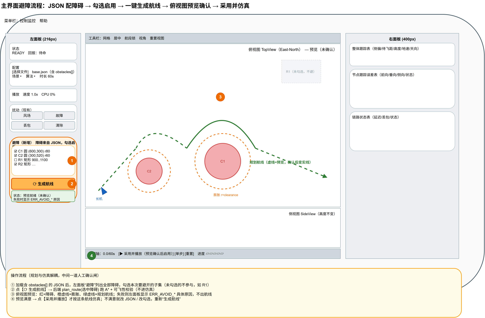

# 二维平面避障（A*）设计文档

> 状态：**已实现**。本文记录第一版（离线静态）避障的最终设计与落地形态，对应 `src/algorithm/units/process/tra_plan/avoidance/` 与控制器、界面接入。开发过程的分步计划已完成使命，本文只描述"建成的样子"。

---

## 1. 目标与范围

给现有编队仿真引入**二维水平面避障**：把风险区视为**三维无限高的柱体**，因此只在 East-North 水平面上规划，高度剖面保持不变。用 **A\*** 在栅格上求绕障拓扑路径，再翻译成项目现有的可飞航线（`RouteS`）喂给长机。

### 1.1 第一版定位

| 维度 | 取值 |
| --- | --- |
| 触发时机 | **离线静态**：仿真开始前，对长机整条航线规划一次 |
| 处理对象 | **只对长机航线避障**，僚机跟随长机 |
| 障碍形状 | **圆形** + **轴对齐矩形**，均原生保留、互不转换 |
| 高度 | 保持原航线高度剖面，只改水平 East-North（按水平里程线性插值） |
| 失败处理 | 无解 / 不可飞 → **报具体原因码、回退原始航线，绝不崩** |
| 下游影响 | 不改主循环 `_tick`、跟踪环、编队、模型；只要产出合法 `RouteS`，下游零改动 |
| 障碍来源 | **离线写 JSON**，界面只做"勾选 + 生成航线 + 预览确认 + 采用并仿真"，不做地图鼠标绘制 |

### 1.2 已知约束声明（第一版未处理，留待在线动态版）

1. **僚机槽位可能侵入障碍**：只保证长机航迹安全，编队展开后僚机位置不校验。
2. **初始航向约束**：静态版起点航向基本对齐首航段，问题小；在线动态版才需按当前 `vPsi` 做 Dubins 式约束。
3. **窄处自动减速换更小转弯半径**：航段速度沿用原配置，不为避障调速。
4. **垂直机动避障**：本期不做，风险区按无限高柱体处理。

---

## 2. 总体架构与数据流

A\* 只负责"从障碍哪一边绕"（**拓扑**）；飞机本体约束由"膨胀 + 出口圆弧 + 可飞性校验"保证"绕得过来"（**可飞性**）。两者分层，校验兜底。


> 图源：[避障-A星-数据流.drawio](./避障-A星-数据流.drawio)

链路：`原航线航点 → 逐腿 A*（栅格折线）→ 视线去冗余 → 可飞性校验 → corner_arc 圆弧 → RouteS`。只要出口产出合法 `RouteS`，**下游链路（`LeaderRoute` 选段 → 位置跟踪环 → 三自由度模型、僚机编队、俯视图）全部零改动**。

---

## 3. 飞机本体约束与避障的耦合

栅格 A\* 不懂动力学，本体约束必须从源头揉进规划，否则路径"几何可行但飞不出来"。经讨论收敛，**几何上真正支配避障的物理约束只有转弯半径 R 一个**；`clearance` 与 `L` 是围绕 R 选取的工程裕度，并非独立物理量。其余看似相关的量都不构成独立约束：

| 量 | 字段 / 来源 | 默认 | 地位 |
| --- | --- | --- | --- |
| **转弯半径 R** | `avoidance.turn_radius_m` → `WayLineS.radius`（人工配置，见 3.1） | 见下 | **唯一支配约束**：决定膨胀、航段长度占用、圆弧外凸是否触障 |
| 前向速度 | `control.velocity_command_limits.forward_*` | 14~25 m/s | 非约束。R 不由速度反算，速度只影响绕障**耗时** |
| 加速度幅值 | `model.limits.acceleration_command_mps2` | 6.0 m/s² | 非独立约束。跟踪能力，影响被 `clearance` 吸收 |
| 滚转角 | `model.limits.phi_*_deg` | ±70°（作业 40°） | 非约束（仅作 R 下界哨兵语义，见 3.1）。按配置 R 飞，不命令到极限 |
| 圆弧退化 | `corner_arc` + 可飞性校验 | — | 非约束，是失败模式——由 `腿长 ≥ d_in+d_out+L` 防住 |

### 3.1 转弯半径 R —— 人工直接配置

现状 `leader_route.py` 用 `R = v²/(g·tan20°)` 反算。**本方案不沿用反算**，R 作为**配置项**（`avoidance.turn_radius_m`）直接给定：

- 为压低航迹偏航角速率 `dVPsi`，工程上 R 常取得比 20° 滚转算出的更大；
- R 在规划前就是**已知常量**，不依赖速度，膨胀与可飞性校验都用它，逻辑更干净。

> 参考量级（20° 标准盘旋，仅供选 R 时心里有数）：14 m/s≈55 m、20 m/s≈112 m、25 m/s≈175 m。

**R 下界哨兵（设计约定）**：R 配得**太小**（小到该速度需要的滚转过陡）时，几何校验会通过、飞机却飞得勉强。设计上以 **40° 作业滚转上限**为下界参考：`R ≥ v²/(g·tan40°)`（量级：14 m/s≈24 m、20 m/s≈49 m、25 m/s≈76 m）。

> 实现说明：第一版**未**加入独立的 `ERR_AVOID_RADIUS_TOO_SMALL` 预检；R 过小引发的后果会在可飞性校验阶段以 `ERR_AVOID_LEG_TOO_SHORT` / `ERR_AVOID_ARC_HITS_OBSTACLE` 形式暴露。该哨兵作为后续增强保留。

### 3.2 两个几何来源：膨胀 + 航段长度占用


> 图源：[避障-A星-几何约束.drawio](./避障-A星-几何约束.drawio)

**① 障碍膨胀**：A\* 把障碍按 `膨胀半径 = r_obs + clearance` 当作不可通行。`clearance` 吸收圆弧外凸与跟踪误差，建议与配置的 R 同量级。

**② 圆弧转弯占用航段长度**：每个拐点从相邻直线段两端各吃掉切点距离

```
d = R · tan(Δψ / 2)        （Δψ = 该拐点航向偏转角）
```

因此**一条腿（相邻两拐点之间）的可飞性约束**为——同时容下两端拐点的圆弧占用，再留直线余度 `L`：

```
腿长(i, i+1)  ≥  R·tan(Δψ_i /2)  +  R·tan(Δψ_{i+1}/2)  +  L
```

- `Δψ` 越接近 180°（急掉头），`tan(Δψ/2)` 爆炸 → 该拐点不可飞，校验阶段拒绝（`max_turn_deg`，默认 150°）。
- 满足此式同时根治 `corner_arc` 的"退化抄近路"陷阱。
- `L`（`leg_length_margin_m`）保证每段拐点之间留有最短直线段。

---

## 4. 数据结构与配置

### 4.1 障碍数据结构（`avoidance/obstacle.py`）

```python
@dataclass
class ObstacleS:
    """二维水平障碍（无限高柱体）。圆与矩形均原生保留，不互相转换。"""
    id: str                   # 唯一标识，供界面列表显示与勾选
    kind: str                 # "circle" | "rect"
    center: PosInEarthS       # circle 圆心（h 忽略）
    radius: float = 0.0       # circle 半径，米
    min_e: float = 0.0; min_n: float = 0.0   # rect（轴对齐）左下
    max_e: float = 0.0; max_n: float = 0.0   # rect 右上
```

构造辅助：`make_circle(id, east, north, radius)`、`make_rect(id, min_e, min_n, max_e, max_n)`。规划结果直接复用现有 `RouteS` / `WayLineS` / `WayPointS`，不新增路径类型。

**统一抽象——每形状只需一个"点到障碍"基元**。形状相关代码全部收敛到 `inside()`，供 A\* 与可飞性校验共用，新增形状只补这一处：

```python
def inside(obs, east, north, clearance=0.0) -> bool:
    if obs.kind == "circle":
        return hypot(east - obs.center.east, north - obs.center.north) <= obs.radius + clearance
    else:  # 轴对齐矩形：外扩 clearance 的方框（圆角按方角近似，误差被 clearance 吸收）
        return (obs.min_e - clearance <= east <= obs.max_e + clearance and
                obs.min_n - clearance <= north <= obs.max_n + clearance)
```

- **A\* 格子判定**：`blocked(obstacles, e, n, clearance)` = 任一 `inside()`。
- **可飞性校验**：把圆弧**采样成密集点**，逐点复用同一 `inside()`——不写"圆弧 vs 障碍"的闭式几何，圆 / 矩形通吃、矩形精度不丢。校验只在生成前跑一次、性能无压力，故采样可取密。

### 4.2 配置 schema（`configs/*.json` 顶层 `avoidance` 段）

以 `configs/base.json` 实际内容为例：

```jsonc
"avoidance": {
  "enabled": true,
  "allow_arc": true,             // 交付编码：true=圆弧段；false=外切线直连原拐点（见 §4.3）
  "turn_radius_m": 200.0,        // R，人工配置（见 3.1）
  "leg_length_margin_m": 80.0,   // L，拐点间最短直线余度
  "clearance_m": 120.0,          // 障碍膨胀安全距离
  "grid": {
    "resolution_m": 20.0,        // 栅格分辨率，远小于 R
    "margin_m": 300.0            // 包围盒外扩
  },
  "obstacles": [
    { "id": "C1", "type": "circle", "enabled": true,
      "center": {"east_m": 900, "north_m": 0}, "radius_m": 200 },
    { "id": "C2", "type": "circle", "enabled": true,
      "center": {"east_m": 2000, "north_m": 1200}, "radius_m": 200 },
    { "id": "R1", "type": "rect", "enabled": false,
      "min": {"east_m": 350, "north_m": -180}, "max": {"east_m": 650, "north_m": 180} }
  ]
}
```

字段约定：

- 顶层 `enabled=false` 或 `obstacles` 为空 → 完全跳过避障，等价于现状。
- 每个障碍带 `id`（界面列表显示 / 勾选用）与 `enabled`（默认勾选状态）。JSON 是**障碍库**，界面再从中**勾选本次启用的子集**——只对勾选项规划，未勾选的不参与（见 §6）。
- 长机原航线取自 `route.waypoints[]`，航点坐标兼容 `x_m/east`、`y_m/north`、`altitude_m/h` 两套字段名（与控制器 `_route_point_from_config` 一致）。
- `allow_arc`（默认 `true`）：交付编码开关，见 §4.3。

### 4.3 交付编码：圆弧段 vs 外切线（`allow_arc`）

部分客户的下游（自驾仪 / 航线格式）**不支持圆弧航段**，只接受直线段。`avoidance.allow_arc` 决定避障航线在拐点处**如何编码交付**，但**不改变可飞性判据**：

| | `allow_arc: true`（默认） | `allow_arc: false`（外切线） |
| --- | --- | --- |
| 拐点编码 | 相切**圆弧** `WayLineS`（`radius=R`） | **外切线**：直连原拐点的两条直线（`radius=0`） |
| §3.2 可飞性校验 | 按真实 R 校验（急拐 / 腿长 / 圆弧触障） | **同样按真实 R 校验**，不可飞两种编码都拒 |
| 几何关系 | 圆弧内切于拐角，贴近被绕障碍一侧 | 顶点在转弯**外侧**，离障碍更远，更保守 |

关键点:**`allow_arc` 只决定最终航段怎么编码,不决定能不能飞**。哪怕交付外切线折角,飞机过弯仍要半径 R 装得下、不触障——所以 `check_feasibility`（§3.2、§7.2）两种模式**完全一致地跑**,`allow_arc=false` 不会绕过校验。客户自驾仪到顶点按自身半径（≤R）圆一下,仍在已验证的安全包络内。

**作用域仅避障输出**:`allow_arc` 不耦合长机配置航线（后者的圆弧由 `sim_control._build_leader_route(insert_arcs=...)` 各自管理）。

> 实现：`points_to_route(..., insert_arcs=allow_arc)`——`False` 时所有拐点走"直连"分支,产出穿过各原拐点的纯直线折线;`plan_avoidance_route(..., allow_arc=...)` 透传,`check_feasibility` 调用不受影响。

---

## 5. 模块落点与对外接口

在 `src/algorithm/units/process/tra_plan/avoidance/` 下建避障子模块，与 `LeaderRoute` 同级，全部**纯函数**便于单测：

```
src/algorithm/units/process/tra_plan/
├── leader_route.py                # 现有
└── avoidance/
    ├── obstacle.py                # ObstacleS + 唯一形状基元 inside() / blocked()（圆 / 矩形）
    ├── astar.py                   # 栅格化 + A* 内核 plan_path()，格子判定调 inside()
    ├── path_to_route.py           # line_of_sight_clear + simplify_path + points_to_route（圆弧出口）
    ├── feasibility.py             # check_feasibility（腿长 + 圆弧采样逐点调 inside()）
    └── planner.py                 # plan_avoidance_route：逐腿编排上面四步，产出 PlanResult
```

### 5.1 规划编排入口

```python
def plan_avoidance_route(
    waypoints, obstacles, *,
    turn_radius_m, leg_margin_m, clearance_m, speed_mps,
    resolution_m, margin_m=0.0,
    arc_clearance=0.0, sample_step=None, max_turn_deg=150.0,
    allow_arc=True,
) -> PlanResult
```

**逐腿规划**保形：对原航线每条腿 `waypoints[i]→[i+1]` 独立跑 `plan_path → simplify_path`，再拼接（丢掉相邻腿重合的衔接点）、去重，整体做一次 `check_feasibility`（始终按真实 R），最后 `points_to_route(insert_arcs=allow_arc)` 按交付编码生成圆弧或外切线航线（见 §4.3）。高度按水平里程在腿两端间线性插值。

```python
@dataclass
class PlanResult:
    ok: bool
    route: RouteS | None = None
    code: str = "OK"           # 失败时为 ERR_AVOID_*
    detail: str = ""           # 人读定位信息
    leg_index: int | None = None       # 触发失败的原航线腿序号
    obstacle_id: str | None = None
    simplified_points: list = ...       # 去冗余拐点（诊断/预览）
    feasibility: FeasibilityResult | None = None
```

### 5.2 控制器接入（规划与仿真解耦）

`sim_control.py` 通过**长机航线覆盖**机制接入，不复用 `DisturbanceCommand`（那是带时长的扰动），障碍是空间持久对象：

- `apply_avoidance_route(route) -> CommandResult`：把预览 `RouteS` 设为 `_leader_route_override`，替换长机航线（运行中拒绝 `ERR_BUSY`，未加载配置 `ERR_NO_CONFIG`，空航线 `ERR_CONFIG_INVALID`）。
- `clear_avoidance_route() -> CommandResult`：清除覆盖，回退到配置原航线。
- 生命周期：`reset()` **保留**覆盖（重置仍飞绕障航线）；`load_config()` **清除**覆盖（重新加载回到配置原航线）。

---

## 6. 界面交互流程（规划与仿真解耦，一道人工确认闸）

不做地图鼠标绘制；障碍离线写进 JSON，界面只负责**勾选 + 一键生成 + 预览 + 确认**。



> 图源：[避障-UI交互示意.drawio](./避障-UI交互示意.drawio)

1. 加载含 `obstacles[]` 的 JSON 后，左面板"避障"分组列出全部障碍，**勾选**本次要避开的子集（未勾选不参与）。
2. 点 **【⟳ 生成航线】** → 后端 `plan_avoidance_route(选中障碍)` 跑逐腿 A\* + 可飞性校验（**不进仿真**）。
   - 若一个障碍都没勾选 → 维持原航线：清空预览、禁用「采用」、状态显示"未选择障碍 · 维持原航线"。
3. 俯视图**预览**：红=障碍、橙虚线=膨胀、绿虚线=规划航线；失败则面板显示 **`ERR_AVOID_*` 具体原因**，不出航线、不可采用。
4. 预览满意 → 点 **【采用航线】** 才把预览 `RouteS` 下发控制器替换长机航线，再点播放仿真；不满意就改 JSON / 改勾选，重新"生成航线"。
5. 任意障碍勾选变更 → 预览立即失效（`_invalidate_preview`），需重新生成，避免预览与勾选集不一致。

> 预览航线先**只在内存中**，确认即用。

---

## 7. 失败情形与诊断（报错须给出具体原因）

避障失败一律**不崩、回退原始航线**，但**必须给出可定位的具体原因**——不能只报"规划失败"。第一版实现 5 个原因码，分两阶段：

### 7.1 无解（A\* 阶段，拓扑到不了）

| 原因码 | 触发条件 | 定位信息 |
| --- | --- | --- |
| `ERR_AVOID_ENDPOINT_IN_OBSTACLE` | 某腿起点或终点落入膨胀障碍内 | 腿 idx + 是起点还是终点 |
| `ERR_AVOID_NO_PATH` | 通道被封死 / 绕行超出栅格范围 / 结果退化为单点 | 腿 idx |

> 设计上窄通道、栅格太小都归入 `ERR_AVOID_NO_PATH`（"通道被封死或绕行超出栅格范围"），第一版未单列 `OUT_OF_GRID`。

### 7.2 不可飞（可飞性校验阶段，能到但飞不出来）

| 原因码 | 触发条件 | 定位信息 |
| --- | --- | --- |
| `ERR_AVOID_LEG_TOO_SHORT` | 某腿 `< d_in + d_out + L` | 腿 idx + 缺多少米 |
| `ERR_AVOID_TURN_TOO_SHARP` | 某拐点 `Δψ ≥ max_turn_deg`（默认 150°） | 拐点 idx + Δψ 值 |
| `ERR_AVOID_ARC_HITS_OBSTACLE` | 圆弧外凸采样点命中真实障碍 | 拐点 idx + 障碍 id |

### 7.3 真失败 vs 假失败

- **假失败（调参可解）**：窄通道、栅格太小、R/clearance/L 配比不当——优先怀疑 **R 偏大**（圆弧鼓得更远、每拐点吃掉腿长更多 `d=R·tan(Δψ/2)`），其次 clearance / 障碍间距。
- **真失败（几何不可能）**：通道物理上窄于最小转弯所需、起终点被障碍隔断——诚实报"飞不过去"，不再建议调参。

---

## 8. 风险与注意事项

- **栅格分辨率 vs R**：`resolution_m` 必须远小于 R，否则圆弧拟合与去冗余不准；太细则 A\* 变慢。`astar.py` 设 `MAX_GRID_CELLS` 上限防止包围盒过大爆内存。
- **膨胀与圆弧外凸**：绕障时圆弧在障碍外侧外凸，`clearance` 要留够；可飞性校验用**真实障碍**（`arc_clearance=0`）复核兜底。
- **矩形膨胀近似**：轴对齐矩形外扩 `clearance` 为方角方框（真实为圆角矩形），方角误差由 `clearance` 吸收。
- **圆弧采样步长**：校验把圆弧打散成点逐点判定，步长须**远小于最小障碍尺寸与 clearance**（`_default_sample_step` 据此取；视线检测用 `ceil` 保证步长是间距上界，不漏穿细障碍），否则可能在两采样点之间"穿过"细障碍。
- **退化场景**：竖直 / 重合航点现有代码会报错；出口翻译已去重相邻重合点避免生成此类航段。

---

## 9. 验收标准（第一版，已满足）

1. 配置障碍后，长机全程航迹位于所有真实障碍之外（端到端测试 + GUI 目视）。
2. `avoidance.enabled=false` 或无障碍 / 未勾选时，行为与现状一致（无回归）。
3. 无解 / 不可飞场景下回退原航线，告警 / 日志给出 **§7 具体 `ERR_AVOID_*` 原因码 + 定位信息**，仿真正常结束。
4. 新增纯函数模块均有 LLT 单测覆盖（配置 / A\* / 去冗余圆弧 / 可飞性 / 编排 / 接入 / UI，共 90 条避障用例）。
5. 俯视图正确叠加障碍、膨胀圈与绿色预览航线。

---

## 10. 第二版（在线动态）衔接概述

静态版已跑通，在线动态版本文不展开，仅声明衔接点：

- **触发**：主循环按周期或事件（障碍变化 / 偏航超限）触发重规划，复用 `astar` / `path_to_route` / `feasibility` 纯函数。
- **初始航向约束**：从当前 `vPsi` 出发，首段需满足最小转弯半径（Dubins 起始段），不能要求瞬时掉头。
- **航线热切换**：重规划结果切入正在跟踪的航线时要平滑过渡，避免位置 / 速度指令跳变引发抖动。
- **实时性**：A\* 栅格规模与重规划频率需在主循环节拍预算内，必要时降分辨率 / 限范围。
- **R 下界哨兵**：补 `ERR_AVOID_RADIUS_TOO_SMALL` 配置预检（见 3.1）。
