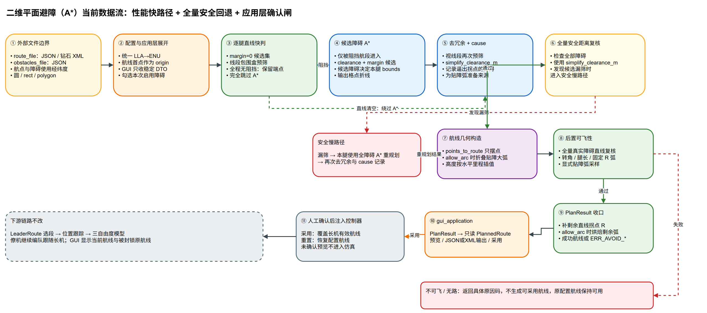
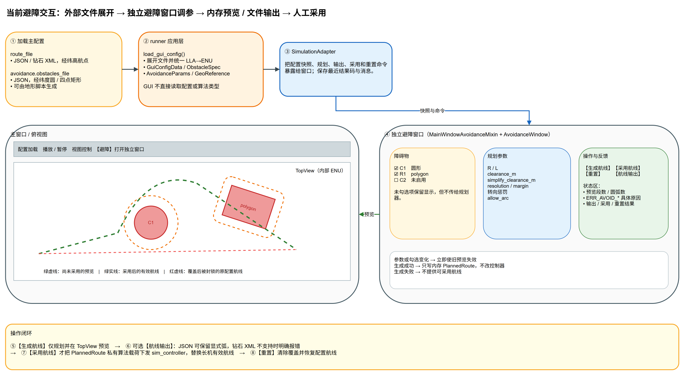

# 二维平面避障（A*）设计文档

> 状态：**已实现**。本文记录第一版（离线静态）避障的最终设计与落地形态，对应 `src/algorithm/units/process/tra_plan/avoidance/` 与控制器、界面接入。开发过程的分步计划已完成使命，本文只描述"建成的样子"。

---

## 1. 目标与范围

给现有编队仿真引入**二维水平面避障**：把风险区视为**三维无限高的柱体**，因此只在 East-North 水平面上规划，高度剖面保持不变。用 **A\*** 在栅格上求绕障拓扑路径，再翻译成 `list[WayPointInputS]` 喂给长机（由 `waypoint_inputs_to_waylines()` 在 `leader.init()` 里统一转换为内部 `list[WayLineS]`）。

### 1.1 第一版定位

| 维度 | 取值 |
| --- | --- |
| 触发时机 | **离线静态**：仿真开始前，对长机整条航线规划一次 |
| 处理对象 | **只对长机航线避障**，僚机跟随长机 |
| 障碍形状 | **圆形** + **轴对齐矩形**，均原生保留、互不转换 |
| 高度 | 保持原航线高度剖面，只改水平 East-North（按水平里程线性插值） |
| 失败处理 | 无解 / 不可飞 → **报具体原因码、回退原始航线，绝不崩** |
| 下游影响 | 不改主循环 `_tick`、跟踪环、编队、模型；只要产出合法 `list[WayPointInputS]`，下游零改动 |
| 障碍来源 | **离线写 JSON**，界面只做"勾选 + 生成航线 + 预览确认 + 采用并仿真"，不做地图鼠标绘制 |

### 1.2 已知约束声明（第一版未处理，留待在线动态版）

1. **僚机槽位可能侵入障碍**：只保证长机航迹安全，编队展开后僚机位置不校验。
2. **初始航向约束**：静态版起点航向基本对齐首航段，问题小；在线动态版才需按当前 `vPsi` 做 Dubins 式约束。
3. **窄处自动减速换更小转弯半径**：航段速度沿用原配置，不为避障调速。
4. **垂直机动避障**：本期不做，风险区按无限高柱体处理。

---

## 2. 总体架构与数据流

A\* 只负责"从障碍哪一边绕"（**拓扑**）；飞机本体约束由"膨胀 + 出口圆弧 + 可飞性校验"保证"绕得过来"（**可飞性**）。两者分层，校验兜底。



> 图源：[避障-A星-数据流.drawio](./避障-A星-数据流.drawio)

链路：`原航线航点 → 逐腿 A*（栅格折线）→ 视线去冗余（带 cause 标签）→ points_to_route（只摆点）→ bake_obstacle_hug_arcs（贴障弧，仅 allow_arc）→ 可飞性校验（check_route_feasibility，校折叠后航线）→ assign_transition_radius（补交接半径）→ bake_transition_arcs（拐点烘焙，仅 allow_arc）→ list[WayPointInputS]`。只要出口产出合法 `list[WayPointInputS]`，**下游链路（`waypoint_inputs_to_waylines → LeaderRoute` 选段 → 位置跟踪环 → 三自由度模型、僚机编队、俯视图）全部零改动**。注意：可飞性校验已**后置到贴障折叠之后**（见 §4.4），校的是真正要飞的航线。

---

## 3. 飞机本体约束与避障的耦合

栅格 A\* 不懂动力学，本体约束必须从源头揉进规划，否则路径"几何可行但飞不出来"。经讨论收敛，**几何上真正支配避障的物理约束只有转弯半径 R 一个**；`clearance` 与 `L` 是围绕 R 选取的工程裕度，并非独立物理量。其余看似相关的量都不构成独立约束：

| 量 | 字段 / 来源 | 默认 | 地位 |
| --- | --- | --- | --- |
| **转弯半径 R** | `avoidance.turn_radius_m` → `WayPointInputS.r`（人工配置，见 3.1） | 见下 | **唯一支配约束**：决定膨胀、航段长度占用、圆弧外凸是否触障 |
| 前向速度 | `control.velocity_command_limits.forward_*` | 14~25 m/s | 非约束。R 不由速度反算，速度只影响绕障**耗时** |
| 加速度幅值 | `model.limits.acceleration_command_mps2` | 6.0 m/s² | 非独立约束。跟踪能力，影响被 `clearance` 吸收 |
| 滚转角 | `model.limits.phi_*_deg` | ±70°（作业 40°） | 非约束（仅作 R 下界哨兵语义，见 3.1）。按配置 R 飞，不命令到极限 |
| 圆弧退化 | `corner_arc` + 可飞性校验 | — | 非约束，是失败模式——由 `腿长 ≥ d_in+d_out+L` 防住 |

### 3.1 转弯半径 R —— 人工直接配置

现状 `leader_route.py` 用 `R = v²/(g·tan20°)` 反算。**本方案不沿用反算**，R 作为**配置项**（`avoidance.turn_radius_m`）直接给定：

- 为压低航迹偏航角速率 `dVPsi`，工程上 R 常取得比 20° 滚转算出的更大；
- R 在规划前就是**已知常量**，不依赖速度，膨胀与可飞性校验都用它，逻辑更干净。

> 参考量级（20° 标准盘旋，仅供选 R 时心里有数）：14 m/s≈55 m、20 m/s≈112 m、25 m/s≈175 m。

**R 下界哨兵（设计约定）**：R 配得**太小**（小到该速度需要的滚转过陡）时，几何校验会通过、飞机却飞得勉强。设计上以 **40° 作业滚转上限**为下界参考：`R ≥ v²/(g·tan40°)`（量级：14 m/s≈24 m、20 m/s≈49 m、25 m/s≈76 m）。

> 实现说明：第一版**未**加入独立的 `ERR_AVOID_RADIUS_TOO_SMALL` 预检；R 过小引发的后果会在可飞性校验阶段以 `ERR_AVOID_LEG_TOO_SHORT` / `ERR_AVOID_ARC_HITS_OBSTACLE` 形式暴露。该哨兵作为后续增强保留。

### 3.2 两个几何来源：膨胀 + 航段长度占用


> 图源：[避障-A星-几何约束.drawio](./避障-A星-几何约束.drawio)

**① 障碍膨胀**：A\* 把障碍按 `膨胀半径 = r_obs + clearance` 当作不可通行。`clearance` 吸收圆弧外凸与跟踪误差，建议与配置的 R 同量级。

**② 圆弧转弯占用航段长度**：每个拐点从相邻直线段两端各吃掉切点距离

```
d = R · tan(Δψ / 2)        （Δψ = 该拐点航向偏转角）
```

因此**一条腿（相邻两拐点之间）的可飞性约束**为——同时容下两端拐点的圆弧占用，再留直线余度 `L`：

```
腿长(i, i+1)  ≥  R·tan(Δψ_i /2)  +  R·tan(Δψ_{i+1}/2)  +  L
```

- `Δψ` 越接近 180°（急掉头），`tan(Δψ/2)` 爆炸 → 该拐点不可飞，校验阶段拒绝（`max_turn_deg`，默认 150°）。
- 满足此式同时根治 `corner_arc` 的"退化抄近路"陷阱。
- `L`（`leg_length_margin_m`）保证每段拐点之间留有最短直线段。

---

## 4. 数据结构与配置

### 4.1 障碍数据结构（`avoidance/obstacle.py`）

```python
@dataclass
class ObstacleS:
    """二维水平障碍（无限高柱体）。圆与矩形均原生保留，不互相转换。"""
    id: str                   # 唯一标识，供界面列表显示与勾选
    kind: str                 # "circle" | "rect"
    center: PosInEarthS       # circle 圆心（h 忽略）
    radius: float = 0.0       # circle 半径，米
    min_e: float = 0.0; min_n: float = 0.0   # rect（轴对齐）左下
    max_e: float = 0.0; max_n: float = 0.0   # rect 右上
```

构造辅助：`make_circle(id, east, north, radius)`、`make_rect(id, min_e, min_n, max_e, max_n)`。规划结果输出 `list[WayPointInputS]`（由 `points_to_route()` 生成），经 `waypoint_inputs_to_waylines()` 转换为内部 `list[WayLineS]`，不新增路径类型。

**统一抽象——每形状只需一个"点到障碍"基元**。形状相关代码全部收敛到 `inside()`，供 A\* 与可飞性校验共用，新增形状只补这一处：

```python
def inside(obs, east, north, clearance=0.0) -> bool:
    if obs.kind == "circle":
        return hypot(east - obs.center.east, north - obs.center.north) <= obs.radius + clearance
    else:  # 轴对齐矩形：外扩 clearance 的方框（圆角按方角近似，误差被 clearance 吸收）
        return (obs.min_e - clearance <= east <= obs.max_e + clearance and
                obs.min_n - clearance <= north <= obs.max_n + clearance)
```

- **A\* 格子判定**：`blocked(obstacles, e, n, clearance)` = 任一 `inside()`。
- **可飞性校验**：把圆弧**采样成密集点**，逐点复用同一 `inside()`——不写"圆弧 vs 障碍"的闭式几何，圆 / 矩形通吃、矩形精度不丢。校验只在生成前跑一次、性能无压力，故采样可取密。

### 4.2 配置 schema（`configs/*.json` 顶层 `avoidance` 段）

以 `configs/base.json` 实际内容为例：

```jsonc
"route_file": "element/line.json",
"avoidance": {
  "enabled": true,
  "allow_arc": true,             // 航段自身是否可为曲线（贴障弧线段，见 §4.4）；不影响拐点交接圆弧（见 §4.3）
  "turn_radius_m": 200.0,        // R，人工配置（见 3.1）
  "leg_length_margin_m": 80.0,   // L，拐点间最短直线余度
  "clearance_m": 120.0,          // 障碍膨胀安全距离
  "simplify_clearance_m": 120.0, // 视线去冗余安全距离；缺省回退到 clearance_m
  "turn_switch_penalty_m": 0.0,  // A* 每次航向切换的等效米惩罚；0=旧行为
  "turn_angle_weight_m": 0.0,    // A* 每 45° 航迹角变化的等效米惩罚；0=旧行为
  "grid": {
    "resolution_m": 20.0,        // 栅格分辨率，远小于 R
    "margin_m": 300.0            // 包围盒外扩
  },
  "obstacles_file": "element/obstacles.json"
}
```

字段约定：

- 顶层 `route_file` 是相对主配置文件目录的路径，指向完整 `route` 对象；外部文件使用经纬高 `latitude_deg/longitude_deg/altitude_m` 时，加载时以第一个航点为 ENU origin 并展开为内部 `route.waypoints[]`。
- `avoidance.obstacles_file` 是相对主配置文件目录的路径，由 `src/data/obstaclefile/` 策略工厂解析，指向障碍数组，或包含 `obstacles` 字段的对象；经纬度障碍加载时由上层注入基础航线 origin 并展开为内部 `avoidance.obstacles[]`。
- 顶层 `enabled=false` 或展开后的 `obstacles` 为空 → 完全跳过避障，等价于现状。
- 每个障碍带 `id`（界面列表显示 / 勾选用）与 `enabled`（默认勾选状态）。`element/obstacles.json` 是**障碍库**，界面再从中**勾选本次启用的子集**——只对勾选项规划，未勾选的不参与（见 §6）。
- 长机原航线取自展开后的 `route.waypoints[]`，内部坐标仍兼容 `x_m/east`、`y_m/north`、`altitude_m/h` 两套字段名（与控制器 `_route_point_from_config` 一致）。航线文件还可携带 `turn_sign` 与 `center` 表示已烘焙圆弧航段，供避障航线输出后再次作为 `route_file` 读回。
- 圆形障碍外部中心点使用经纬度，`radius_m` 仍为米；矩形障碍外部使用 `points[4]` 四个经纬点，可表达旋转矩形，内部转换为 polygon 后精确判定，不退化为轴对齐包围盒。
- GUI 画布和避障窗口当前仍按内部 ENU 显示，不在本阶段切换为经纬度显示。
- `allow_arc`（默认 `true`）：航段自身是否可为曲线。`true` 时启用贴障弧（§4.4）——绕障被折叠成沿膨胀圆的大弧；**不影响**直线-直线拐点的交接圆弧（后者由补充函数无条件按 R 补），见 §4.3。
- `simplify_clearance_m`（缺省等于 `clearance_m`）：影响 A* 输出后的 `simplify_path` 视线拉直，**也是贴障弧的贴行半径**（膨胀半径 = `r_obs + simplify_clearance_m`，见 §4.4）。设为 `clearance_m` 时保持旧行为；调小可减少锯齿折线保留的中间拐点，但安全复核仍由后续可飞性校验兜底。
- `turn_switch_penalty_m`（默认 `0.0`）：A* 搜索中每次 8 邻域方向切换的固定等效米代价，用于减少方向频繁切换导致的小直线段。
- `turn_angle_weight_m`（默认 `0.0`）：A* 搜索中每 45° 航迹角变化的线性等效米代价，用于抑制少数过硬的大角度换向。两个航迹角惩罚都为 0 时，代码走旧 A* 分支，路径逐点兼容。

### 4.3 交接半径补充与 `allow_arc`（两件正交的事）

这里有**两个互相独立**的概念，曾被混在一个开关里，现已拆开：

1. **交接半径 R（拐点圆弧）**：两条**直线航段**在拐点处用多大半径平滑过渡。这是避障输出的固有动作，**与 `allow_arc` 无关**，由补充函数 `assign_transition_radius()` 在可飞性校验**之后**统一补：凡"入段、出段都是直线"的内部拐点都设 `WayPointInputS.r=turn_radius_m`，再由 `waypoint_inputs_to_waylines()` 展开为相切圆弧 `WayLineS`（`start.turnSign≠0`）。
2. **航段自身曲率（`allow_arc`）**：指**航段本身是不是一条曲线**（例如将来贴着障碍边界走的弧线段），而不是拐点怎么交接。`allow_arc=false` 表示所有航段（腿）都是直线，`allow_arc=true` 才允许出现"航段即曲线"。

二者正交：`allow_arc=false`（航段都是直线）时，直线-直线拐点**照样**按 R 切交接圆弧——这正是"长机自动在两航段之间加交接圆弧"的能力来源。`allow_arc` 只控制航段骨架能否弯，不会取消拐点交接圆弧。

| | 拐点交接圆弧（R） | 航段自身曲率（`allow_arc`） |
| --- | --- | --- |
| 含义 | 两直线段之间的过渡半径 | 航段本身是否为曲线（贴障弧线段） |
| 来源 | `assign_transition_radius()`，按航段关系无条件补 | `allow_arc` 开关（预留） |
| 受 `allow_arc` 影响 | **否** | 是 |

**补充函数的航段关系判定**：内部拐点 `i`，若入段 `(i-1→i)` 与出段 `(i→i+1)` 都是直线（其起点 `turnSign==0`）→ `r=R`；任一邻段为曲线（`turnSign≠0`，如将来的贴障弧线段）→ `r=0`，交接交给曲线自身；首末点不补。

**现状**：`allow_arc=true` 时由 `bake_obstacle_hug_arcs()`（见 §4.4）产出"贴障弧线段"——这是"航段自身曲率"的实际产生者，两种取值不再一致。补充函数 `assign_transition_radius()` 已预留协作：贴障弧两端是 `turnSign≠0` 的曲线段，相邻拐点据此自动设 `r=0`，把交接交给弧自身。无论取值，可飞性校验（`check_route_feasibility`，§4.4）始终按真实 R 校验折叠后航线。

**作用域仅避障输出**：`allow_arc` 与补充函数都只作用于避障航线；长机配置航线的逐点 `R` 由用户在 `route.waypoints[*].R` 显式给定，经 `sim_control._build_leader_route(insert_arcs=...)` 各自管理，不走补充函数。

> 实现：`points_to_route(...)` 只摆点（`r` 一律 0）；`allow_arc=true` 时先 `bake_obstacle_hug_arcs()` 折叠贴障大弧，再 `assign_transition_radius(route, turn_radius_m)` 给剩余直线-直线拐点补 R，最后 `bake_transition_arcs()` 烘焙这些拐点；`allow_arc=false` 时只补 R、不烘焙。

### 4.4 贴障弧（`bake_obstacle_hug_arcs`，沿障碍膨胀圆走一段大弧）

**问题**：§3.1 的 R 是飞机**最小**转弯半径。当 `R < 障碍膨胀半径 = r_obs + 拉直安全间距` 时，绕障路径本应贴着膨胀圆（半径 = 膨胀半径）走一段干净大弧，但若对去冗余折线每个拐点都按固定 R 倒角，会把这段路切成"弧（R）—直—弧—直"的碎段（R 比路径该有的曲率更弯）。

**做法**（仅 `allow_arc=true`，放在 `assign_transition_radius` 之前）：识别"连续贴同一圆同一侧"的拐点串，整串折叠成**一段真圆弧航段**——`turnSign≠0`、`center=障碍中心`、半径=膨胀半径（即 `r_obs + simplify_clearance_m`，UI 的"拉直安全间距"）。R 退化为可行性约束：仅当`膨胀半径 ≥ R`时才贴，否则保留固定 R 倒角。

**贴障串识别**（方案 B，记账而非距离反推）：`simplify_path_with_causes()` 在视线拉直时，对每个保留拐点记录"被哪个障碍逼停"的 `cause` 标签（`line_of_sight_clear` 内部本就知道命中的障碍）。极大串 = 连续 `cause` 同一圆 + 沿圆心极角单调同向（转向一致）+ 串长 ≥ 2（单顶点擦边交给固定 R 倒角）。

**几何**（`arc_path.py`）：
- 自由点 → 圆：`tangent_point()` 在两切点中取"切线方向与该弧转向切向一致"的那个；
- 相邻两段贴障弧之间：`common_tangent()` 求两圆公切线（同向 sweep→外公切线、反向→内公切线，按转向选唯一一条），**两端相切、无拐点衔接**。

**安全与退化**：每段弧采样 + 每条衔接直线都按**真实障碍**（`clearance=0`）触障复核。优先走"相邻段公切线"方案（要求整体可飞，否则放弃）；不可飞时退化为"各圆独立、逐段折叠"（失败的段保留原顶点），恒返回一条可飞航线。仅圆形障碍走贴障弧；矩形维持固定 R 倒角。

**可飞性校验已后置（已落地）**：`check_route_feasibility` 校的是**贴障折叠之后**真正要飞的航线，而非"固定 R 倒角"的中间态。做法：在贴障弧处把航线切成若干**直线骨架子折线**，每段照旧 `check_feasibility`（固定 R 校转角/腿长/触障），贴障弧段另做触障复核。于是被贴障弧合并掉的拐点**不再受固定 R 腿长约束**，"R>膨胀半径致固定 R 判腿太短、但贴障弧本可救活"的解不再被误杀（回归测试 `test_hug_arc_rescues_fixed_radius_leg_too_short`）。无贴障弧时（如 `allow_arc=false`）退化为对整条折线跑一次，与旧行为一致。

**已知遗留 / TODO**：

1. **可选简化——角点大 r 倒角表示**：贴障大弧在几何上等价于"其两条切线、用膨胀半径做的固定倒角"，故可不造独立曲线段，而是在两切线交点放一个航点、`r=膨胀半径`，复用 `assign_transition_radius`/`bake`/长机平滑——可进一步消除 `allow_arc` 分叉、统一表示。**代价**：角点倒角扫掠角 <180°，故"绕障超过半圈（扫掠 >180°）"无法用单个倒角表示，仍需保留当前显式弧段（现状显式弧段已支持 >180°，实测可生成 ~204° 单段弧）。概率低，留待评估。
2. **圆-圆公切线**：仅"两障碍近到被连续贴、中间无自由顶点"时触发，属窄场景；运行上**可通过扩大避障区域规避**，不依赖算法硬解。当前已实现公切线衔接作为兜底。

---

## 5. 模块落点与对外接口

在 `src/algorithm/units/process/tra_plan/avoidance/` 下建避障子模块，与 `LeaderRoute` 同级，全部**纯函数**便于单测：

```
src/algorithm/units/process/tra_plan/
├── leader_route.py                # 现有
└── avoidance/
    ├── obstacle.py                # ObstacleS + 唯一形状基元 inside() / blocked()（圆 / 矩形）
    ├── astar.py                   # 栅格化 + A* 内核 plan_path()，格子判定调 inside()
    ├── path_to_route.py           # line_of_sight_clear + simplify_path(_with_causes) + points_to_route（只摆点）+ assign_transition_radius（补交接半径）+ bake_obstacle_hug_arcs（贴障弧，§4.4）
    ├── feasibility.py             # check_feasibility（折线+固定R：腿长+圆弧采样）+ check_route_feasibility（折叠后航线：拆直线骨架逐段校 + 贴障弧触障）
    └── planner.py                 # plan_avoidance_route：逐腿编排上面四步，产出 PlanResult
```

### 5.1 规划编排入口

```python
def plan_avoidance_route(
    waypoints, obstacles, *,
    turn_radius_m, leg_margin_m, clearance_m, speed_mps,
    resolution_m, simplify_clearance_m=None,
    turn_switch_penalty_m=0.0, turn_angle_weight_m=0.0,
    margin_m=0.0,
    arc_clearance=0.0, sample_step=None, max_turn_deg=150.0,
    allow_arc=True,
) -> PlanResult
```

**逐腿规划**保形：对原航线每条腿 `waypoints[i]→[i+1]` 独立跑 `plan_path → simplify_path_with_causes`（带 cause 标签，供贴障弧识别），再拼接（丢掉相邻腿重合的衔接点，cause 随点一并拼接/去重）、去重，`points_to_route()` 摆点（`r=0`）。`allow_arc=true` 时先 `bake_obstacle_hug_arcs()` 折叠贴障大弧（见 §4.4）。随后对**折叠后的航线**做 `check_route_feasibility()`（始终按真实 R；被贴障弧合并的拐点不再受固定 R 腿长约束），通过后 `assign_transition_radius()`（给剩余直线-直线拐点补 R，见 §4.3）、`allow_arc=true` 再 `bake_transition_arcs()` 烘焙拐点圆弧；`allow_arc=false` 时只补 R、不烘焙。高度按水平里程在腿两端间线性插值。`simplify_clearance_m=None` 时回退到 `clearance_m`。

```python
@dataclass
class PlanResult:
    ok: bool
    route: list[WayPointInputS] | None = None  # 规划结果；由 waypoint_inputs_to_waylines() 转为 list[WayLineS]
    code: str = "OK"           # 失败时为 ERR_AVOID_*
    detail: str = ""           # 人读定位信息
    leg_index: int | None = None       # 触发失败的原航线腿序号
    obstacle_id: str | None = None
    simplified_points: list = ...       # 去冗余拐点（诊断/预览）
    feasibility: FeasibilityResult | None = None
```

### 5.2 控制器接入（规划与仿真解耦）

`sim_control.py` 通过**长机航线覆盖**机制接入，不复用 `DisturbanceCommand`（那是带时长的扰动），障碍是空间持久对象：

- `apply_avoidance_route(route: list[WayPointInputS]) -> CommandResult`：把预览航线设为 `_leader_route_override`，替换长机航线（运行中拒绝 `ERR_BUSY`，未加载配置 `ERR_NO_CONFIG`，航线长度不足 `ERR_CONFIG_INVALID`）。
- `clear_avoidance_route() -> CommandResult`：清除覆盖，回退到配置原航线。
- 生命周期：`reset()` **保留**覆盖（重置仍飞绕障航线）；`load_config()` **清除**覆盖（重新加载回到配置原航线）。

---

## 6. 界面交互流程（规划与仿真解耦，一道人工确认闸）

不做地图鼠标绘制；障碍离线写进 JSON，界面只负责**勾选 + 一键生成 + 预览 + 确认**。



> 图源：[避障-UI交互示意.drawio](./避障-UI交互示意.drawio)

1. 加载含 `obstacles[]` 的 JSON 后，左面板"避障"分组列出全部障碍，**勾选**本次要避开的子集（未勾选不参与）。
2. 点 **【⟳ 生成航线】** → 后端 `plan_avoidance_route(选中障碍)` 跑逐腿 A\* + 可飞性校验（**不进仿真**）。
   - 若一个障碍都没勾选 → 维持原航线：清空预览、禁用「采用」、状态显示"未选择障碍 · 维持原航线"。
3. 俯视图**预览**：红=障碍、橙虚线=膨胀、绿虚线=规划航线；失败则面板显示 **`ERR_AVOID_*` 具体原因**，不出航线、不可采用。
4. 预览满意 → 可点 **【航线输出】** 将当前预览航线写成 `route_file` 可读的 JSON 文件；也可点 **【采用航线】** 把预览 `RouteS` 下发控制器替换长机航线，再点播放仿真；不满意就改 JSON / 改勾选，重新"生成航线"。
5. 任意障碍勾选变更 → 预览立即失效（`_invalidate_preview`），需重新生成，避免预览与勾选集不一致。

> 预览航线先**只在内存中**，确认即用。

---

## 7. 失败情形与诊断（报错须给出具体原因）

避障失败一律**不崩、回退原始航线**，但**必须给出可定位的具体原因**——不能只报"规划失败"。第一版实现 5 个原因码，分两阶段：

### 7.1 无解（A\* 阶段，拓扑到不了）

| 原因码 | 触发条件 | 定位信息 |
| --- | --- | --- |
| `ERR_AVOID_ENDPOINT_IN_OBSTACLE` | 某腿起点或终点落入膨胀障碍内 | 腿 idx + 是起点还是终点 |
| `ERR_AVOID_NO_PATH` | 通道被封死 / 绕行超出栅格范围 / 结果退化为单点 | 腿 idx |

> 设计上窄通道、栅格太小都归入 `ERR_AVOID_NO_PATH`（"通道被封死或绕行超出栅格范围"），第一版未单列 `OUT_OF_GRID`。

### 7.2 不可飞（可飞性校验阶段，能到但飞不出来）

| 原因码 | 触发条件 | 定位信息 |
| --- | --- | --- |
| `ERR_AVOID_LEG_TOO_SHORT` | 某腿 `< d_in + d_out + L` | 腿 idx + 缺多少米 |
| `ERR_AVOID_TURN_TOO_SHARP` | 某拐点 `Δψ ≥ max_turn_deg`（默认 150°） | 拐点 idx + Δψ 值 |
| `ERR_AVOID_ARC_HITS_OBSTACLE` | 圆弧外凸采样点命中真实障碍 | 拐点 idx + 障碍 id |

### 7.3 真失败 vs 假失败

- **假失败（调参可解）**：窄通道、栅格太小、R/clearance/L 配比不当——优先怀疑 **R 偏大**（圆弧鼓得更远、每拐点吃掉腿长更多 `d=R·tan(Δψ/2)`），其次 clearance / 障碍间距。
- **真失败（几何不可能）**：通道物理上窄于最小转弯所需、起终点被障碍隔断——诚实报"飞不过去"，不再建议调参。

---

## 8. 参数调整顺序

调参建议从**物理约束**到**搜索质量**逐层推进：先锁定飞机能力与安全边界，再调整栅格精度和搜索范围，最后才用去冗余 / 航迹角惩罚减少碎段。每次只改一类参数，并记录 `PlanResult.code`、`simplified_points` 数量、航段数量、最大绕行偏移和规划耗时。

| 顺序 | 参数 | 物理意义 | 影响性 | 建议初始参数 | 调整思路 |
| --- | --- | --- | --- | --- | --- |
| 1 | `turn_radius_m` | 飞机绕拐点生成圆弧时使用的最小转弯半径 R。 | 越大，转弯越平缓，但圆弧外凸更远、每个拐点占用的切线距离更长，更容易触发腿太短或圆弧触障。 | 使用飞机能力或任务约束给定；若无外部约束，可先取 `200~300m`。 | 优先按物理能力定，不用它修饰路径形状。若频繁 `ERR_AVOID_LEG_TOO_SHORT` 且业务允许，可下调；若转弯过急或跟踪困难，应上调。 |
| 2 | `leg_length_margin_m` | 相邻圆弧之间额外保留的最短直线余度 L。 | 越大，圆弧间过渡更保守，但更容易判定腿长不足；越小，航线更容易通过校验但圆弧衔接更紧。 | `0.2R~0.5R`；例如 `R=300m` 时先试 `60~150m`。 | R 确定后再调。若 `ERR_AVOID_LEG_TOO_SHORT` 频繁且路径几何合理，先小幅降低 L；若仿真中转弯段衔接太紧，再提高 L。 |
| 3 | `clearance_m` | A* 搜索时对障碍做外扩的安全距离。 | 越大，路径离障碍越远但绕行更大、通道更容易被封死；越小，路径更贴近障碍，安全余度降低。 | 由业务安全距离决定；若无约束，可先取 `80~150m`，或约 `0.25R~0.5R`。 | 先保证安全。若 `ERR_AVOID_NO_PATH` 出现在窄通道，可逐步降低；若预览或仿真过于贴障碍，应提高。 |
| 4 | `grid.resolution_m` | A* 栅格间距，决定搜索离散精度。 | 越小，几何更细、绕障更准确，但搜索更慢；越大，搜索更快但路径粗糙、边界误差更大。 | 建议 `<= R/10`；例如 `R=300m` 时先取 `20~30m`。 | 确保远小于 R 后再微调。若路径过粗或贴障误差明显，降低；若规划慢或接近 `MAX_GRID_CELLS`，提高或缩小范围。 |
| 5 | `grid.margin_m` | 自动搜索包围盒在起点、终点和障碍外的额外扩展距离。 | 越大，A* 有更多绕行空间但网格规模增大；越小，可能因边界太窄找不到可行绕行。 | 先取 `clearance_m + R` 或 `300m`。 | 若报无路但肉眼看可绕，先增大；若规划耗时高且绕行空间明显过宽，可减小。 |
| 6 | `simplify_clearance_m` | A* 后 `simplify_path` 视线拉直时使用的障碍外扩距离。 | 等于 `clearance_m` 时最保守且兼容旧行为；调小后更容易拉直，拐点和航段更少，但拉直线段离膨胀边界更近。 | 初始设为 `clearance_m` 验证兼容；减少碎段时试 `0.5*clearance_m`，再试 `0`。 | 只在安全距离和可飞性已稳定后调。若航段碎且圆弧复核仍安全，逐步降低；若拉直后过于贴障或圆弧触障，调回更大值。 |
| 7 | `turn_switch_penalty_m` | A* 中每次 8 邻域方向切换的固定等效米惩罚。 | 越大，越不愿频繁换向，小直线段减少；过大时可能绕远或贴边界选择少转向路径。 | 初始 `0` 保持旧行为；减少碎段时从 `1.0*resolution_m` 试起。 | 先单独调它，不同时调 `turn_angle_weight_m`。若方向切换仍多，逐步加到 `2~4*resolution_m`；若路径绕行过大，降低。 |
| 8 | `turn_angle_weight_m` | A* 中每 45° 航迹角变化的线性等效米惩罚。 | 用于区分 45°、90°、135° 等换向角度；可减少硬拐，但不是减少碎段的主力。过大时会和最短路目标拉扯。 | 初始 `0`；仅在启用 `turn_switch_penalty_m` 后仍出现硬拐时，试 `0.25~0.5*turn_switch_penalty_m`。 | 最后再调。若路径少段但大角度硬拐明显，逐步增加；若路径明显绕远或过度追求小角度，降低。 |

---

## 9. 风险与注意事项

- **栅格分辨率 vs R**：`resolution_m` 必须远小于 R，否则圆弧拟合与去冗余不准；太细则 A\* 变慢。`astar.py` 设 `MAX_GRID_CELLS` 上限防止包围盒过大爆内存。
- **航迹角惩罚开销**：`turn_switch_penalty_m` 或 `turn_angle_weight_m` 非 0 时，A* 状态从 `(i,j)` 扩展为 `(i,j,入射方向)`，状态空间最多约 8 倍；两个值均为 0 时走旧分支避免额外开销。方向夹角只有 8×8 种组合，`astar.py` 在模块加载时预计算 `_DIRECTION_DELTA_DEG` 表，热循环中只查表计算惩罚，避免每次扩展重复 `acos/degrees/hypot`。
- **膨胀与圆弧外凸**：绕障时圆弧在障碍外侧外凸，`clearance` 要留够；可飞性校验用**真实障碍**（`arc_clearance=0`）复核兜底。
- **矩形膨胀近似**：轴对齐 `rect` 判障外扩 `clearance` 为方角方框（真实为圆角矩形），方角误差由 `clearance` 吸收；四点矩形（含旋转）走 `polygon` 分支，判障按"点到边距离 ≤ clearance"是**圆角**边界，显示层亦已对齐为圆角（见 §9.1）。
- **圆弧采样步长**：校验把圆弧打散成点逐点判定，步长须**远小于最小障碍尺寸与 clearance**（`_default_sample_step` 据此取；视线检测用 `ceil` 保证步长是间距上界，不漏穿细障碍），否则可能在两采样点之间"穿过"细障碍。
- **退化场景**：竖直 / 重合航点现有代码会报错；出口翻译已去重相邻重合点避免生成此类航段。

### 9.1 折线"擦"膨胀角：显示一致性 vs 以直代曲（诊断结论）

**现象**：生成的绿色航线折线看上去会**稍微穿过矩形障碍膨胀框的角**，圆形障碍不会。经拆解为两层，性质完全不同：

**① 显示不一致（已修，纯渲染问题）**：后端 `inside()` 的 polygon 分支按"点到边距离 ≤ clearance"判障，角部是半径 = `clearance` 的**圆角**边界（等价多边形与半径 `clearance` 圆盘的 Minkowski 和）。而旧显示层 `_inflated_polygon_vertices` 用 **miter 尖角**外扩画膨胀框，角部比真实圆角边界更往外凸（对角约 `clearance·(√2−1)`）。航线贴着后端圆角边界飞时，就落在了所画尖角框以内 → 肉眼"穿角"。圆形因显示 `radius+inflate` 与后端 `radius+clearance` 一致，所画即所判，故不穿。

> 修复：新增 `avoidance_tools._rounded_inflated_polygon_points`（圆角外扩：每条边沿外法线平移 `inflate`，凸顶点用半径 = `inflate` 的圆弧衔接并离散成折线点），`top_view._stroke_obstacle_shape` 的 polygon 分支改用之，与后端 `inside()` 语义严格一致；后端判障与路径生成不变。

**② 以直代曲（真实但无害，非显示问题）**：修复①后"画的 = 算的"，残余那点极小切入是航线折线**本身的真实几何**——用**直线弦**逼近弯曲的膨胀边界，弦中点必然下凹进安全缓冲，深度 = 弓高 `c²/(8R)`（`c`=弦长，`R`=局部边界半径：圆为 `r_obs+clearance`、角为 `clearance`）。它吃掉的是**安全裕度、不是障碍本体**，把渲染画得再精细也在那儿。

**诊断证据**（`configs/single_avoidance_80km.json`，clearance=300 m、R=600 m，实际航线 38 航点）：

- 所有**航点**到最近障碍本体的最小距离 = **300.0 m**（正好 = clearance，顶点全部合规、精确贴在膨胀边界上）；
- 整条轨迹到**真实障碍本体**的最近距离 = **295.7 m > 0**（**从未碰到本体**，只吃掉了 300 m 里的 ~4 m 裕度）；
- 中段侵入深度与弓高公式吻合：

| 段类型 | 弦长 c | 实测弓高 | 公式 `c²/(8R)` |
| --- | --- | --- | --- |
| 圆 | 296.5 m | **3.93 m** | **3.93 m**（一分不差） |
| 多边形角 | 93.0 m | 4.30 m | 3.61 m（同量级；角部弧半径沿整条弦非恒定，实测略高） |

**结论**：绿线擦进的只是"画出来的圆角安全框"里那几米安全裕度，成因是折线离散逼近弯曲边界的**弓高（以直代曲）**，真实障碍一点没碰。若需进一步消除，方向在**路径**（该处走贴障弧 / 加密航点使弦更短），而非渲染；鉴于从未触障，一般**无需处理**。

---

## 10. 验收标准（第一版，已满足）

1. 配置障碍后，长机全程航迹位于所有真实障碍之外（端到端测试 + GUI 目视）。
2. `avoidance.enabled=false` 或无障碍 / 未勾选时，行为与现状一致（无回归）。
3. 无解 / 不可飞场景下回退原航线，告警 / 日志给出 **§7 具体 `ERR_AVOID_*` 原因码 + 定位信息**，仿真正常结束。
4. 新增纯函数模块均有 LLT 单测覆盖（配置 / A\* / 去冗余圆弧 / 可飞性 / 编排 / 接入 / UI，共 90 条避障用例）。
5. 俯视图正确叠加障碍、膨胀圈与绿色预览航线。

---

## 11. 第二版（在线动态）衔接概述

静态版已跑通，在线动态版本文不展开，仅声明衔接点：

- **触发**：主循环按周期或事件（障碍变化 / 偏航超限）触发重规划，复用 `astar` / `path_to_route` / `feasibility` 纯函数。
- **初始航向约束**：从当前 `vPsi` 出发，首段需满足最小转弯半径（Dubins 起始段），不能要求瞬时掉头。
- **航线热切换**：重规划结果切入正在跟踪的航线时要平滑过渡，避免位置 / 速度指令跳变引发抖动。
- **实时性**：A\* 栅格规模与重规划频率需在主循环节拍预算内，必要时降分辨率 / 限范围。
- **R 下界哨兵**：补 `ERR_AVOID_RADIUS_TOO_SMALL` 配置预检（见 3.1）。
